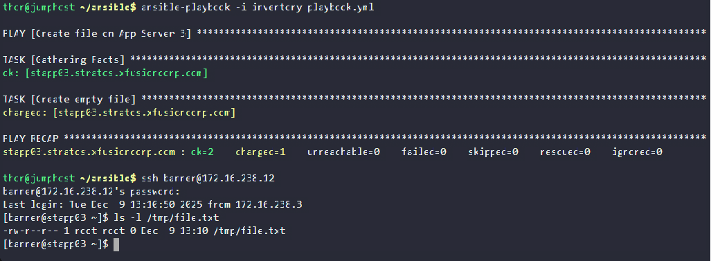

#### STEP-BY-STEP SOLUTION

1️⃣ Update the Ansible Inventory File
File: /home/thor/ansible/inventory

We want the playbook to target stapp03 (App Server 3).

Infrastructure details give:

Server	IP	User	Password
stapp03	172.16.238.11	banner	BigGr33n
Modify inventory to:

[appserver3]
stapp03.stratos.xfusioncorp.com ansible_host=172.16.238.12 ansible_user=banner ansible_ssh_pass=BigGr33n

✔ This tells Ansible exactly how to connect to App Server 2.

2️⃣ Create the Ansible Playbook
File: /home/thor/ansible/playbook.yml

Create the file with:

vi /home/thor/ansible/playbook.yml

Add this content:

---
- name: Create file on App Server 3
  hosts: appserver3
  become: yes
  tasks:
    - name: Create empty file
      file:
        path: /tmp/file.txt
        state: touch

Explanation:

hosts: appserver3 → Matches the group defined in the inventory.

become: yes → Needed because /tmp may require privilege escalation.

state: touch → Ensures the file exists but is empty.

3️⃣ Validate the Playbook

Run:

cd /home/thor/ansible
ansible-playbook -i inventory playbook.yml

You should see:

✔ Successful connection to stapp03
✔ A task creating /tmp/file.txt

4️⃣ OPTIONAL: Manually Confirm on App Server 3

SSH to stapp03 (through jump host):

ssh banner@172.16.238.12

Check file:

ls -l /tmp/file.txt

---