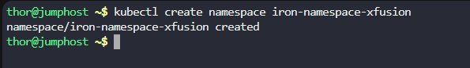

# Step 1: Create the Namespace

First, create the namespace:

```
kubectl create namespace iron-namespace-xfusion
```




# Step 2: Create the Iron Gallery Deployment

Create a file named iron-gallery-deployment.yaml:

```
vi iron-gallery-deployment.yaml
```

```
apiVersion: apps/v1
kind: Deployment
metadata:
  name: iron-gallery-deployment-xfusion
  namespace: iron-namespace-xfusion
spec:
  replicas: 1
  selector:
    matchLabels:
      run: iron-gallery
  template:
    metadata:
      labels:
        run: iron-gallery
    spec:
      containers:
      - name: iron-gallery-container-xfusion
        image: kodekloud/irongallery:2.0
        resources:
          limits:
            memory: "100Mi"
            cpu: "50m"
        volumeMounts:
        - name: config
          mountPath: /usr/share/nginx/html/data
        - name: images
          mountPath: /usr/share/nginx/html/uploads
      volumes:
      - name: config
        emptyDir: {}
      - name: images
        emptyDir: {}
```

# Step 3: Create the Iron DB Deployment

Create a file named iron-db-deployment.yaml:

```
vi iron-db-deployment.yaml
```

```
apiVersion: apps/v1
kind: Deployment
metadata:
  name: iron-db-deployment-xfusion
  namespace: iron-namespace-xfusion
spec:
  replicas: 1
  selector:
    matchLabels:
      db: mariadb
  template:
    metadata:
      labels:
        db: mariadb
    spec:
      containers:
      - name: iron-db-container-xfusion
        image: kodekloud/irondb:2.0
        env:
        - name: MYSQL_DATABASE
          value: "database_blog"
        - name: MYSQL_ROOT_PASSWORD
          value: "RootPass123!"
        - name: MYSQL_PASSWORD
          value: "UserPass123!"
        - name: MYSQL_USER
          value: "gallery_user"
        volumeMounts:
        - name: db
          mountPath: /var/lib/mysql
      volumes:
      - name: db
        emptyDir: {}
```


# Step 4: Create the Iron DB Service

Create a file named iron-db-service.yaml:

```
vi iron-db-service.yaml
```

```
apiVersion: v1
kind: Service
metadata:
  name: iron-db-service-xfusion
  namespace: iron-namespace-xfusion
spec:
  selector:
    db: mariadb
  ports:
  - protocol: TCP
    port: 3306
    targetPort: 3306
  type: ClusterIP
```

# Step 5: Create the Iron Gallery Service

Create a file named iron-gallery-service.yaml:

```
vi iron-gallery-service.yaml
```

```
apiVersion: v1
kind: Service
metadata:
  name: iron-gallery-service-xfusion
  namespace: iron-namespace-xfusion
spec:
  type: NodePort
  selector:
    run: iron-gallery
  ports:
  - protocol: TCP
    port: 80
    targetPort: 80
    nodePort: 32678
```

# Step 6: Deploy All Resources

Now apply all the configurations:

# Apply all configurations one by one
```
kubectl apply -f iron-gallery-deployment.yaml
kubectl apply -f iron-db-deployment.yaml
kubectl apply -f iron-db-service.yaml
kubectl apply -f iron-gallery-service.yaml
```


# Step 7: Verification

Check if all resources are created successfully one by one:


# Check namespace
```
kubectl get namespaces | grep iron-namespace-xfusion
```

# Check deployments
```
kubectl get deployments -n iron-namespace-xfusion
```

# Check pods
```
kubectl get pods -n iron-namespace-xfusion
```

# Check services
```
kubectl get services -n iron-namespace-xfusion
```


# Step 8: Testing the Application

Once the pods are running, you can test the Iron Gallery application:

# Get node IP
```
kubectl get nodes -o wide
```

# Access the application (replace with actual node IP)
```
curl http://172.17.0.2:32678
```


