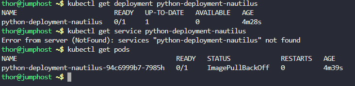
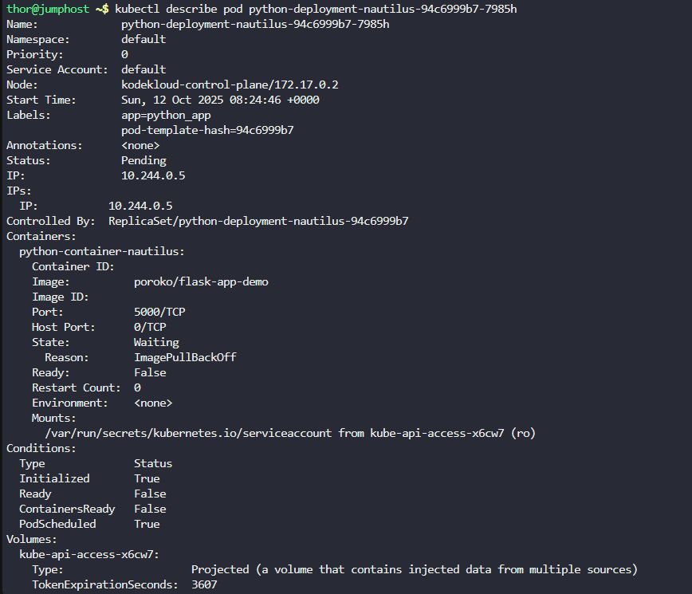
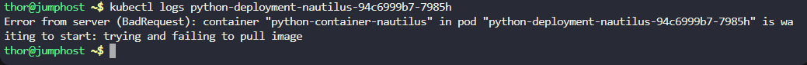
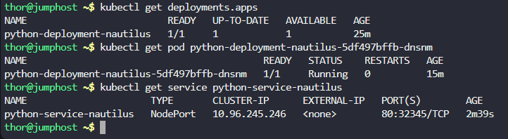
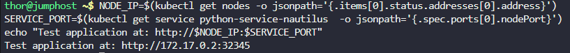

Step 1: Check Basic Resource Status

# 1. Check if deployment exists and its status
```
kubectl get deployment python-deployment-devops
```

# 2. Check if service exists
```
kubectl get service python-deployment-devops
```


# 3. Check all pods and their status
```
kubectl get pods
```



Step 2: Check Pod Details

# 4. Check detailed pod status
```
kubectl get pods -o wide
```

# 5. Check pod labels
```
kubectl get pods --show-labels | grep python
```


Step 3: Investigate Deployment Configuration

# 6. Check what image the deployment is using
```
kubectl get deployment python-deployment-devops -o jsonpath='{.spec.template.spec.containers[0].image}' && echo
```

# 7. Check container port configuration
```
kubectl get deployment python-deployment-devops -o jsonpath='{.spec.template.spec.containers[0].ports}' && echo
```


Step 4: Check for Errors

# 8. Check deployment events for errors
```
kubectl describe deployment python-deployment-devops
```

# 9. Check the failing pod details
```
kubectl describe pod python-deployment-devops-678b746b7-wdd9x
```

# 10. Check pod logs
```
kubectl logs python-deployment-devops-678b746b7-wdd9x
```







# Fix the image name to the correct one
```
kubectl set image deployment/python-deployment-devops python-container-devops=poroko/flask-demo-app:latest
```


# If you need specific port 32345 and it's taken, use:
```
kubectl get services --all-namespaces -o wide | grep 32345
```



# If safe, delete the conflicting service, then:
```
cat <<EOF | kubectl apply -f -
apiVersion: v1
kind: Service
metadata:
  name: python-deployment-devops
spec:
  type: NodePort
  selector:
    app: python_app
  ports:
  - port: 80
    targetPort: 5000
    nodePort: 32345
EOF
```


# Check all resources
```
kubectl get deployments.apps 
kubectl get pod python-deployment-devops-b856d4d4d-lxcz9
kubectl get service python-deployment-devops 
```



# Test the application
```
NODE_IP=$(kubectl get nodes -o jsonpath='{.items[0].status.addresses[0].address}')
SERVICE_PORT=$(kubectl get service python-deployment-devops -o jsonpath='{.spec.ports[0].nodePort}')
echo "Test application at: http://$NODE_IP:$SERVICE_PORT"
curl -s http://$NODE_IP:$SERVICE_PORT
```


