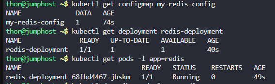
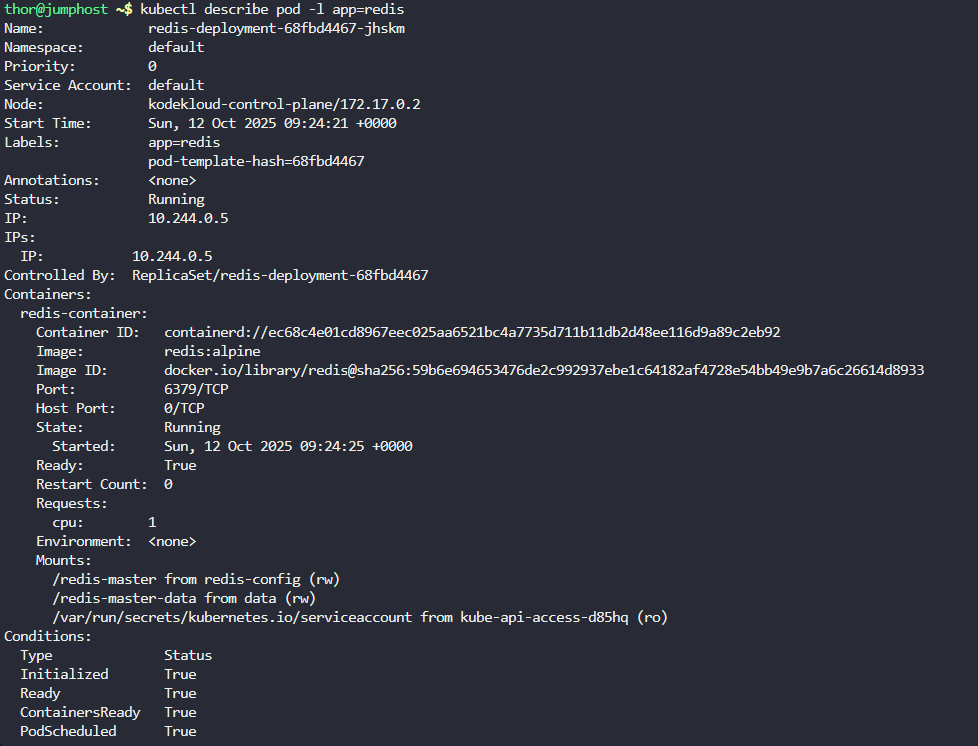
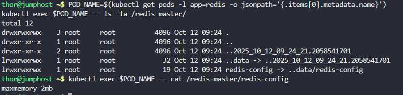
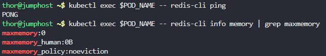

Step 1: Create the ConfigMap

# Create the Redis configuration ConfigMap
cat <<EOF | kubectl apply -f -
apiVersion: v1
kind: ConfigMap
metadata:
  name: my-redis-config
data:
  redis-config: |
    maxmemory 2mb
EOF

Step 2: Create the Redis Deployment

# Create the Redis deployment with all specified requirements
cat <<EOF | kubectl apply -f -
apiVersion: apps/v1
kind: Deployment
metadata:
  name: redis-deployment
spec:
  replicas: 1
  selector:
    matchLabels:
      app: redis
  template:
    metadata:
      labels:
        app: redis
    spec:
      containers:
      - name: redis-container
        image: redis:alpine
        ports:
        - containerPort: 6379
        resources:
          requests:
            cpu: "1"
        volumeMounts:
        - name: data
          mountPath: /redis-master-data
        - name: redis-config
          mountPath: /redis-master
      volumes:
      - name: data
        emptyDir: {}
      - name: redis-config
        configMap:
          name: my-redis-config
EOF

 Step 3: Verification
Check if everything is created properly:

# Verify ConfigMap
kubectl get configmap my-redis-config

# Verify Deployment
kubectl get deployment redis-deployment

# Verify Pod status
kubectl get pods -l app=redis

# Check pod details
kubectl describe pod -l app=redis

Verify the configuration is mounted correctly:

# Check if the config file is mounted
POD_NAME=$(kubectl get pods -l app=redis -o jsonpath='{.items[0].metadata.name}')
kubectl exec $POD_NAME -- ls -la /redis-master/

# Check the content of the config file
kubectl exec $POD_NAME -- cat /redis-master/redis-config

Test Redis functionality:

# Test if Redis is running and accepting connections
kubectl exec $POD_NAME -- redis-cli ping

# Check Redis info
kubectl exec $POD_NAME -- redis-cli info memory | grep maxmemorya

