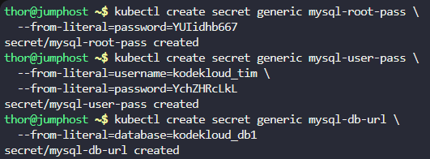
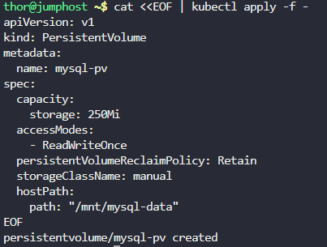
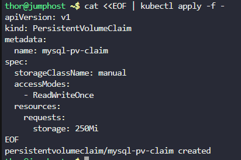
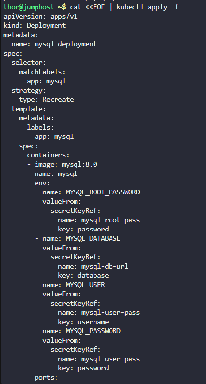
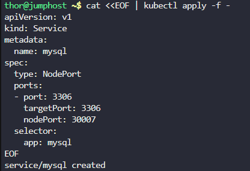
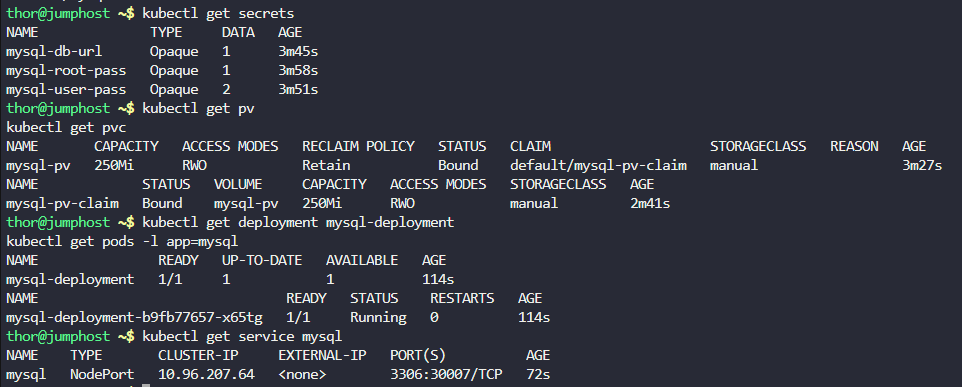
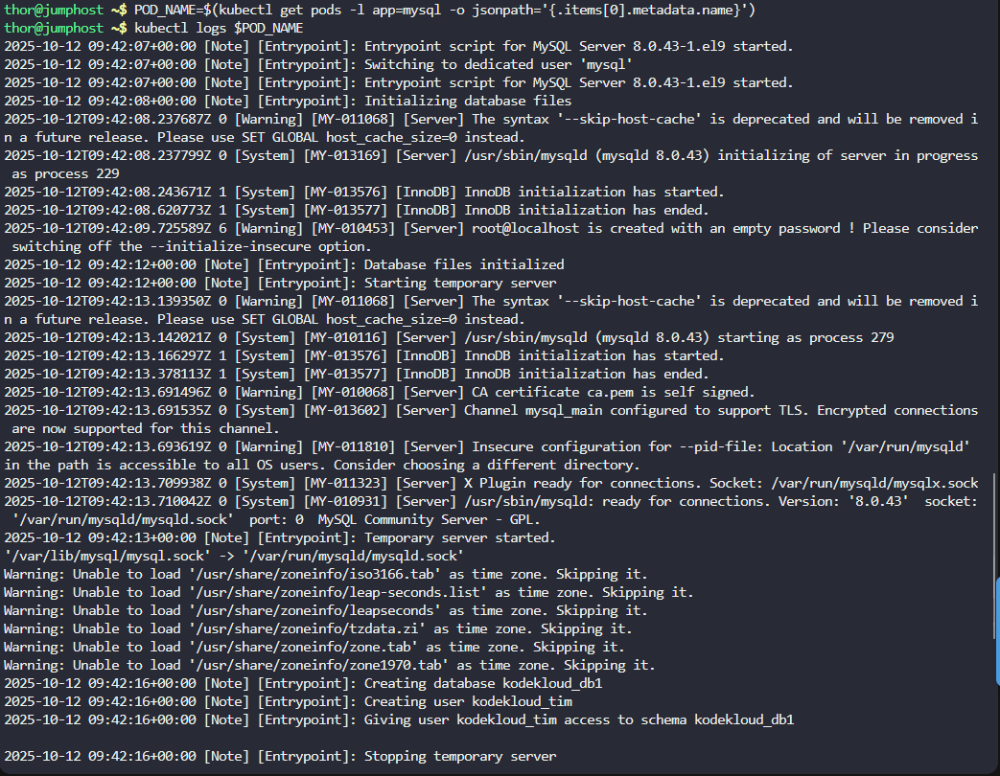

Step 1: Create the Secrets

# Create mysql-root-pass secret
kubectl create secret generic mysql-root-pass \
  --from-literal=password=YUIidhb667

# Create mysql-user-pass secret
kubectl create secret generic mysql-user-pass \
  --from-literal=username=kodekloud_tim \
  --from-literal=password=YchZHRcLkL

# Create mysql-db-url secret
kubectl create secret generic mysql-db-url \
  --from-literal=database=kodekloud_db1

Step 2: Create the PersistentVolume

# Create PersistentVolume mysql-pv
cat <<EOF | kubectl apply -f -
apiVersion: v1
kind: PersistentVolume
metadata:
  name: mysql-pv
spec:
  capacity:
    storage: 250Mi
  accessModes:
    - ReadWriteOnce
  persistentVolumeReclaimPolicy: Retain
  storageClassName: manual
  hostPath:
    path: "/mnt/mysql-data"
EOF

Step 3: Create the PersistentVolumeClaim

# Create PersistentVolumeClaim mysql-pv-claim
cat <<EOF | kubectl apply -f -
apiVersion: v1
kind: PersistentVolumeClaim
metadata:
  name: mysql-pv-claim
spec:
  storageClassName: manual
  accessModes:
    - ReadWriteOnce
  resources:
    requests:
      storage: 250Mi
EOF

Step 4: Create the MySQL Deployment

# Create mysql-deployment with all environment variables and volume mounts
cat <<EOF | kubectl apply -f -
apiVersion: apps/v1
kind: Deployment
metadata:
  name: mysql-deployment
spec:
  selector:
    matchLabels:
      app: mysql
  strategy:
    type: Recreate
  template:
    metadata:
      labels:
        app: mysql
    spec:
      containers:
      - image: mysql:8.0
        name: mysql
        env:
        - name: MYSQL_ROOT_PASSWORD
          valueFrom:
            secretKeyRef:
              name: mysql-root-pass
              key: password
        - name: MYSQL_DATABASE
          valueFrom:
            secretKeyRef:
              name: mysql-db-url
              key: database
        - name: MYSQL_USER
          valueFrom:
            secretKeyRef:
              name: mysql-user-pass
              key: username
        - name: MYSQL_PASSWORD
          valueFrom:
            secretKeyRef:
              name: mysql-user-pass
              key: password
        ports:
        - containerPort: 3306
          name: mysql
        volumeMounts:
        - name: mysql-persistent-storage
          mountPath: /var/lib/mysql
      volumes:
      - name: mysql-persistent-storage
        persistentVolumeClaim:
          claimName: mysql-pv-claim
EOF

Step 5: Create the MySQL Service

# Create NodePort service mysql
cat <<EOF | kubectl apply -f -
apiVersion: v1
kind: Service
metadata:
  name: mysql
spec:
  type: NodePort
  ports:
  - port: 3306
    targetPort: 3306
    nodePort: 30007
  selector:
    app: mysql
EOF

Step 6: Verification
Check all created resources:

# Verify secrets
kubectl get secrets

# Verify PersistentVolume and PersistentVolumeClaim
kubectl get pv
kubectl get pvc

# Verify deployment and pods
kubectl get deployment mysql-deployment
kubectl get pods -l app=mysql

# Verify service
kubectl get service mysql

Check if MySQL is running properly:

# Get pod name
POD_NAME=$(kubectl get pods -l app=mysql -o jsonpath='{.items[0].metadata.name}')

# Check pod logs
kubectl logs $POD_NAME

# Check if MySQL is ready (this might take a minute)
kubectl exec $POD_NAME -- mysql -u root -pYUIidhb667 -e "SHOW DATABASES;"

