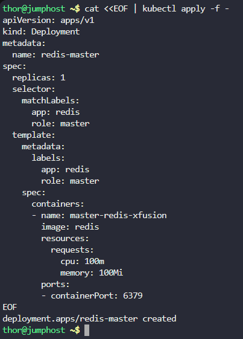
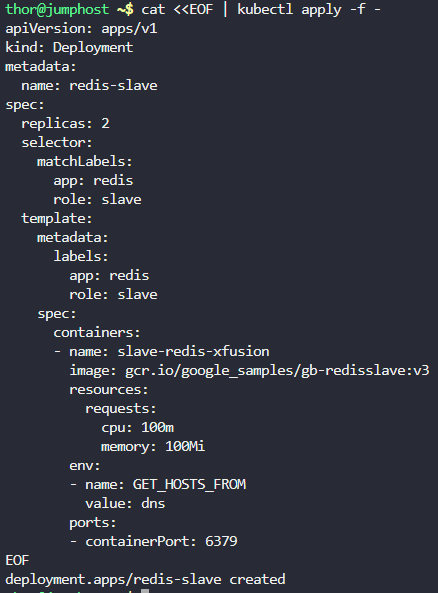
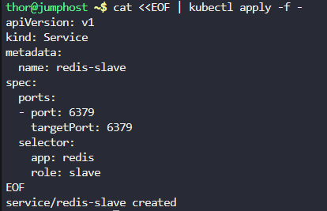
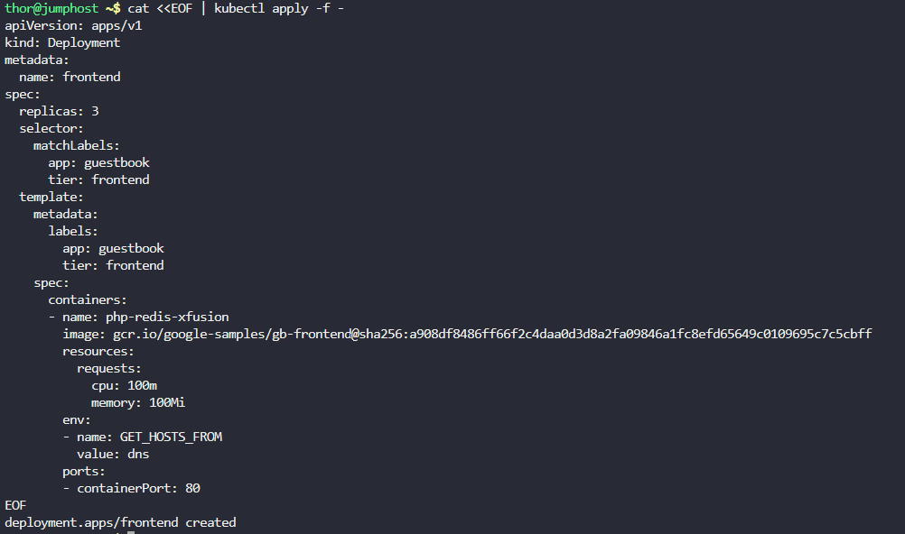
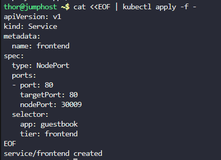
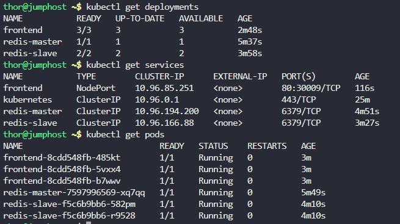
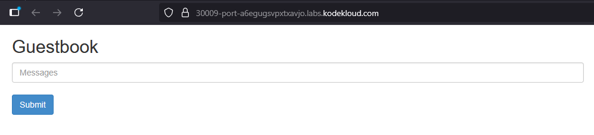

# Step 1: Create Redis Master Deployment

```
cat <<EOF | kubectl apply -f -
apiVersion: apps/v1
kind: Deployment
metadata:
  name: redis-master
spec:
  replicas: 1
  selector:
    matchLabels:
      app: redis
      role: master
  template:
    metadata:
      labels:
        app: redis
        role: master
    spec:
      containers:
      - name: master-redis-xfusion
        image: redis
        resources:
          requests:
            cpu: 100m
            memory: 100Mi
        ports:
        - containerPort: 6379
EOF
```



# Step 2: Create Redis Master Service

```
cat <<EOF | kubectl apply -f -
apiVersion: v1
kind: Service
metadata:
  name: redis-master
spec:
  ports:
  - port: 6379
    targetPort: 6379
  selector:
    app: redis
    role: master
EOF
```


# Step 3: Create Redis Slave Deployment

```
cat <<EOF | kubectl apply -f -
apiVersion: apps/v1
kind: Deployment
metadata:
  name: redis-slave
spec:
  replicas: 2
  selector:
    matchLabels:
      app: redis
      role: slave
  template:
    metadata:
      labels:
        app: redis
        role: slave
    spec:
      containers:
      - name: slave-redis-xfusion
        image: gcr.io/google_samples/gb-redisslave:v3
        resources:
          requests:
            cpu: 100m
            memory: 100Mi
        env:
        - name: GET_HOSTS_FROM
          value: dns
        ports:
        - containerPort: 6379
EOF
```



# Step 4: Create Redis Slave Service

```
cat <<EOF | kubectl apply -f -
apiVersion: v1
kind: Service
metadata:
  name: redis-slave
spec:
  ports:
  - port: 6379
    targetPort: 6379
  selector:
    app: redis
    role: slave
EOF
```



# Step 5: Create Frontend Deployment

```
cat <<EOF | kubectl apply -f -
apiVersion: apps/v1
kind: Deployment
metadata:
  name: frontend
spec:
  replicas: 3
  selector:
    matchLabels:
      app: guestbook
      tier: frontend
  template:
    metadata:
      labels:
        app: guestbook
        tier: frontend
    spec:
      containers:
      - name: php-redis-xfusion
        image: gcr.io/google-samples/gb-frontend@sha256:a908df8486ff66f2c4daa0d3d8a2fa09846a1fc8efd65649c0109695c7c5cbff
        resources:
          requests:
            cpu: 100m
            memory: 100Mi
        env:
        - name: GET_HOSTS_FROM
          value: dns
        ports:
        - containerPort: 80
EOF
```



# Step 6: Create Frontend Service

```
cat <<EOF | kubectl apply -f -
apiVersion: v1
kind: Service
metadata:
  name: frontend
spec:
  type: NodePort
  ports:
  - port: 80
    targetPort: 80
    nodePort: 30009
  selector:
    app: guestbook
    tier: frontend
EOF
```



# Step 7: Verification
Check all deployments by one:


```
kubectl get deployments
```


```
kubectl get services
```

```
kubectl get pods
```



