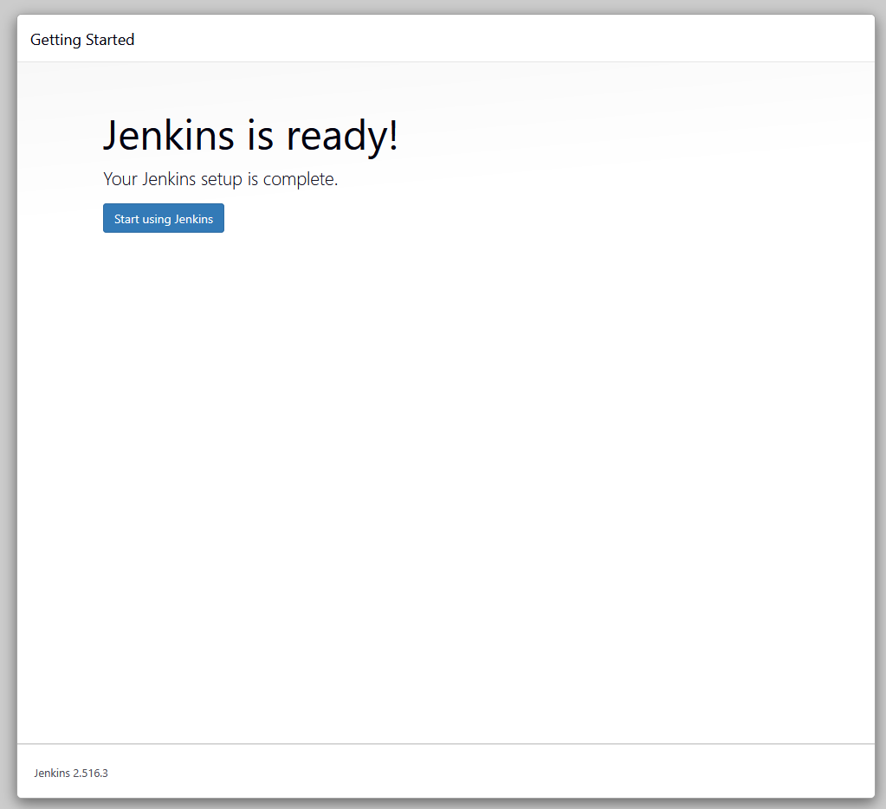

# Connect to the Jenkins Server

First, connect from the jump host to the Jenkins server:

# Connect to Jenkins server from jump host
```
ssh root@jenkins
```


# Install Jenkins using YUM
```
yum install wget -y
wget -O /etc/yum.repos.d/jenkins.repo \
https://pkg.jenkins.io/redhat-stable/jenkins.repo
rpm --import https://pkg.jenkins.io/redhat-stable/jenkins.io-2023.key
yum upgrade -y
```

# Add required dependencies for the jenkins package
```
yum install fontconfig java-21-openjdk jenkins -y
systemctl daemon-reload
```


# Start and enable Jenkins service

```
systemctl start jenkins
systemctl enable jenkins
systemctl status jenkins
```


# Get the initial admin password
```
cat /var/lib/jenkins/secrets/initialAdminPassword
```


# Access Jenkins Web UI

Click the "Jenkins" button on the top bar to access Jenkins UI

Enter the initial admin password from Step 4

Follow the setup wizard and create the admin user with these details:

Username: theadmin

Password: Adm!n321

Full name: Ravi

Email: ravi@jenkins.stratos.xfusioncorp.coma




