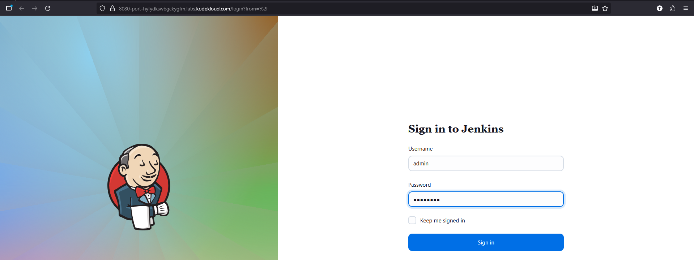
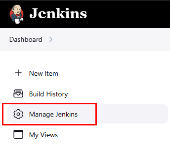
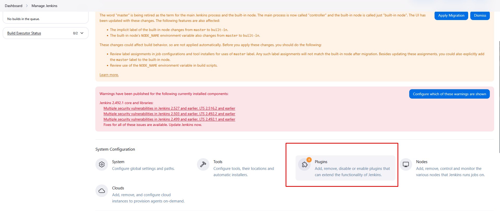
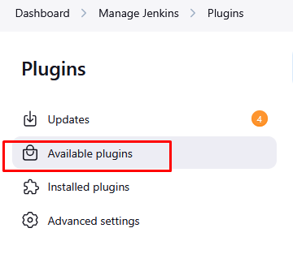
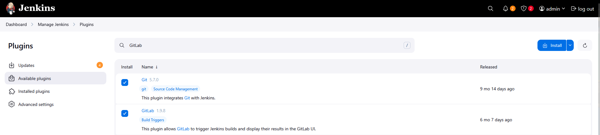
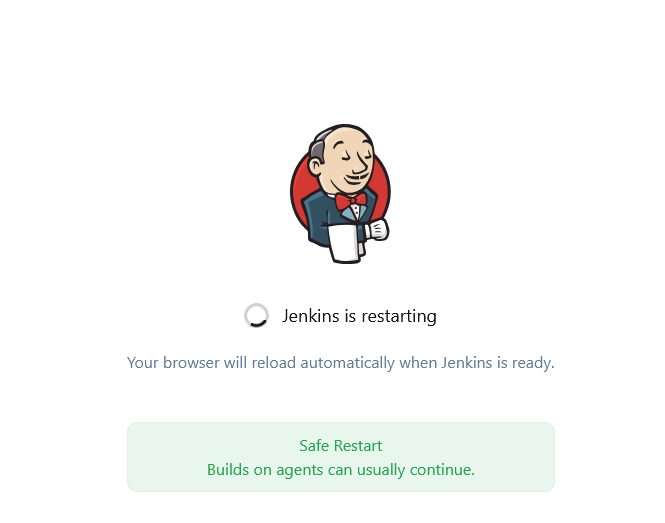
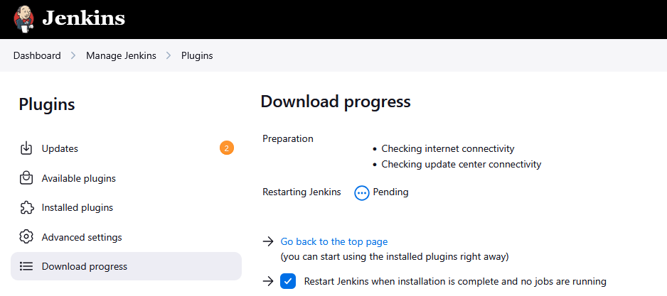

# Step 1: Access Jenkins UI

Click the "Jenkins" button on the top bar

Login with credentials:

Username: admin

Password: Adm!n321

# Step 2: Install Git Plugin

Once logged in, follow these steps:
Navigate to Plugin Management:

Click on "Manage Jenkins" in the left sidebar

Click on "Plugins"

Go to the "Available" tab

Search and Install Git Plugin:

In the filter/search box, type "Git"

Find the "Git" plugin in the list (it should be one of the first results)

Check the checkbox next to the Git plugin

Also search for "GitLab" and check the checkbox next to "GitLab" plugin

Click the "Install" button

If required, opt to Restart Jenkins when installation is complete and no jobs are running 

    

