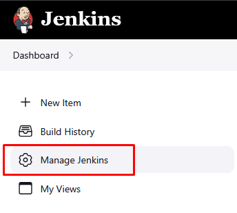
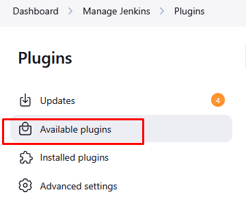
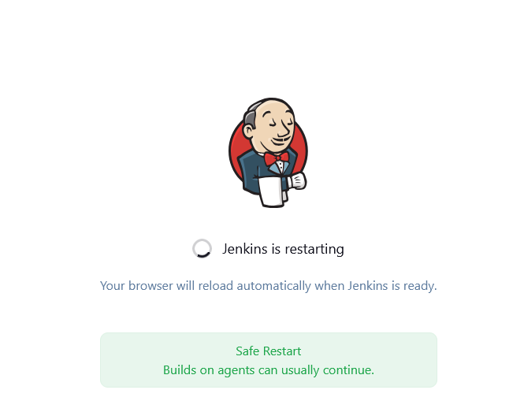

Step 1: Access Jenkins UI

    Click the "Jenkins" button on the top bar

    Login with credentials:

        Username: admin

        Password: Adm!n321

Step 2: Install Git Plugin

Once logged in, follow these steps:
Navigate to Plugin Management:

    Click on "Manage Jenkins" in the left sidebar

    Click on "Plugins"

    Go to the "Available" tab

Search and Install Git Plugin:

    In the filter/search box, type "Git"

    Find the "Git" plugin in the list (it should be one of the first results)

    Check the checkbox next to the Git plugin

    Also search for "GitLab" and check the checkbox next to "GitLab" plugin

    Click the "Install" button

    If required, opt to Restart Jenkins when installation is complete and no jobs are running 

    

