# Step 1: Access Jenkins and Install Required Plugin

Login to Jenkins:

Click the "Jenkins" button on the top bar

Login with credentials:

Username: admin

Password: Adm!n321

Install Matrix Authorization Strategy Plugin:

Go to "Manage Jenkins" → "Plugins"

Go to the "Available Plugins" tab

Search for "Matrix Authorization Strategy"

Check the checkbox and click "Install without restart"

If prompted to restart, check "Restart Jenkins when installation is complete and no jobs are running"

Wait for Jenkins to restart and login again

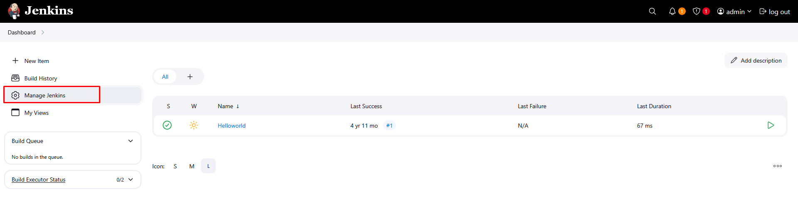

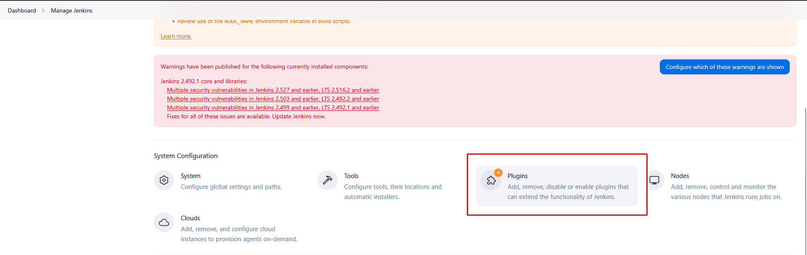

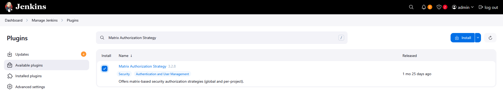

# Step 2: Create User Anita

Go to "Manage Jenkins" → "Users"

Click "Create User" in the left sidebar

Fill in the user details:

Username: anita

Password: ksH85UJjhb

Confirm password: ksH85UJjhb

Full name: Anita

Email: (optional, you can leave blank)

Click "Create User"   

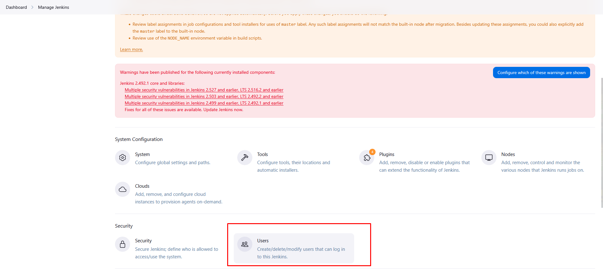

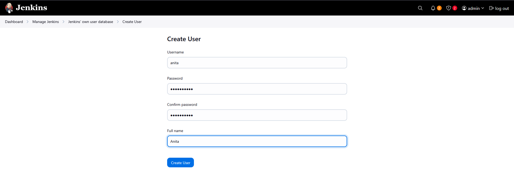

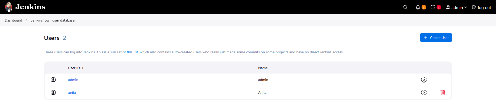

# Step 3: Configure Global Security

Go to "Manage Jenkins" → "Security"

Under "Authorization", select "Project-based Matrix Authorization Strategy"

In the "User/group to add" field, type anita and click "Add"

For the newly added anita user, check the box for "Overall Read" permission

Find "Anonymous Users" in the list and uncheck ALL permissions (if any are checked)

Ensure "admin" user has "Administer" permission checked (it should be there by default)

Click "Save" at the bottom

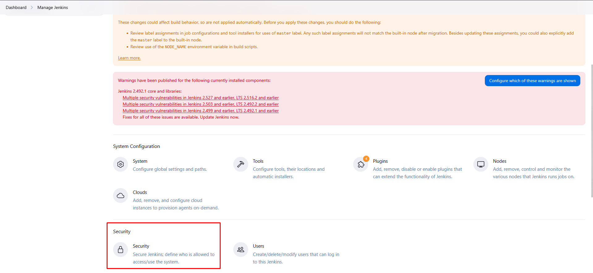

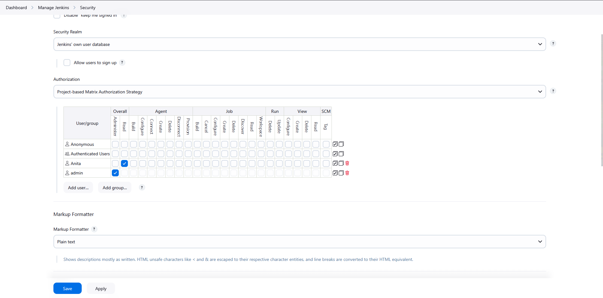

# Step 4: Configure Job Permissions

Go to the Jenkins dashboard

Click on the existing job 

Click "Configure" on the left sidebar

Scroll down to "Enable project-based security" (this option appears because we installed the Matrix plugin)

In the "User/group to add" field, type anita and click "Add"

For the anita user, check ONLY the "Read" permission

Uncheck all other permissions for anita (like Build, Workspace, Configure, etc.)

Click "Save"

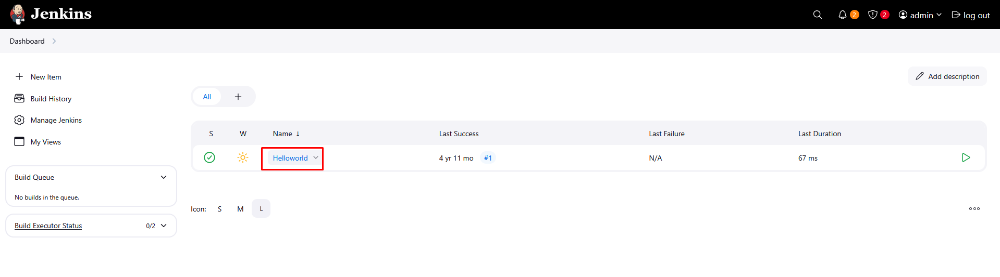

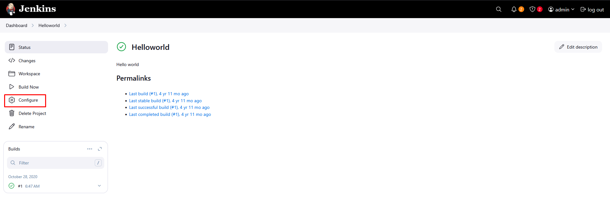

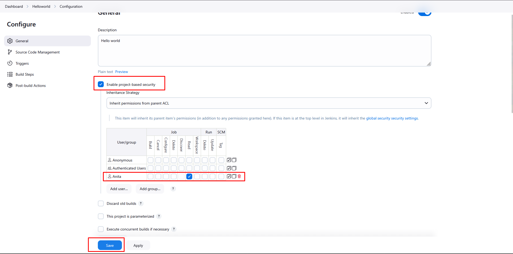