# Step 1: Access Jenkins and Install Required Plugins

Login to Jenkins:

Click the "Jenkins" button on the top bar

Login with credentials:

Username: admin

Password: Adm!n321

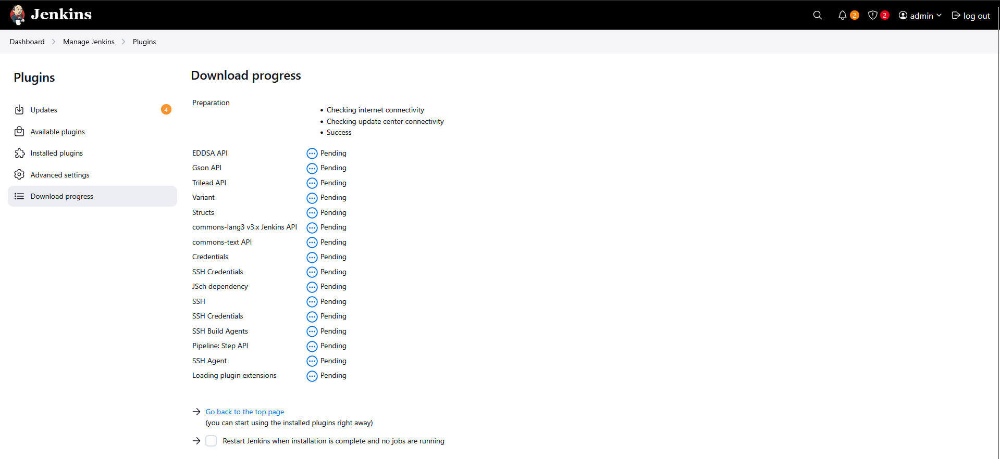

Install SSH Plugin (if needed):

Go to "Manage Jenkins" → "Manage Plugins"

Go to the "Available" tab

Go to Available tab and search for the following plugins:

SSH

SSH Credentials

SSH Build Agents

SSH Agents

Install all plugins and restart Jenkins if required

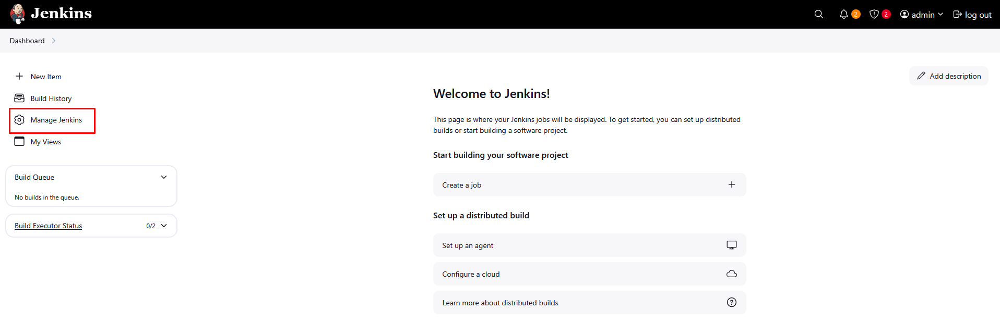

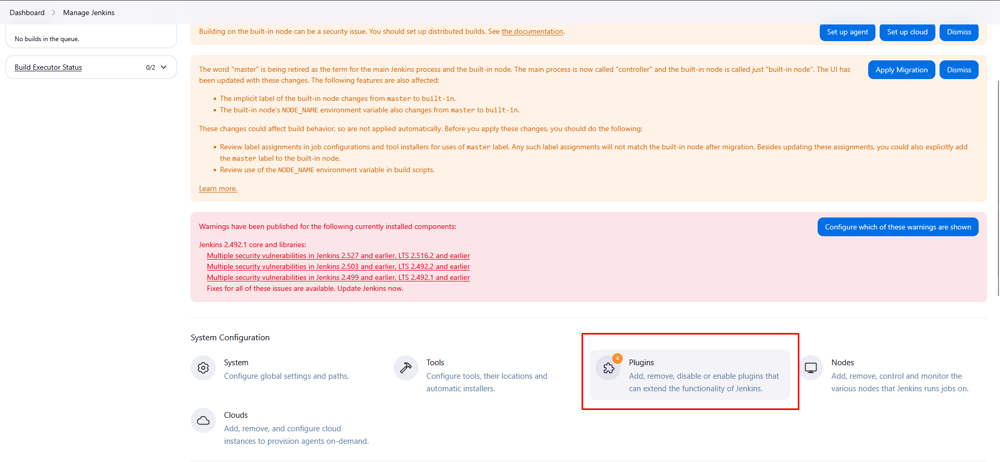


# Step 2: Configure SSH Credentials

Go to Manage Jenkins → Credentials

Click on Global credentials (unrestricted)

Click Add Credentials

Configure SSH credentials:

Kind: SSH Username with private key

Scope: Global

ID: storage-server-credentials

Description: Credentials for storage server

Username: natasha

Password: Bl@kW

Save credentials

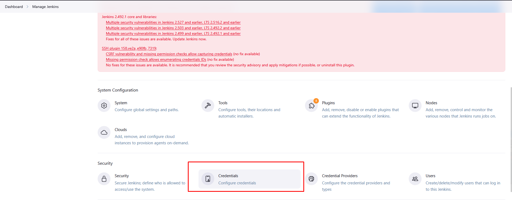

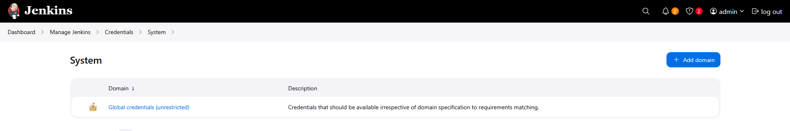

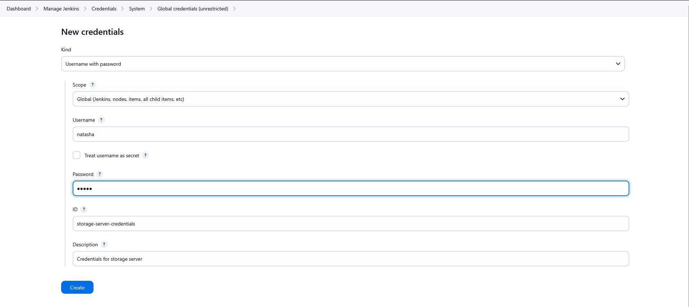

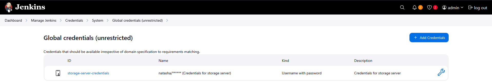

# Step 3: Configure SSH Server Connection

Go to Manage Jenkins → Configure System

Scroll down to SSH remote hosts section

Add SSH Server with following configuration:

Hostname: ststor01.stratos.xfusioncorp.com

Port: 22

Credentials: storage-server-credentials (select from dropdown)

JavaPath: (leave default)

Click Test Connection to verify

Save the configuration

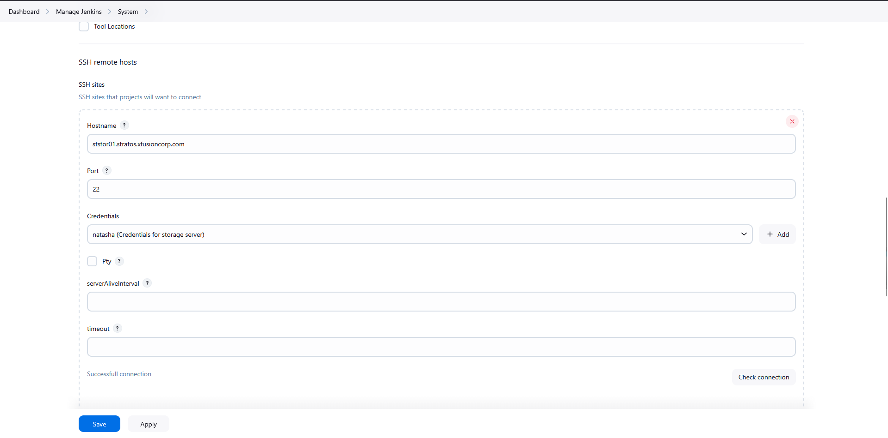


# Step 4: Create Jenkins Job

Click New Item on Jenkins dashboard

Enter job name: install-packages

Select Freestyle project and click OK

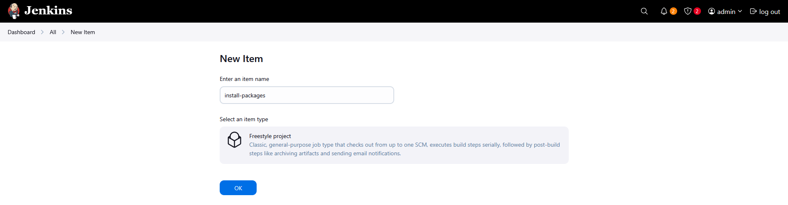

# Step 5: Configure Job Parameters

Check This project is parameterized

Add String Parameter:

Name: PACKAGE

Description: Package to install on storage server

Default Value: (leave empty)

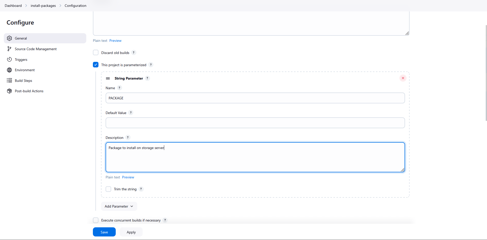

# Step 6: Configure Build Step

Under Build section, click Add build step

Select Execute shell script on remote host using ssh

Configure:

SSH site: "natasha@ststor01.stratos.xfusioncorp.com:22"

Command: 
         
```
#!/bin/bash
echo "Starting package installation on storage server"
echo "Package: $PACKAGE"

if [ -z "$PACKAGE" ]; then
    echo "ERROR: No package specified in PACKAGE parameter"
    exit 1
fi

# Install package using sudo with password
echo "Bl@kW" | sudo -S yum install -y $PACKAGE

# Check if installation was successful
if sudo rpm -q $PACKAGE || sudo yum list installed $PACKAGE &>/dev/null; then
    echo "SUCCESS: Package $PACKAGE installed successfully"
    echo "Package location:"
    sudo rpm -ql $PACKAGE 2>/dev/null | head -5
    exit 0
else
    echo "ERROR: Failed to install package $PACKAGE"
    echo "Available packages:"
    yum list available | grep -i $PACKAGE | head -5
    exit 1
fi
```

Click Save


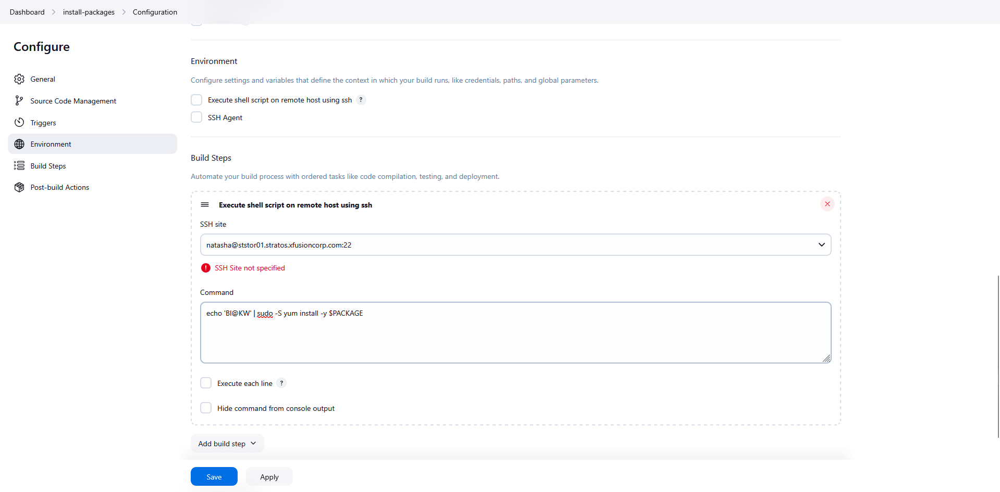

# Step 7: Save and Test Job

Click Build with Parameters

Enter package name (e.g., nginx) and click Build

Check console output for success/failure

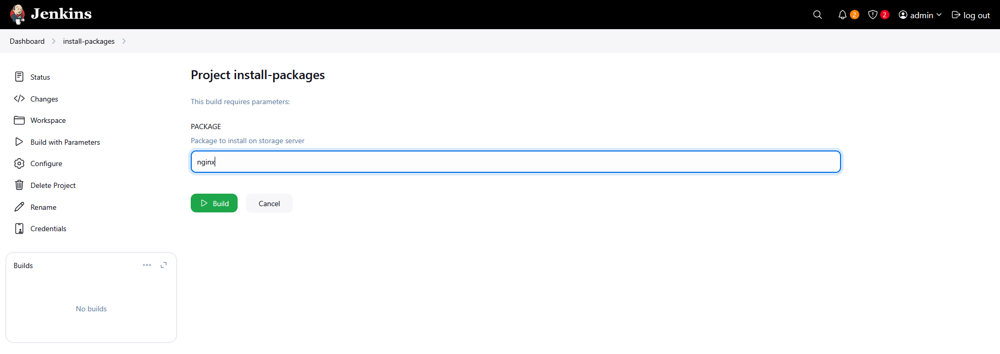

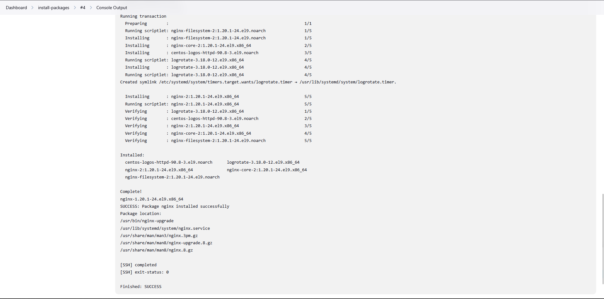