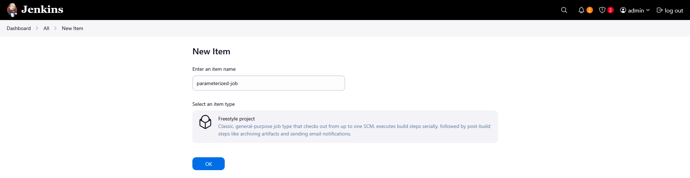
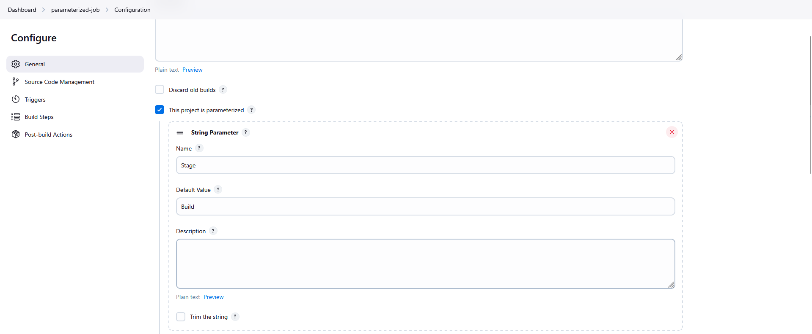
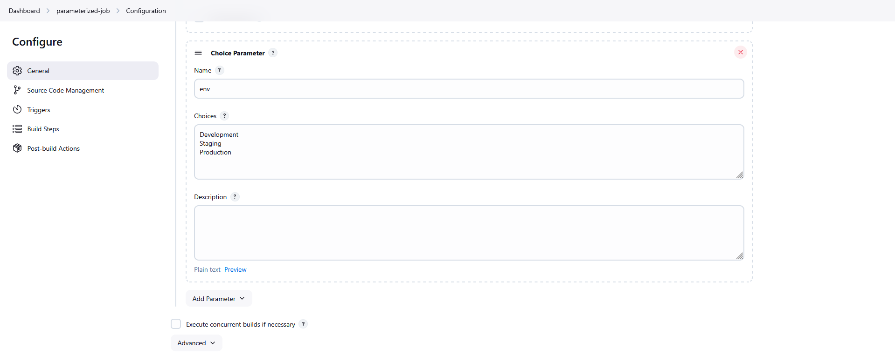
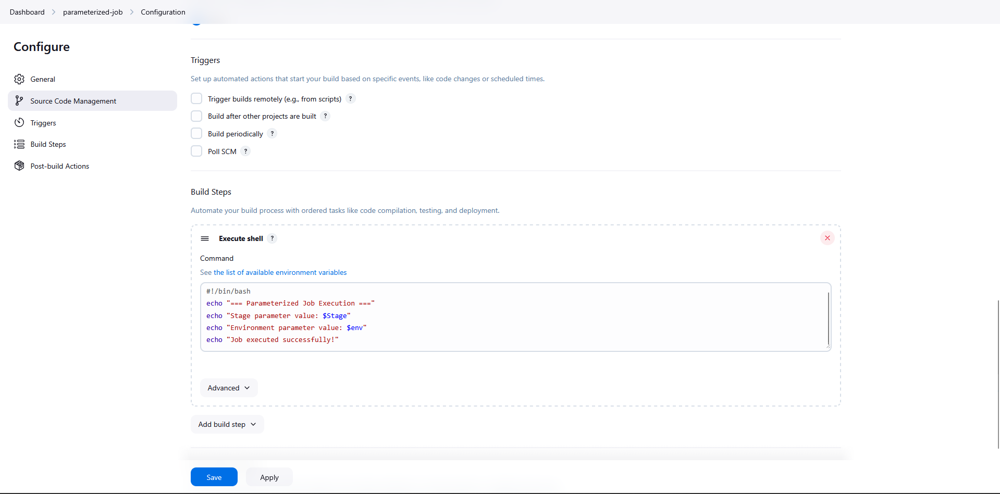
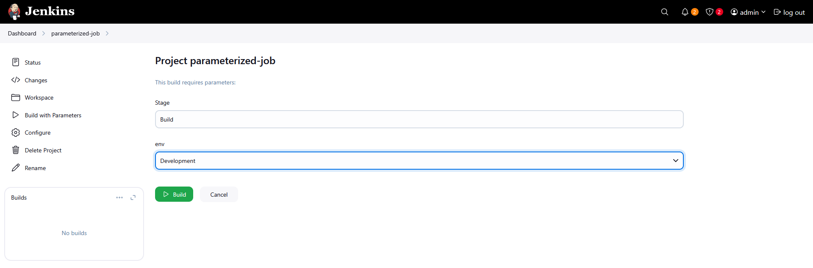
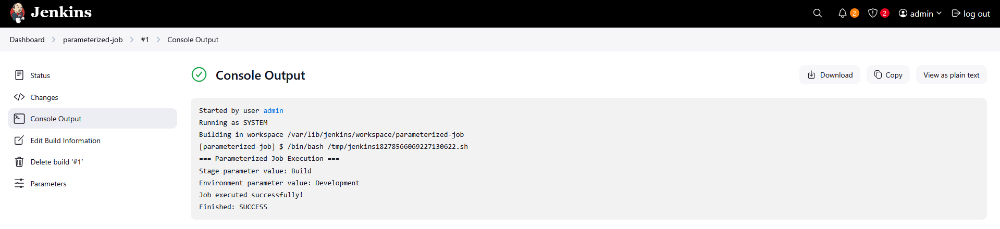

Solution
# Step 1: Access Jenkins

Click the Jenkins button on the top bar

Login with credentials:

Username: admin

Password: Adm!n321

# Step 2: Create New Job

Click "New Item" on the Jenkins dashboard

Enter job name: parameterized-job

Select "Freestyle project"

Click "OK"



# Step 3: Configure String Parameter

Check "This project is parameterized"

Click "Add Parameter" → "String Parameter"

Configure the string parameter:

Name: Stage

Description: (optional)

Default Value: Build

        

# Step 4: Configure Choice Parameter

Click "Add Parameter" → "Choice Parameter"

Configure the choice parameter:

Name: env

Description: (optional)

Choices (enter each on a new line):

Development
Staging
Production



# Step 5: Configure Build Step

Under "Build" section, click "Add build step"

Select "Execute shell"

Enter the shell command:
```
#!/bin/bash
echo "=== Parameterized Job Execution ==="
echo "Stage parameter value: $Stage"
echo "Environment parameter value: $env"
echo "Job executed successfully!"
```

# Step 6: Save the Job

Click "Save" at the bottom of the page



# Step 7: Test the Job

Go to the "parameterized-job" on Jenkins dashboard

Click "Build with Parameters"

Verify the parameters:

Stage: Should show default value Build

env: Select "Development" from dropdown

Click "Build"

Check the Console Output to verify:

Stage parameter value: Build

Environment parameter value: Development




