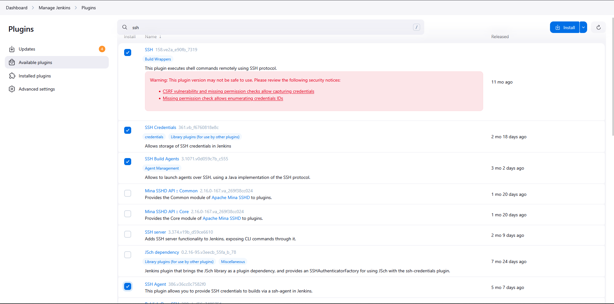
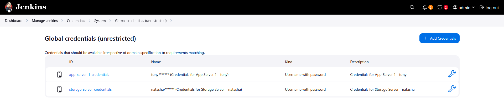
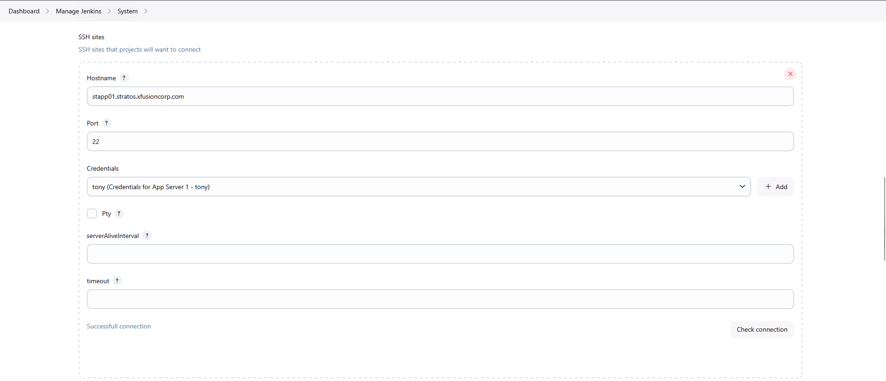
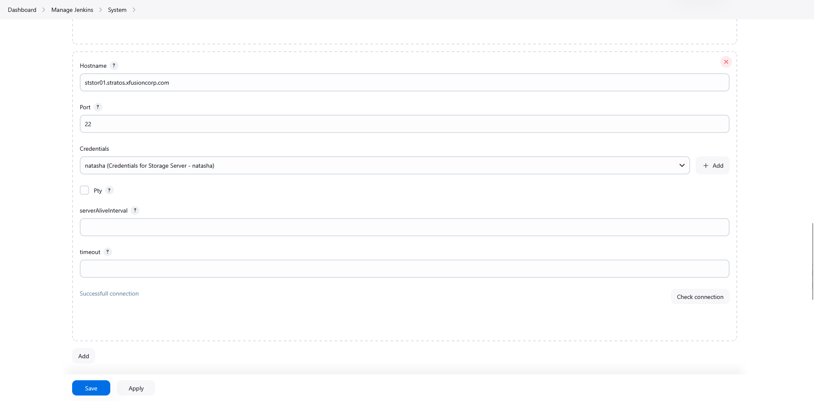
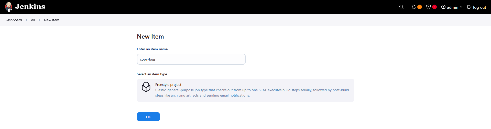
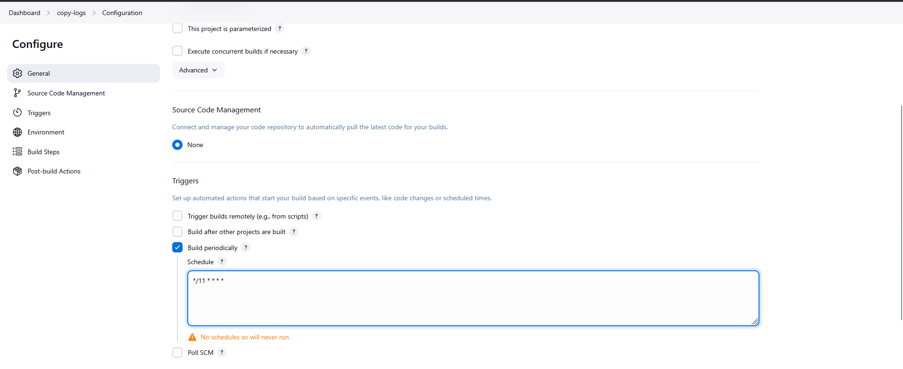
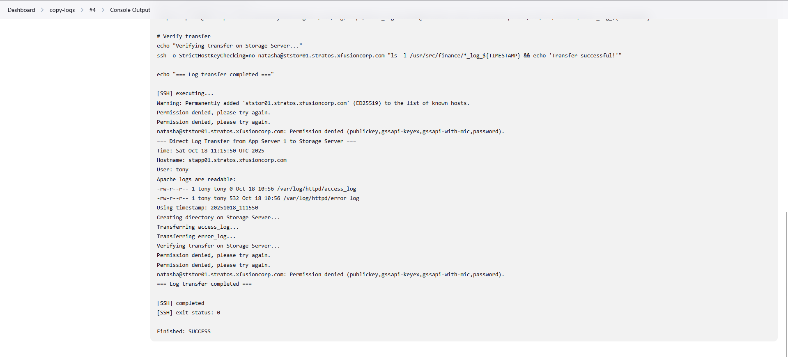
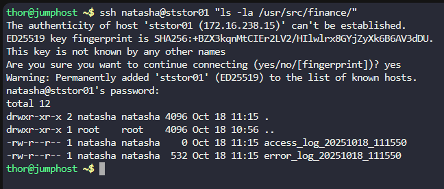

# Step 1: Access Jenkins

Click the Jenkins button on the top bar

Login with credentials:

Username: admin

Password: Adm!n321

# Step 2: Install Required Plugins


Go to Manage Jenkins → Manage Plugins

Available tab → Search for and install:

SSH

SSH Credentials

SSH Build Agents

SSH Agents

Install and restart Jenkins if prompted



Step 3: Configure SSH Credentials

    Go to Manage Jenkins → Manage Credentials

    Click on Global credentials (unrestricted)

    Click Add Credentials

Create Credentials for App Server 1:

Kind: SSH Username with private key

Scope: Global

ID: app-server-1-credentials

Description: Credentials for App Server 1 - tony

Username: tony

Private Key: Enter directly

Passphrase: Ir0nM@n

Create Credentials for Storage Server:

Click Add Credentials again

Kind: SSH Username with private key

Scope: Global

ID: storage-server-credentials

Description: Credentials for Storage Server - natasha

Username: natasha

Private Key: Enter directly

Passphrase: Bl@kW



Step 4: Configure SSH Sites

    Go to Manage Jenkins → Configure System

    Scroll down to SSH remote hosts section

Configure App Server 1 SSH Site:

Click Add

Hostname: stapp01.stratos.xfusioncorp.com

Port: 22

Credentials: app-server-1-credentials (select from dropdown)

JavaPath: (leave default)

Test Connection → Save

Configure Storage Server SSH Site:

Click Add again

Hostname: ststor01.stratos.xfusioncorp.com

Port: 22

Credentials: storage-server-credentials (select from dropdown)

JavaPath: (leave default)

Test Connection → Save





Step 5: Create Jenkins Job

Click New Item on Jenkins dashboard

Enter job name: copy-logs

Select Freestyle project

Click OK



Step 6: Configure Build Triggers

    Check Build periodically

    Enter cron expression: */11 * * * * (runs every 11 minutes)

   

Step 7: Configure Build Steps
Build Step 1: Copy Logs from App Server 1

Under Build, click Add build step

Select Execute shell script on remote host using ssh

Configure:

SSH Site: stapp01.stratos.xfusioncorp.com:22

Command:
```
#!/bin/bash
echo "=== Direct Log Transfer from App Server 1 to Storage Server ==="
echo "Time: $(date)"
echo "Hostname: $(hostname)"
echo "User: $(whoami)"

# Check if Apache logs exist and are readable
if [ ! -r "/var/log/httpd/access_log" ]; then
    echo "ERROR: Cannot read access_log"
    ls -la /var/log/httpd/
    exit 1
fi

if [ ! -r "/var/log/httpd/error_log" ]; then
    echo "ERROR: Cannot read error_log"
    exit 1
fi

echo "Apache logs are readable:"
ls -l /var/log/httpd/access_log
ls -l /var/log/httpd/error_log

TIMESTAMP=$(date +%Y%m%d_%H%M%S)
echo "Using timestamp: $TIMESTAMP"

# Create destination directory on Storage Server using SSH
echo "Creating directory on Storage Server..."
ssh -o StrictHostKeyChecking=no natasha@ststor01.stratos.xfusioncorp.com "mkdir -p /usr/src/finance"

# Transfer logs directly using SCP with password authentication
echo "Transferring access_log..."
sshpass -p 'Bl@kW' scp -o StrictHostKeyChecking=no /var/log/httpd/access_log natasha@ststor01.stratos.xfusioncorp.com:/usr/src/finance/access_log_${TIMESTAMP}

echo "Transferring error_log..."
sshpass -p 'Bl@kW' scp -o StrictHostKeyChecking=no /var/log/httpd/error_log natasha@ststor01.stratos.xfusioncorp.com:/usr/src/finance/error_log_${TIMESTAMP}

# Verify transfer
echo "Verifying transfer on Storage Server..."
ssh -o StrictHostKeyChecking=no natasha@ststor01.stratos.xfusioncorp.com "ls -l /usr/src/finance/*_log_${TIMESTAMP} && echo 'Transfer successful!'"

echo "=== Log transfer completed ==="
```


Step 8: Save and Test

Click Save to create the job

Click Build Now to test immediately

Monitor Console Output



# Check files on Storage Server
ssh natasha@ststor01 "ls -la /usr/src/finance/"


