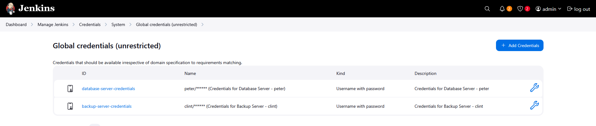

# Step 1: Access Jenkins

Click the Jenkins button on the top bar

Login with credentials:

Username: admin

Password: Adm!n321

# Step 2: Install Required SSH Plugins

Go to Manage Jenkins → Manage Plugins

Available tab → Search for and install:

SSH

SSH Credentials

SSH Build Agents

SSH Agents

Install and restart Jenkins if prompted


# Step 3: Configure SSH Credentials

Go to Manage Jenkins → Manage Credentials

Click on Global credentials (unrestricted)

Click Add Credentials

Create Credentials for Database Server:

Kind: SSH Username with private key

Scope: Global

ID: database-server-credentials

Description: Credentials for Database Server - peter

Username: peter

Passphrase: Sp!dy

Create Credentials for Backup Server:

Click Add Credentials again

Kind: SSH Username with private key

Scope: Global

ID: backup-server-credentials

Description: Credentials for Backup Server - clint

Username: clint

Passphrase: H@wk3y3



Step 4: Configure SSH Sites

Go to Manage Jenkins → Configure System

Scroll down to SSH remote hosts section

Configure Database Server SSH Site:

Click Add

Hostname: stdb01.stratos.xfusioncorp.com

Port: 22

Credentials: database-server-credentials (select from dropdown)

JavaPath: (leave default)

Check Connection → Save

Configure Backup Server SSH Site:

Click Add again

Hostname: stbkp01.stratos.xfusioncorp.com

Port: 22

Credentials: backup-server-credentials (select from dropdown)

JavaPath: (leave default)

Check Connection → Save


# Step 5: Create Jenkins Job

Click New Item on Jenkins dashboard

Enter job name: database-backup

Select Freestyle project

Click OK


# Step 6: Configure Build Triggers

Check Build periodically

Enter cron expression: */10 * * * * (runs every 10 minutes)


# Step 7: Configure Build Steps

Build Step 1: Create Database Backup on Database Server

Under Build, click Add build step

Select Execute shell script on remote host using ssh

Configure:

SSH Site: stdb01.stratos.xfusioncorp.com:22

Command:
```
#!/bin/bash
echo "=== Creating Database Backup ==="
echo "Time: $(date)"
echo "Hostname: $(hostname)"
echo "User: $(whoami)"

# Database credentials
DB_NAME="kodekloud_db01"
DB_USER="kodekloud_roy"
DB_PASSWORD="asdfgdsd"
BACKUP_FILE="db_$(date +%F).sql"

echo "Database: $DB_NAME"
echo "Backup file: $BACKUP_FILE"

# Test database connection
echo "Testing database connection..."
mysql -u $DB_USER -p$DB_PASSWORD -e "SHOW DATABASES;" > /dev/null 2>&1

if [ $? -eq 0 ]; then
    echo "✅ Database connection successful"
    
    # Check if specific database exists
    if mysql -u $DB_USER -p$DB_PASSWORD -e "USE $DB_NAME;" 2>/dev/null; then
        echo "✅ Database $DB_NAME exists"
        
        # Create database dump
        echo "Creating database dump..."
        mysqldump -u $DB_USER -p$DB_PASSWORD $DB_NAME > /tmp/$BACKUP_FILE
        
        # Verify dump was created successfully
        if [ $? -eq 0 ] && [ -s "/tmp/$BACKUP_FILE" ]; then
            echo "✅ Database dump created successfully"
            echo "File size: $(du -h /tmp/$BACKUP_FILE | cut -f1)"
            echo "File location: /tmp/$BACKUP_FILE"
        else
            echo "❌ Failed to create database dump"
            exit 1
        fi
    else
        echo "❌ Database $DB_NAME does not exist or cannot be accessed"
        echo "Available databases:"
        mysql -u $DB_USER -p$DB_PASSWORD -e "SHOW DATABASES;"
        exit 1
    fi
else
    echo "❌ Cannot connect to database server"
    echo "Please check database credentials and connectivity"
    exit 1
fi
```

Build Step 2: Transfer Backup to Backup Server

Click Add build step again

Select Execute shell script on remote host using ssh

Configure:

SSH Site: stdb01.stratos.xfusioncorp.com:22

Command:

```
#!/bin/bash
echo "=== Transferring Backup to Backup Server ==="
echo "Time: $(date)"

BACKUP_FILE="db_$(date +%F).sql"

# Install sshpass if not available
if ! command -v sshpass &> /dev/null; then
    echo "Installing sshpass..."
    sudo yum install -y sshpass
fi

# Ensure backup directory exists on Backup Server
echo "Creating backup directory on Backup Server..."
sshpass -p 'H@wk3y3' ssh -o StrictHostKeyChecking=no clint@stbkp01.stratos.xfusioncorp.com "mkdir -p /home/clint/db_backups"

# Transfer backup file to Backup Server using sshpass
echo "Transferring $BACKUP_FILE to Backup Server..."
sshpass -p 'H@wk3y3' scp -o StrictHostKeyChecking=no /tmp/$BACKUP_FILE clint@stbkp01.stratos.xfusioncorp.com:/home/clint/db_backups/

if [ $? -eq 0 ]; then
    echo "✅ Backup transferred successfully"
else
    echo "❌ Failed to transfer backup"
    exit 1
fi
```        

Build Step 3: Verify Backup on Backup Server

Click Add build step again

Select Execute shell script on remote host using ssh

Configure:

SSH Site: stbkp01.stratos.xfusioncorp.com:22

Command:
```
#!/bin/bash
echo "=== Verifying Backup on Backup Server ==="
echo "Time: $(date)"
echo "Hostname: $(hostname)"
echo "User: $(whoami)"

BACKUP_FILE="db_$(date +%F).sql"

# Verify backup file exists and is not empty
if [ -f "/home/clint/db_backups/$BACKUP_FILE" ] && [ -s "/home/clint/db_backups/$BACKUP_FILE" ]; then
    echo "✅ Backup verified successfully on Backup Server"
    echo "File location: /home/clint/db_backups/$BACKUP_FILE"
    echo "File size: $(du -h /home/clint/db_backups/$BACKUP_FILE | cut -f1)"
    echo "First few lines:"
    head -3 /home/clint/db_backups/$BACKUP_FILE
else
    echo "❌ Backup verification failed - file not found or empty"
    echo "Files in /home/clint/db_backups/:"
    ls -la /home/clint/db_backups/
    exit 1
fi
```

# Step 8: Save and Test

Click Save to create the job

Click Build Now to test immediately

Monitor Console Output for success


Verify backup file on Backup Server:

```
ssh clint@stbkp01 "ls -la /home/clint/db_backups/"
```

