# Step 1: Access Jenkins and Install Required Plugins

Click the Jenkins button on the top bar

Login with credentials:

Username: admin

Password: Adm!n321

Install SSH Slave Plugin:

Go to Manage Jenkins → Manage Plugins

Available tab → Search for "SSH"

Install and restart Jenkins if prompted

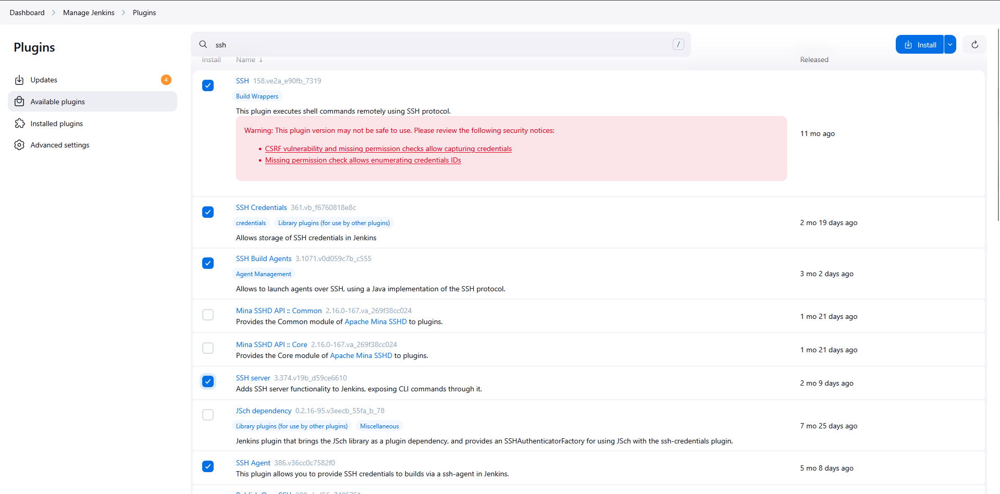

# Step 2: Configure SSH Credentials for App Servers

Go to Manage Jenkins → Manage Credentials

Click on Global credentials (unrestricted)

Click Add Credentials

Create Credentials for App Server 1:

Kind: SSH Username with private key

Scope: Global

ID: app-server-1-credentials

Description: Credentials for App Server 1 - tony

Username: tony

Passphrase: Ir0nM@n

Create Credentials for App Server 2:

Click Add Credentials again

Kind: SSH Username with private key

Scope: Global

ID: app-server-2-credentials

Description: Credentials for App Server 2 - steve

Username: steve

Passphrase: Am3ric@

Create Credentials for App Server 3:

Click Add Credentials again

Kind: SSH Username with private key

Scope: Global

ID: app-server-3-credentials

Description: Credentials for App Server 3 - banner

Username: banner

Passphrase: BigGr33n

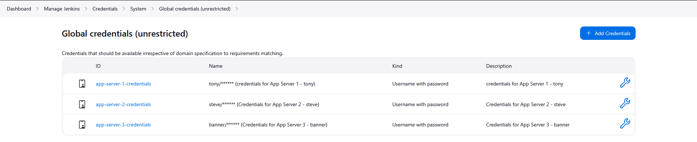

# Step 3: Configure Slave Nodes

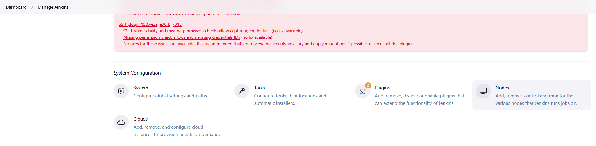

Go to Manage Jenkins → Manage Nodes

Click New Node

Configure App Server 1 Slave:

Node name: App_server_1

Select Permanent Agent

Click Create

Configure Settings:

Description: App Server 1 Slave Node

Number of executors: 2

Remote root directory: /home/tony/jenkins

Labels: stapp01

Usage: Use this node as much as possible

Launch method: Launch agents via SSH

Host: stapp01.stratos.xfusioncorp.com

Credentials: app-server-1-credentials (select from dropdown)

Host Key Verification Strategy: Non verifying Verification Strategy

Availability: Keep this agent online as much as possible

Click Save

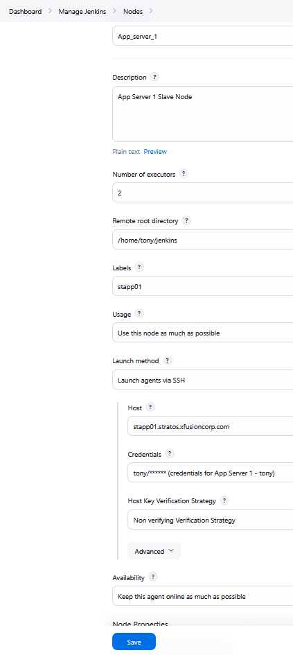

Configure App Server 2 Slave:

Click New Node

Node name: App_server_2

Select Permanent Agent

Click Create

Configure Settings:

Description: App Server 2 Slave Node

Number of executors: 2

Remote root directory: /home/steve/jenkins

Labels: stapp02

Usage: Use this node as much as possible

Launch method: Launch agents via SSH

Host: stapp02.stratos.xfusioncorp.com

Credentials: app-server-2-credentials (select from dropdown)

Host Key Verification Strategy: Non verifying Verification Strategy

Availability: Keep this agent online as much as possible

Click Save

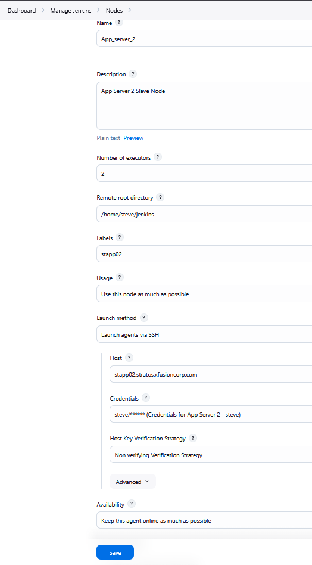

Configure App Server 3 Slave:

Click New Node

Node name: App_server_3

Select Permanent Agent

Click Create

Configure Settings:

Description: App Server 3 Slave Node

Number of executors: 2

Remote root directory: /home/banner/jenkins

Labels: stapp03

Usage: Use this node as much as possible

Launch method: Launch agents via SSH

Host: stapp03.stratos.xfusioncorp.com

Credentials: app-server-3-credentials (select from dropdown)

Host Key Verification Strategy: Non verifying Verification Strategy

Availability: Keep this agent online as much as possible

Click Save

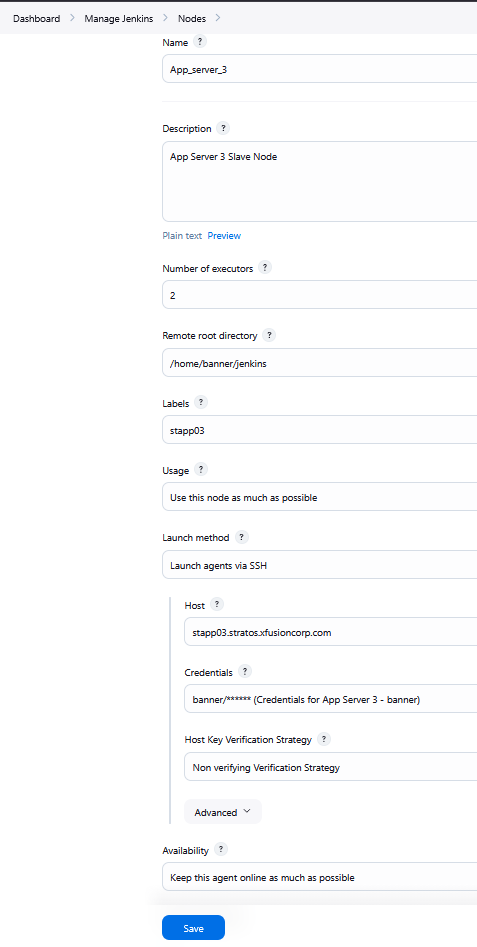

# Step 4: Verify Slave Nodes are Online

Go to Manage Jenkins → Manage Nodes 

Check the status of all three slave nodes:

App_server_1 - Should icon (online)

App_server_2 - Should icon (online)

App_server_3 - Should icon (online)

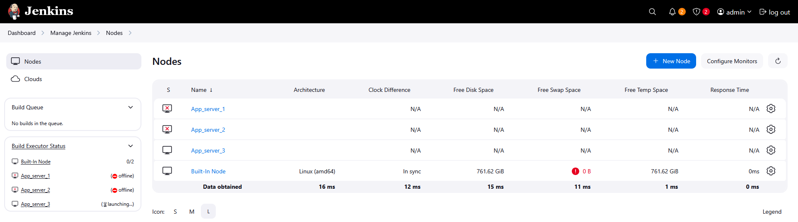

Nodes are offline.After I check java need to install on these app servers.

# Step 5: Install Java on All App Servers from Jump Host

1. Install Java 17 on CentOS Stream 9
```
sudo dnf install -y java-17-openjdk-devel
java -version
```

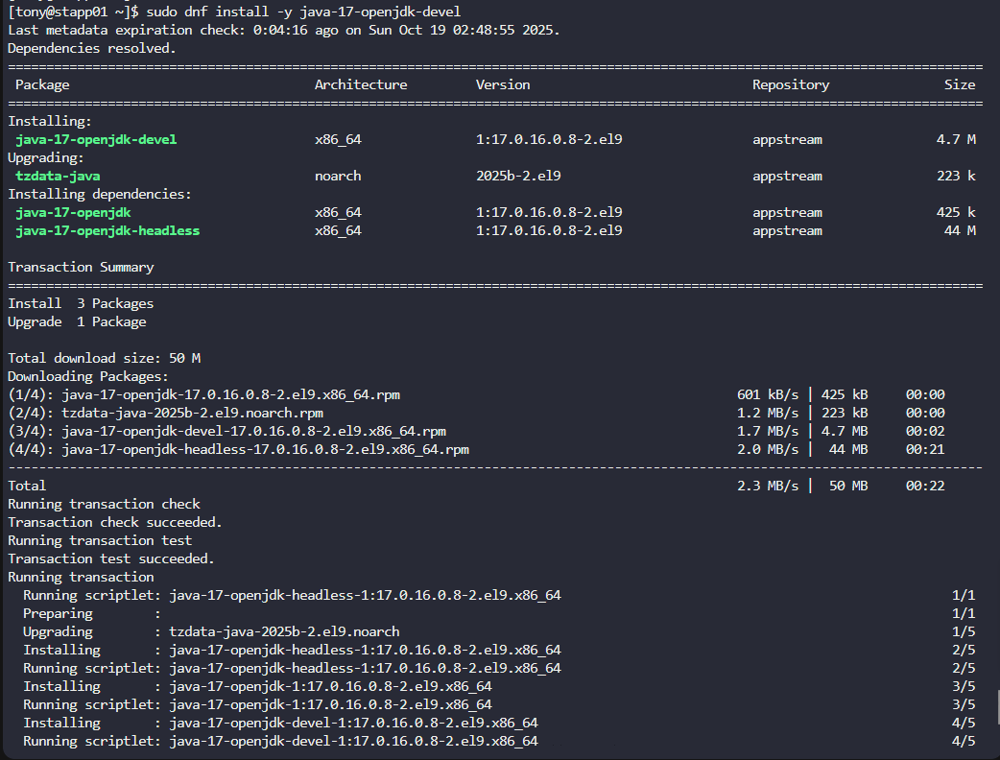

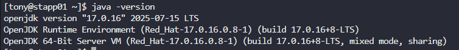

Update Jenkins Agent Configuration

Go to Jenkins → Manage Jenkins → Nodes

Select agents and do one by one

Update the "JavaPath" field to: /usr/lib/jvm/java-17-openjdk/bin/java

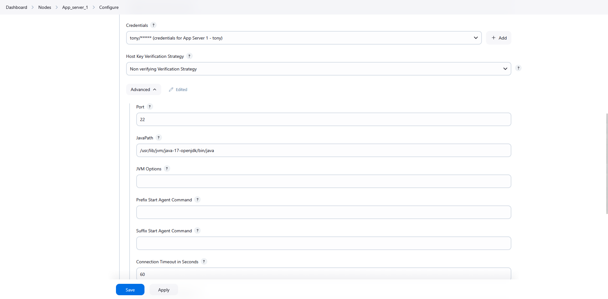

# Step 6: Verify Slave Nodes are Online

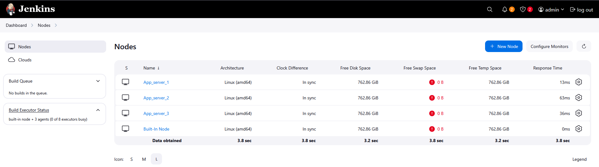