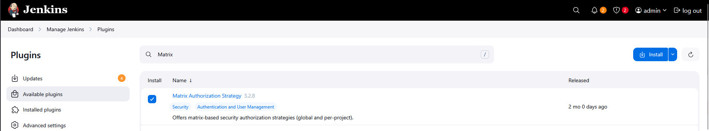
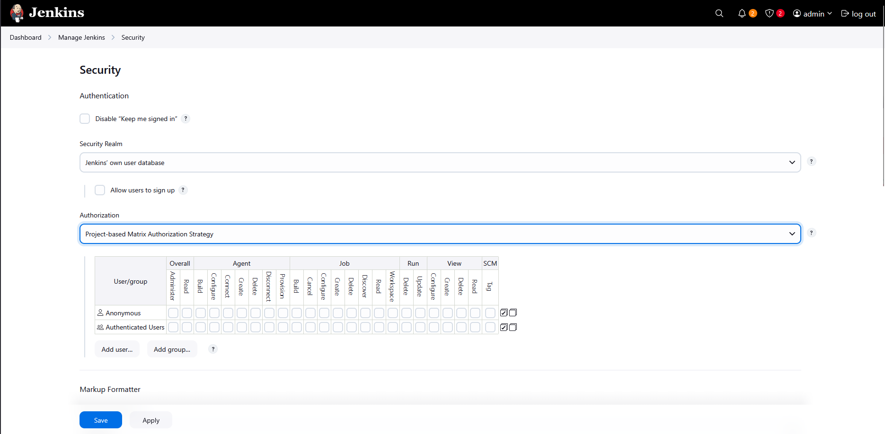
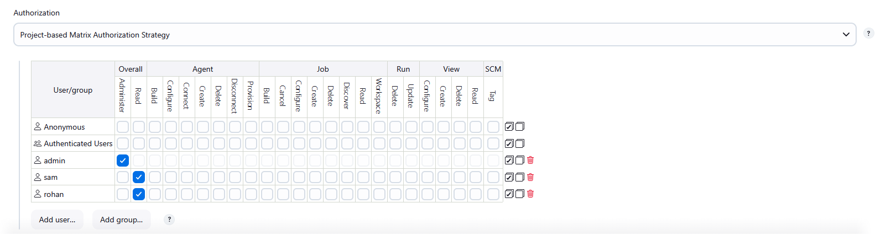
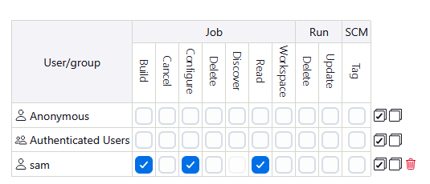
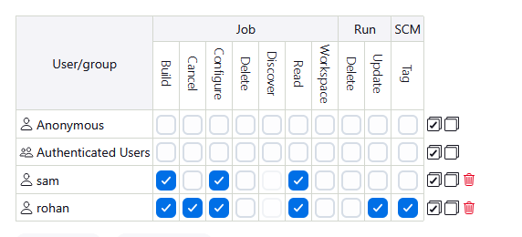

Step-by-Step Solution

# Step 1. Access Jenkins and Login

Click the Jenkins button on the top bar

Login with:

Username: admin

Password: Adm!n321

# Step 2. Navigate to the Packages Job

On the Jenkins dashboard, find and click on the "Packages" job

# Step 3. Configure Project-based Matrix Authorization

Install plugin: Matrix Authorization Strategy

# Step 4. Enable Project-based Matrix Authorization

Go to "Manage Jenkins" → "Configure Global Security"

Under "Authorization", select "Project-based Matrix Authorization Strategy"

Save the configuration

Return to the Packages job configuration

# Step 5. Set Inheritance and Add Users

Select 'Enable project-based security'

Look for "Inheritance Strategy" and select "Inherit permissions from parent ACL"

In the permission matrix section, you should see:

A text field to add users

Checkboxes for various permissions

# Step 6. Add sam user with permissions

In the user/group field, type: sam

Click "Add"

Check the following permissions for sam:

✅ Build

✅ Configure

✅ Read

# Step 7. Add rohan user with permissions

In the user/group field, type: rohan

Click "Add"

Check the following permissions for rohan:

✅ Build

✅ Cancel

✅ Configure

✅ Read

✅ Update

✅ Tag

# Step 8. Save Configuration

Scroll to the bottom of the page

Click "Save"

