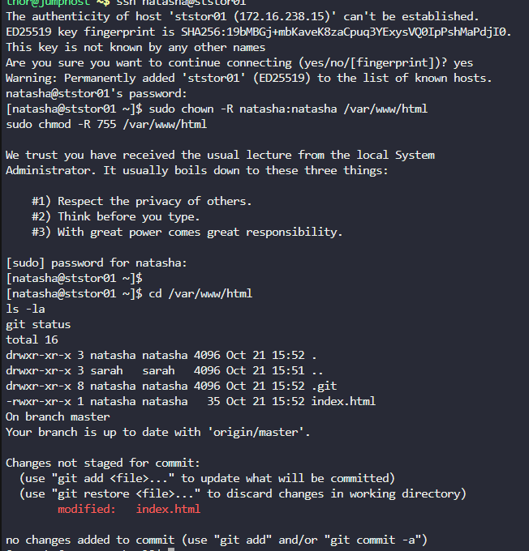
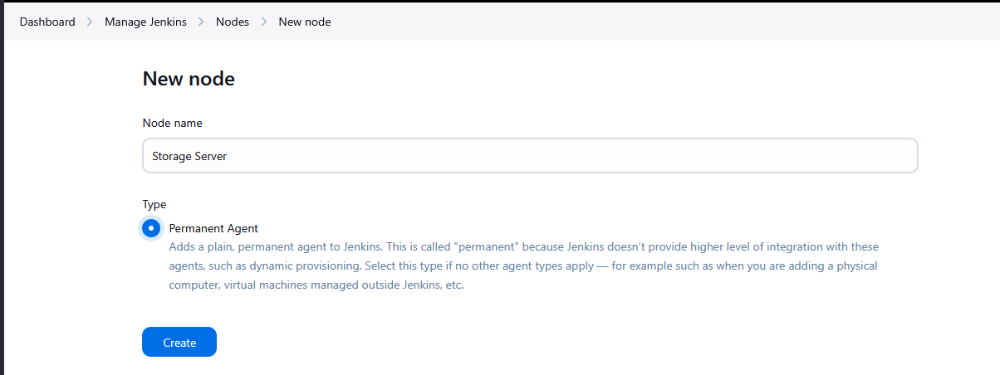
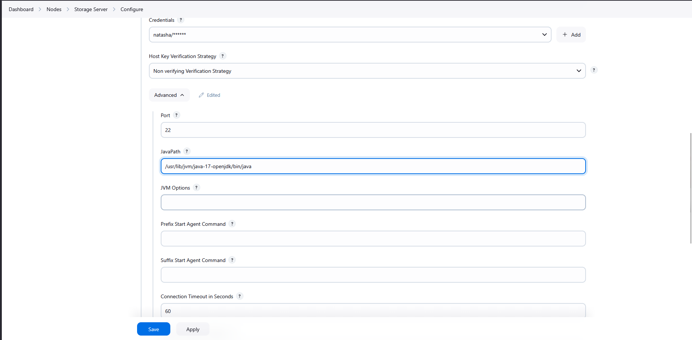
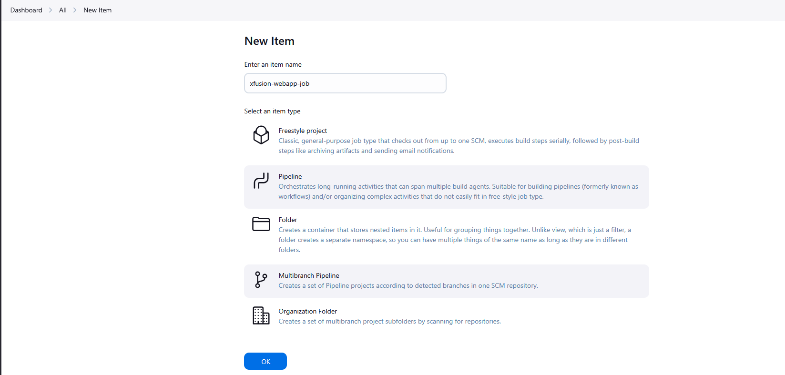
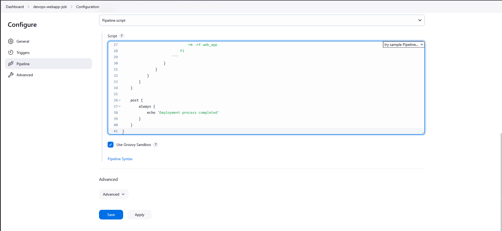
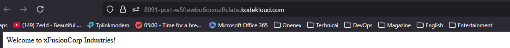

# Step 1: Access Jenkins

Click on the Jenkins button on the top bar

Login with:

Username: admin

Password: Adm!n321

Verify you can access the Jenkins dashboard

# Step 2: Install Required Plugins 
    
Go to Manage Jenkins → Manage Plugins

Install these plugins if not already installed:

Pipeline

Git

SSH Agent

SSH

SSH Build Agents

SSH Server

If plugins are installed, restart Jenkins when prompted

# Step 3: Fix Storage Server Permissions First

# From jump server, connect to Storage Server
ssh natasha@ststor01
# Password: Bl@kW

# Fix permissions for /var/www/html
sudo chown -R natasha:natasha /var/www/html
sudo chmod -R 755 /var/www/html

# Fix permissions for /var/www/html/workspace
sudo mkdir -p /var/www/html/workspace
sudo chown -R natasha:natasha /var/www/html/workspace
sudo chmod -R 755 /var/www/html/workspace

# Verify the repository exists
cd /var/www/html
ls -la
git status



# Step 4: Add Storage Server as Slave Node

In Jenkins, go to Manage Jenkins → Manage Nodes and Clouds

Click New Node

Enter node name: Storage Server

Select Permanent Agent and click Create



Configure the node with these settings:

Name: Storage Server

Description: Storage server for web app deployment

Number of executors: 2

Remote root directory: /var/www/html

Labels: ststor01

Usage: Use this node as much as possible

Launch method: Launch agent via SSH

Host: ststor01.stratos.xfusioncorp.com or 172.16.238.15

Credentials: Click Add → Jenkins

Kind: SSH Username with private key

Username: natasha

use password: Bl@kW

Host Key Verification Strategy: Non verifying Verification Strategy

Click Save

# Step 5: Install Java on All App Servers from Jump Host

1. Install Java 17 on CentOS Stream 9
```
sudo dnf install -y java-17-openjdk-devel
java -version
```

2. Update Jenkins Agent Configuration

Go to Jenkins → Manage Jenkins → Nodes

Update the "JavaPath" field to: /usr/lib/jvm/java-17-openjdk/bin/java



# Step 6: Access Gitea and Verify Repository

Click on the Gitea button on the top bar

Login with:

Username: sarah

Password: Sarah_pass123

Verify the web_app repository exists under user sarah

# Step 7: Create Jenkins Pipeline Job

Back in Jenkins, click New Item

Enter item name: xfusion-webapp-job

Select Pipeline (NOT Multibranch Pipeline)

Click OK



# Step 8: Configure the Pipeline

In the job configuration:

General Section:

Description: Pipeline for deploying web_app to storage server

Pipeline Section:

Definition: Pipeline script

Paste the following pipeline script:
```
pipeline {
    agent {
        label 'ststor01'
    }
    
    stages {
        stage('Deploy') {
            steps {
                sh '''
                    # Navigate to the web root (not workspace)
                    cd /var/www/html
                    
                    # Check what's there
                    echo "Current directory: $(pwd)"
                    ls -la
                    
                    # If web_app directory exists, move its contents to root
                    if [ -d "web_app" ]; then
                        echo "Moving content from web_app to root directory..."
                        cp -r web_app/* ./
                        rm -rf web_app
                        echo "Content moved successfully"
                    else
                        echo "Content is already at root level"
                    fi
                    
                    echo "Deployment completed"
                    ls -la
                '''
            }
        }
    }
}
```

Click Save



# Step 9: Build the Pipeline

Click Build Now to run the pipeline

Monitor the build in Build History

Check the console output for any errors


# Step 10: Verify Deployment

Click on the App button on the top bar to access the application

Verify that the website loads correctly at the main URL without any subdirectories

The content should be accessible directly at https://<LBR-URL> (not https://<LBR-URL>/web_app)


