# Access Jenkins and Install Required Plugins

Login to Jenkins:

Click on the Jenkins button on the top bar

Username: admin

Password: Adm!n321

# Install Plugin

Go to Manage Jenkins → Manage Plugins

Click on Available tab

Search for "Pipeline" and install "Pipeline"

Restart Jenkins when installation completes

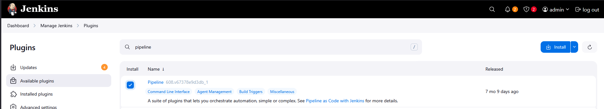

# Install Java

Log in to Natash Server and type these commands
```
sudo yum install -y java-17-openjdk screen
```

# Update Jenkins URL

Navigate to: Dashboard → Manage Jenkins → System

Update Jenkins URL configuration

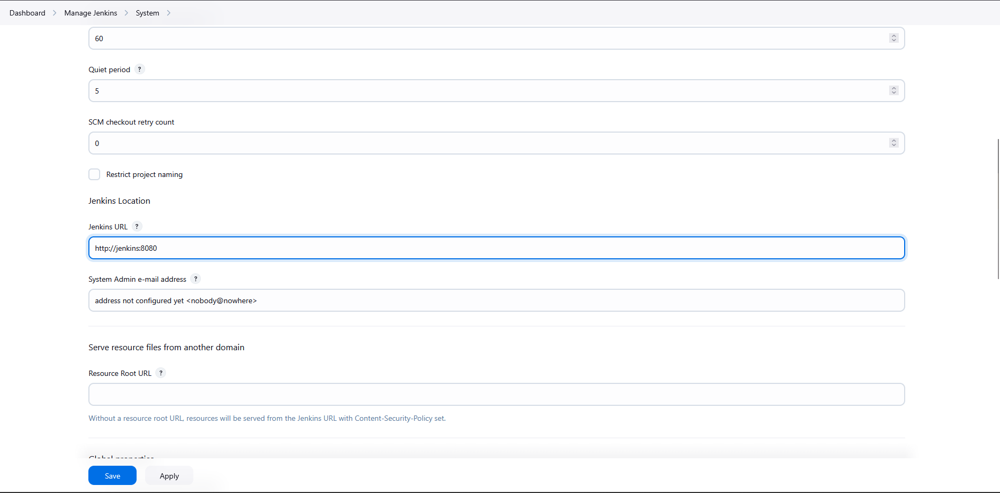

# Add Nodes

Go to: Dashboard → Manage Jenkins → Nodes

Add new node for the storage server

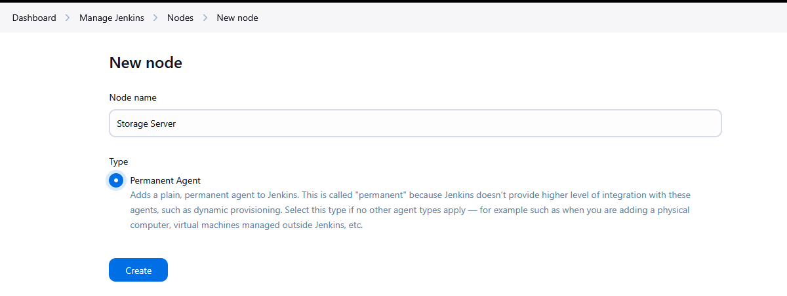

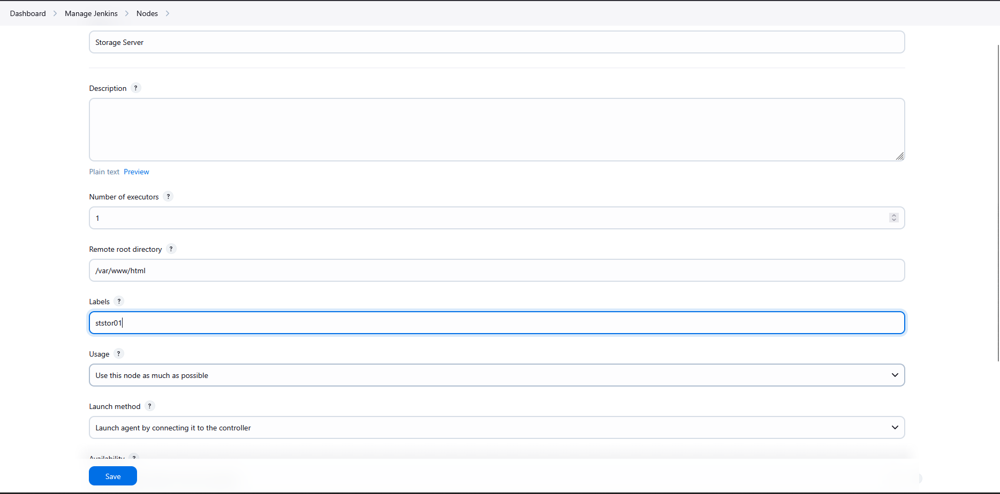

# Run the following commands on the Natash server:

```
curl -sO http://jenkins:8080/jnlpJars/agent.jar
ls
screen -S jenkins
sudo java -jar agent.jar -url http://jenkins:8080/ -secret bc600056194a3a381539dc5203bba803ef6c62eca90f83553f35ae428fd6d6f4 -name "Storage Server" -webSocket -workDir "/var/www/html"
```
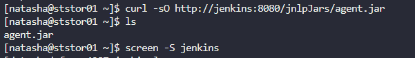

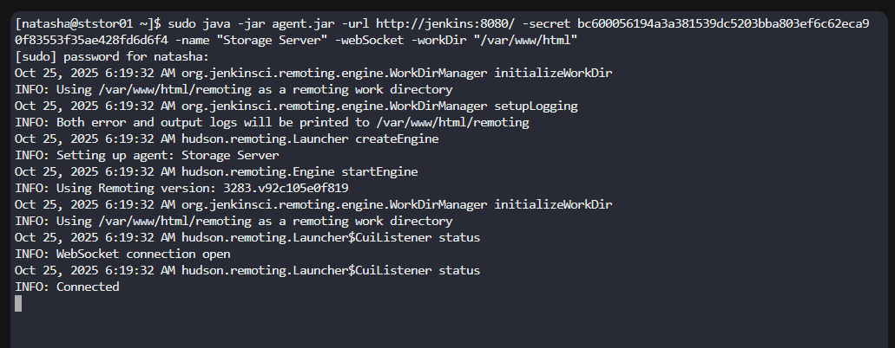

Exit screen session using Ctrl + A + D

# Configure Git Repository

```
cd /var/www/html/
ls
git status
git config --global --add safe.directory /var/www/html
sudo !!
git status
git branch
```

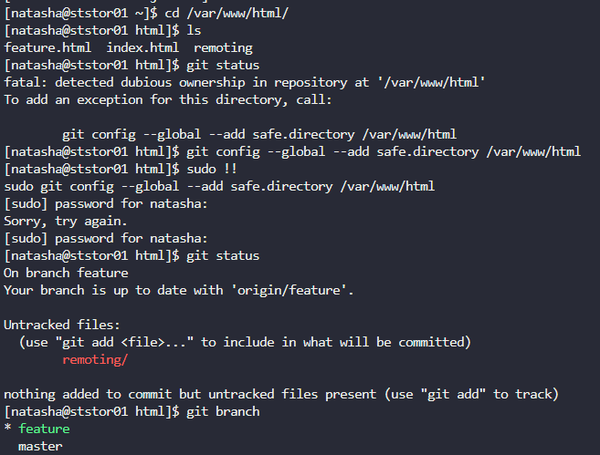


# Pipeline Configuration

Jenkins Job Setup

Create a new Pipeline job in Jenkins

Use the following pipeline script:

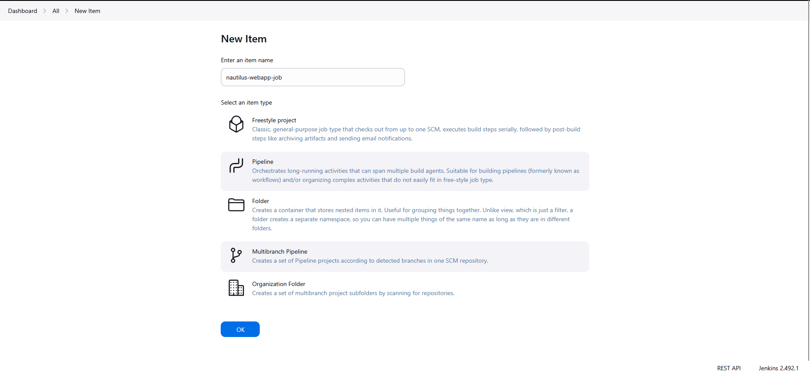

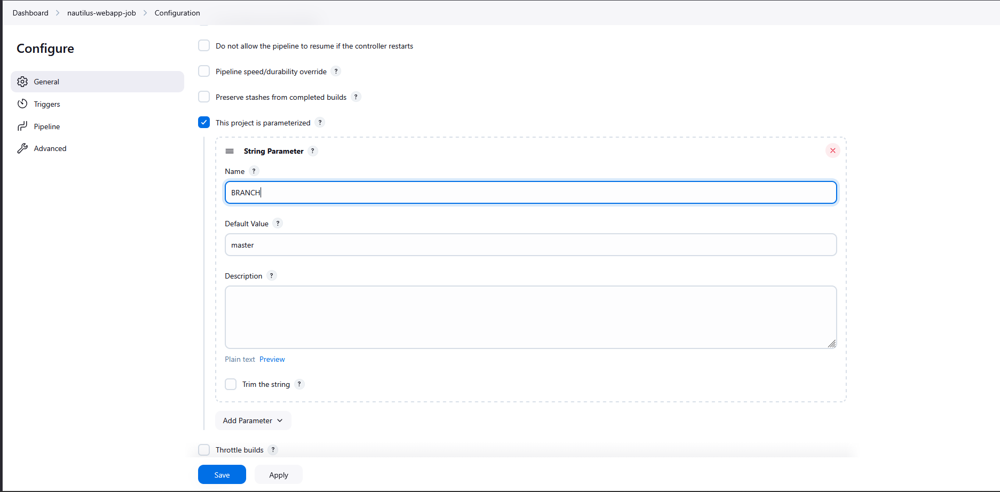

```
pipeline {
    agent { label 'ststor01' }
    
    parameters {
        string(name: 'BRANCH', defaultValue: 'master', description: 'BRANCH NAME')
    }

    stages {
        stage('Deploy') {
            steps {
                echo 'Starting Deployment'
                script {
                    if (params.BRANCH == 'master') {
                        echo 'Deploy on Master'
                        sh '''
                            cd /var/www/html
                            git fetch
                            git checkout master
                            git pull origin master
                        '''
                    } else if (params.BRANCH == 'feature') { 
                        echo 'Deploy on feature'
                        sh '''
                            cd /var/www/html
                            git fetch
                            git checkout feature
                            git pull origin feature
                        '''
                    } else {
                        echo 'Nothing to do'
                    }
                }
            }
        }
    }
}
```

Add this code to pipeline script and then click `Save`

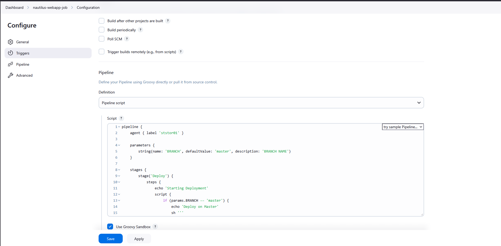

# Running Deployments

Navigate to the Jenkins job

Click Build with Parameters

Select the target branch:

master - Deploys from master branch

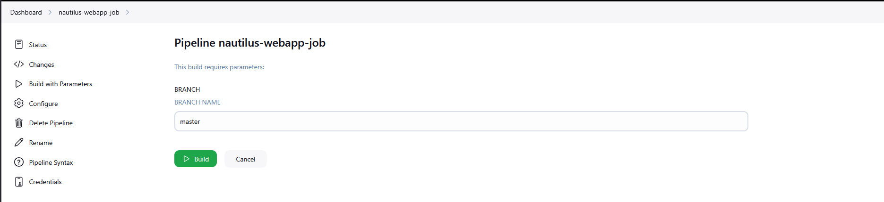

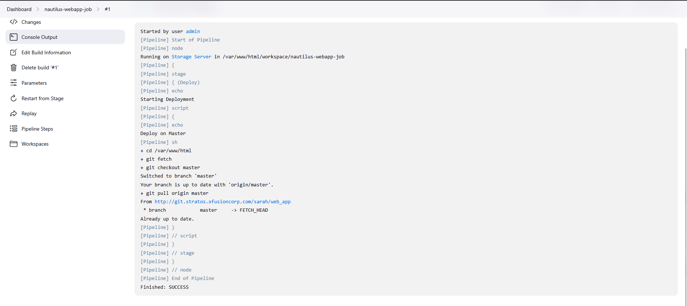

feature - Deploys from feature branch

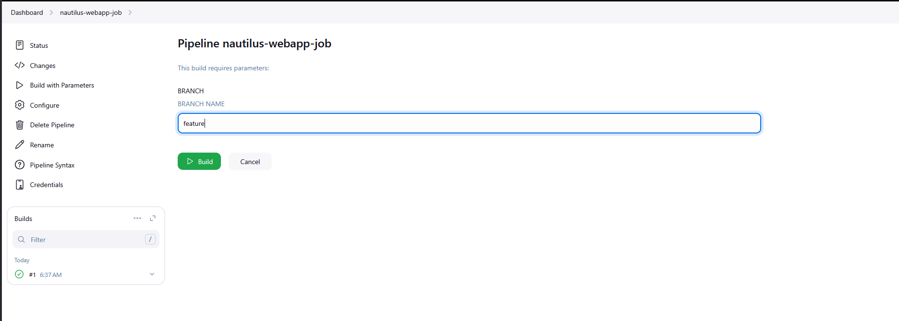

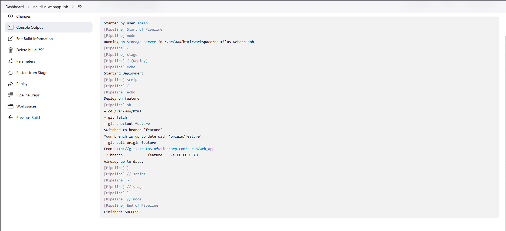