# Install httpd and Update ports to all app servers
```
sudo yum install -y httpd
```

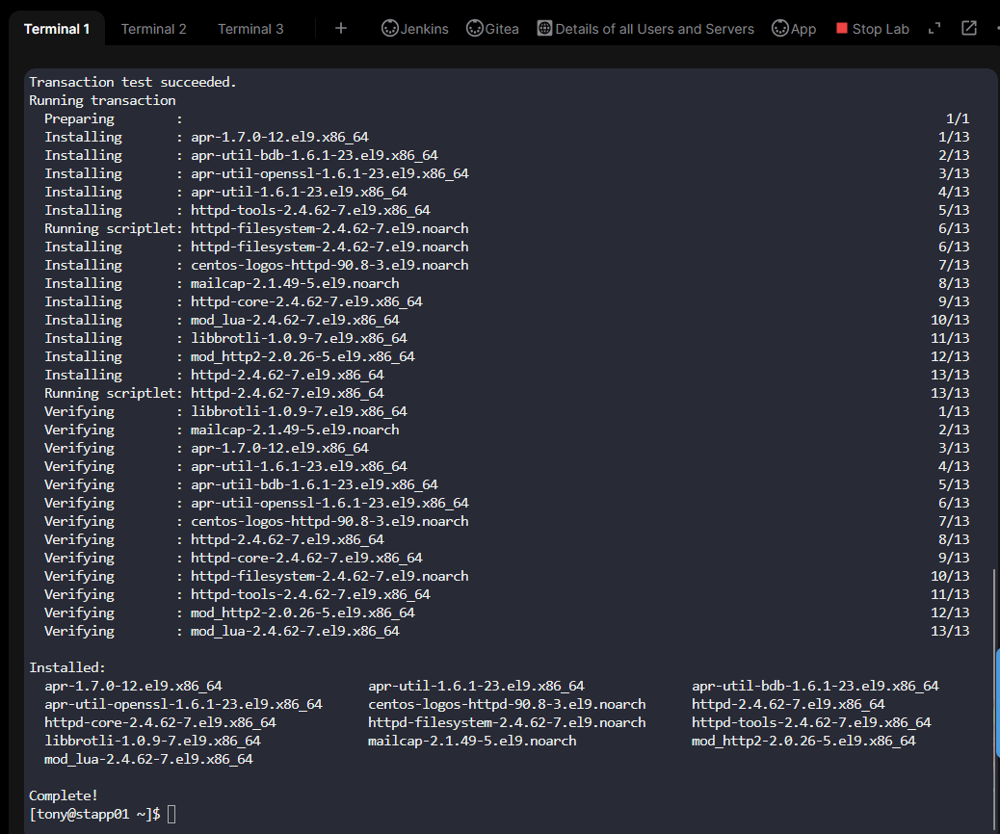
```
cat /etc/httpd/conf/httpd.conf | grep Listen
sudo sed  -i 's/^Listen 80/Listen 8080/' /etc/httpd/conf/httpd.conf
cat /etc/httpd/conf/httpd.conf | grep Listen
sudo systemctl enable --now httpd
curl localhost:8080
```

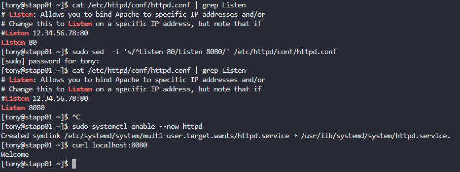

# Update Jenkins URL 

Dashboard >     Manage Jenkins >     System


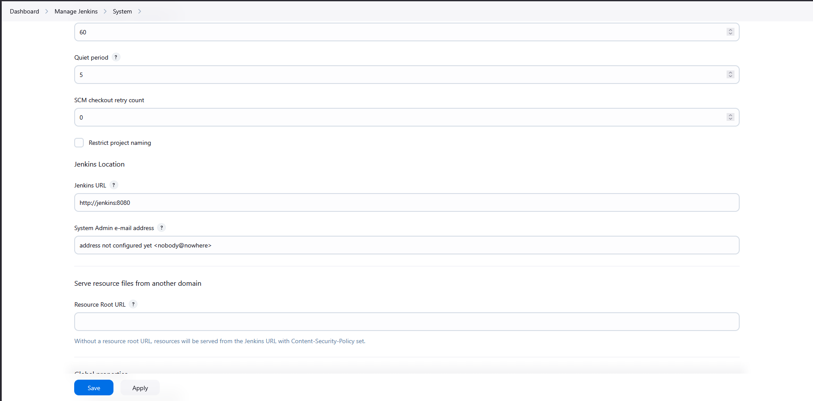

# Install Plugins

Dashboard > Manage Jenkins > Plugins

Select `Git` and Install

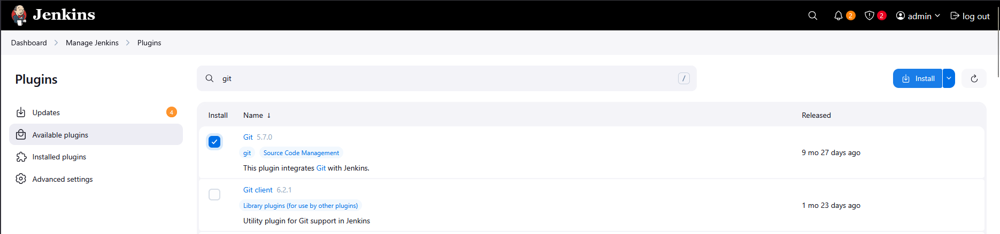


# Add Credentials

Dashboard > Manage Jenkins > Credentials > System > Global credentials (unrestricted)

Username : sarah
Password : Sarah_pass123
ID : sarah


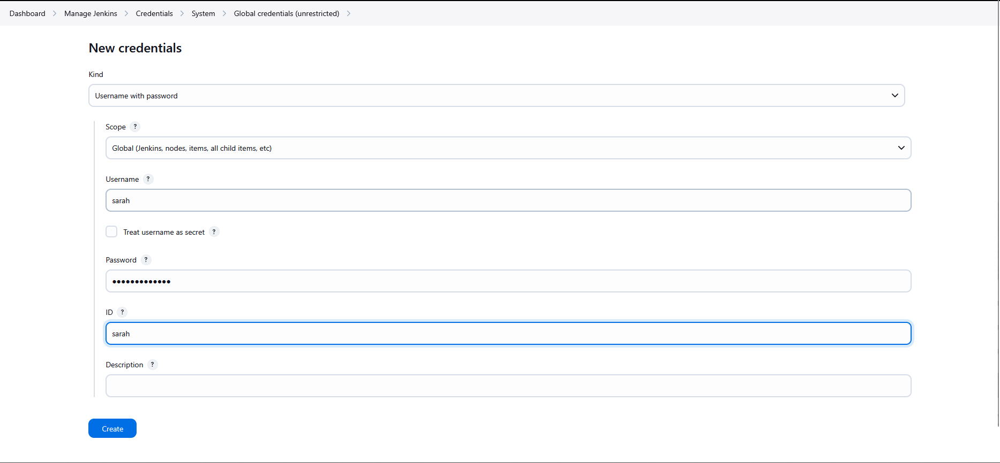

# Add Nodes

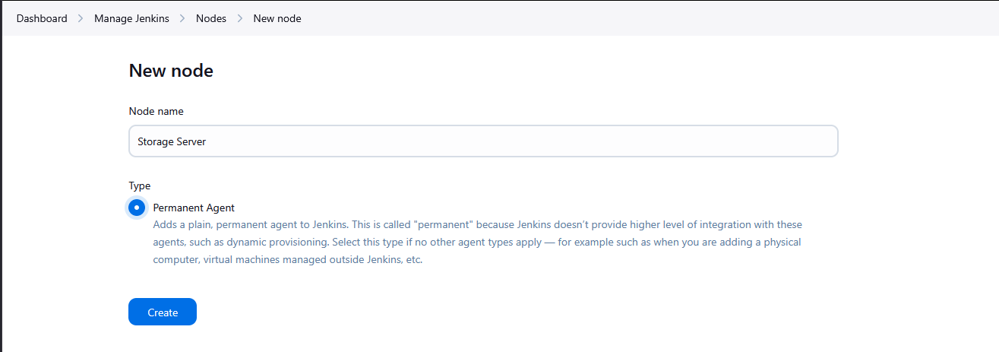

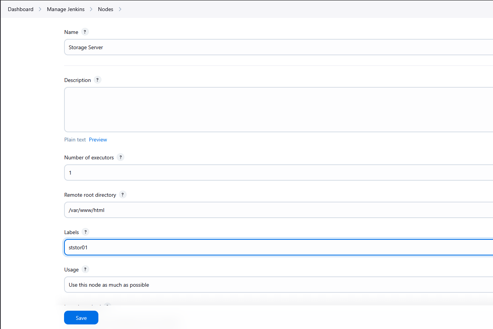


# Install Storage Server on Natasha Server

```
cd /var/www/html/
ls -la
git status
git config --global --add safe.directory /var/www/html
sudo !!
cd ~
sudo yum install -y java-17-openjdk screen
```

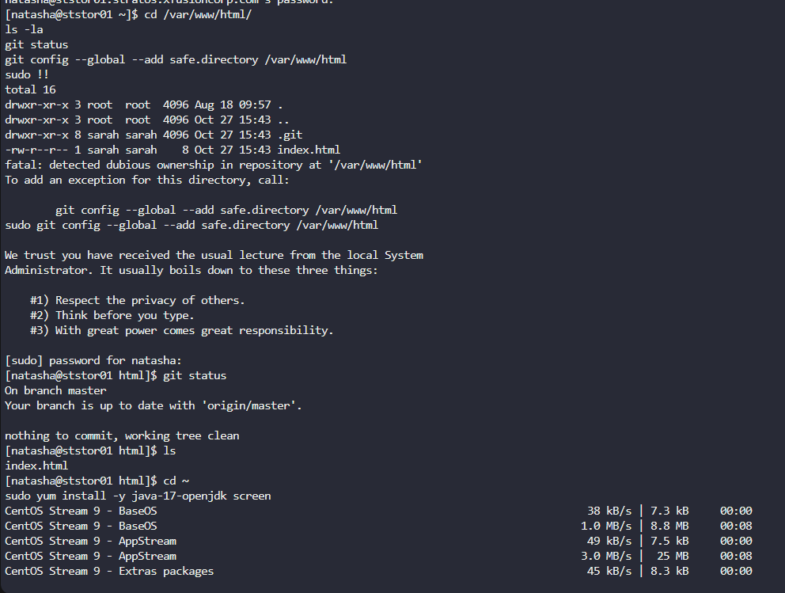

```
ls -lah /var/www/html
sudo chown -R sarah:sarah /var/www/html
ls -lah /var/www/html
```

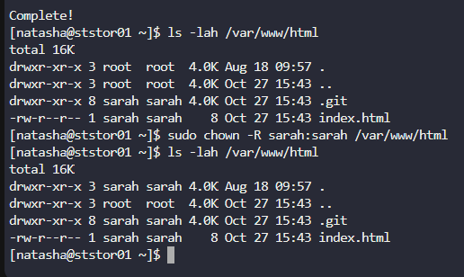

```
curl -sO http://jenkins:8080/jnlpJars/agent.jar
ls
screen -S jk
sudo java -jar agent.jar -url http://jenkins:8080/ -secret 704997eee1caa9bba99575eae0b524545eed2569158b17fd2be1cbd080d1ad49 -name "Storage Server" -webSocket -workDir "/var/www/html"
```


# Create Job

Dashboard > New Item

`nautilus-app-deployment`

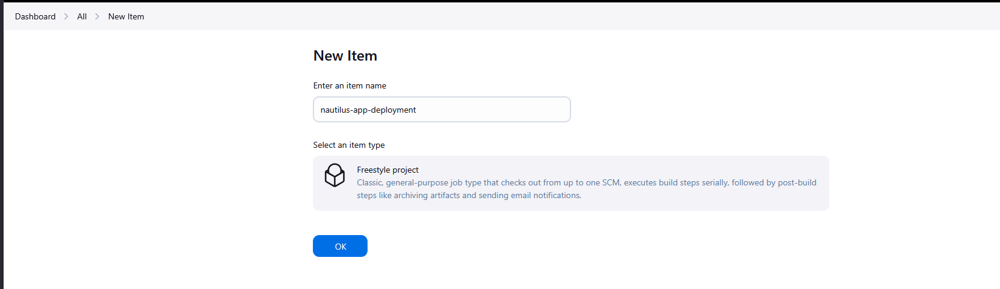

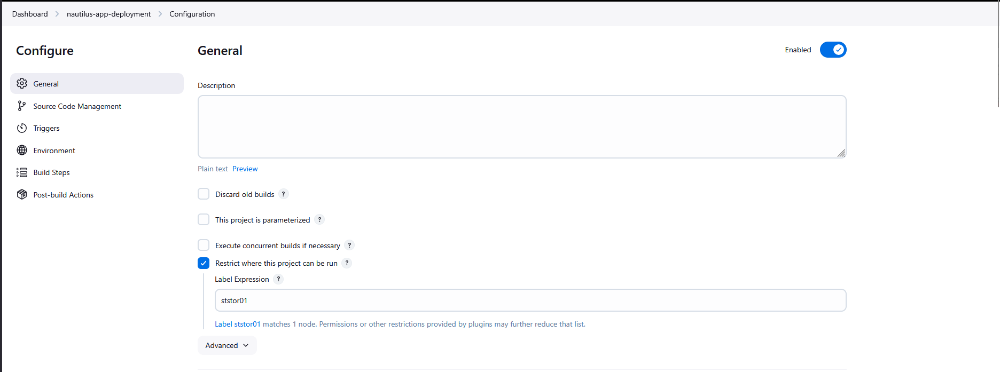

# Insert Gitea repo link

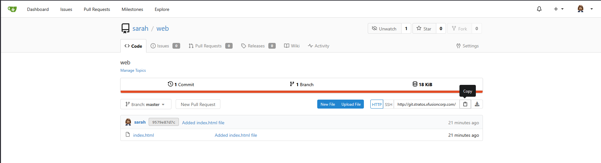

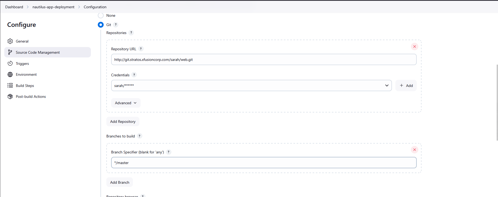

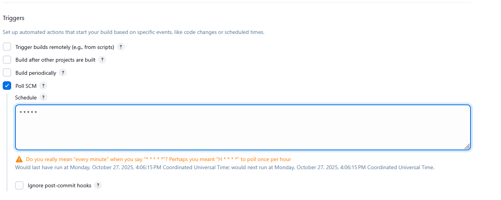

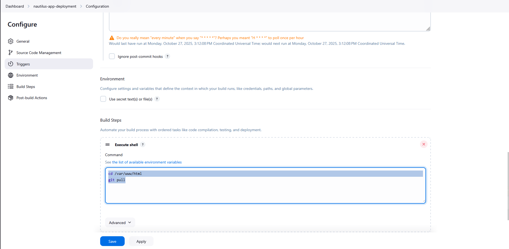

# Log in with sarah and update index.html

```
ssh sarah@ststor01
ls
cd web/
ls
git status
cat index.html
vi index.html
git status
git add index.html 
git commit -m "first deployment"
git push
cd /var/www/html/
git log
```

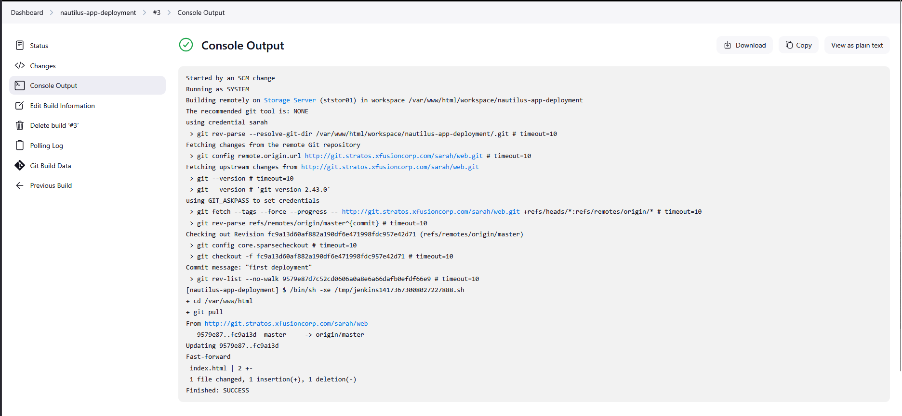

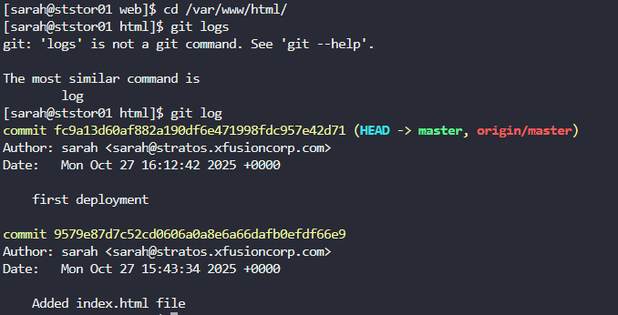

#  Use curl commands from all app servers

```
curl localhost:8080
```

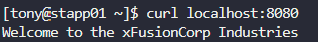

# Check from Browser app

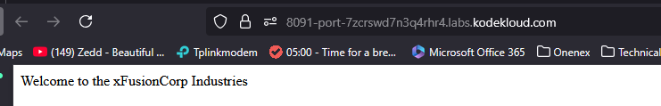

***