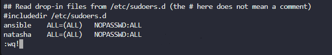
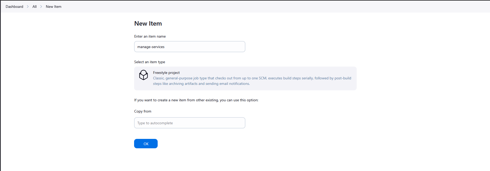

# Create keygen from Thor Host 

```
ssh-keygen -t ed25519
ssh-copy-id natasha@ststor01
ssh natasna@ststor01
sudo visudo
```



# Please do all app server like this
```
ssh-copy-id tony@stapp01
ssh tony@stapp01
sudo vi sudo
```

# Install SSH Agent plugin


# Check Repository


# Add Credential


# Create job


```
ssh -o StrictHostKeyChecking=no natasha@ststor01 "cd /var/www/html && sudo git checkout master && sudo git pull origin master"
```


# Create another job




```
ssh -o StrictHostKeyChecking=no tony@stapp01 "sudo systemctl restart httpd"
ssh -o StrictHostKeyChecking=no steve@stapp02 "sudo systemctl restart httpd"
ssh -o StrictHostKeyChecking=no banner@stapp03 "sudo systemctl restart httpd"
```

# Build from nautilus-app-deployment

Click `Build Now`


***


# Lesson Learn

The Fundamental Rule

Public Key = Lock 🔒
Private Key = Key 🔑

You give your PUBLIC key (lock) to others - they use it to encrypt data that only you can decrypt

You keep your PRIVATE key (key) secure - only you use it to decrypt data encrypted with your public key

When to Use Which Key?
Scenario 1: SSH Authentication (EC2, servers, etc.)

You add your PUBLIC key to the remote server


Your Machine (client)              Remote Server (ststor01, EC2, etc.)
Private Key: id_ed25519    →→→→    Public Key: ~/.ssh/authorized_keys

Why?

Server needs to verify that you own the private key

Server stores your public key in authorized_keys

When you connect, server sends a challenge encrypted with your public key

Only your private key can decrypt it and prove your identity

Scenario 2: Accessing Remote Services (Jenkins, Git, etc.)

You add your PRIVATE key to the service/client


Your Machine (server)               Jenkins/Git Client
Private Key: id_rsa         ←←←←    Client needs private key to authenticate

Why?

Jenkins/Git needs to authenticate TO remote servers ON YOUR BEHALF

The client (Jenkins) acts as the SSH client and needs your private key

Example: Jenkins pulling code from Git → needs private key to authenticate to Git server

Detailed Examples
Example 1: EC2 Instance (Public Key)


# You generate key pair locally
ssh-keygen -t rsa  # Creates id_rsa (private) and id_rsa.pub (public)

# You give PUBLIC key to EC2 (during instance creation or via ssh-copy-id)
ssh-copy-id user@ec2-instance

# EC2 stores your PUBLIC key in ~/.ssh/authorized_keys

Example 2: Jenkins (Private Key)


# You generate key pair
ssh-keygen -t rsa

# You give PUBLIC key to Git server (GitHub/GitLab)
# Copy id_rsa.pub to GitHub SSH keys

# You give PRIVATE key to Jenkins
# Add id_rsa to Jenkins credentials for Git operations

Why Jenkins needs private key:

Jenkins needs to clone your repository from GitHub

GitHub has your public key

Jenkins uses your private key to prove it's authorized

Visual Flow


Your Machine:
├── Private Key (id_rsa) → Give to: Jenkins, CI/CD tools, SSH clients
└── Public Key (id_rsa.pub) → Give to: Servers, GitHub, GitLab, etc.

Remote Server:
└── authorized_keys → Contains PUBLIC keys of allowed users

GitHub/GitLab:
└── SSH Keys → Contains PUBLIC keys of users/machines

Simple Rule of Thumb
If the service...	Then add...	Because...
You connect TO it (SSH, servers)	PUBLIC key	Server needs to verify your identity
Connects FOR you (Jenkins, CI/CD)	PRIVATE key	Service needs to authenticate on your behalf
Stores your identity (GitHub)	PUBLIC key	They need to know who you are
Security Note

NEVER share your private key indiscriminately. Only give it to trusted services that need to act on your behalf, and use passphrases for additional security.

This explains why EC2 needs your public key (you're connecting TO it) while Jenkins needs your private key (it's connecting FOR you).

***