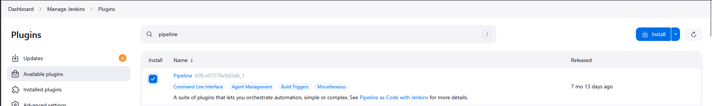
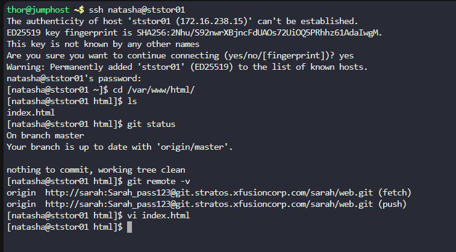
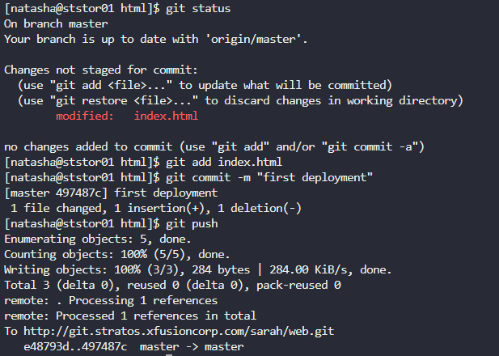
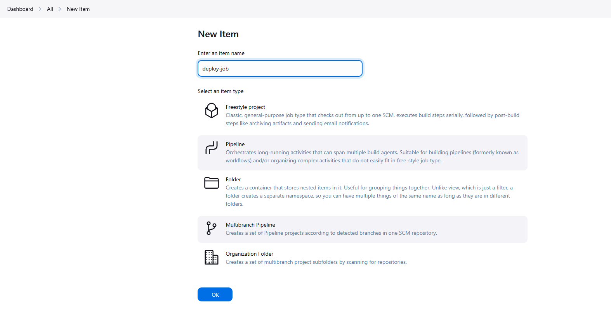
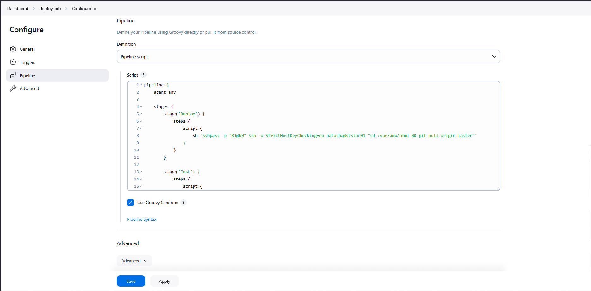
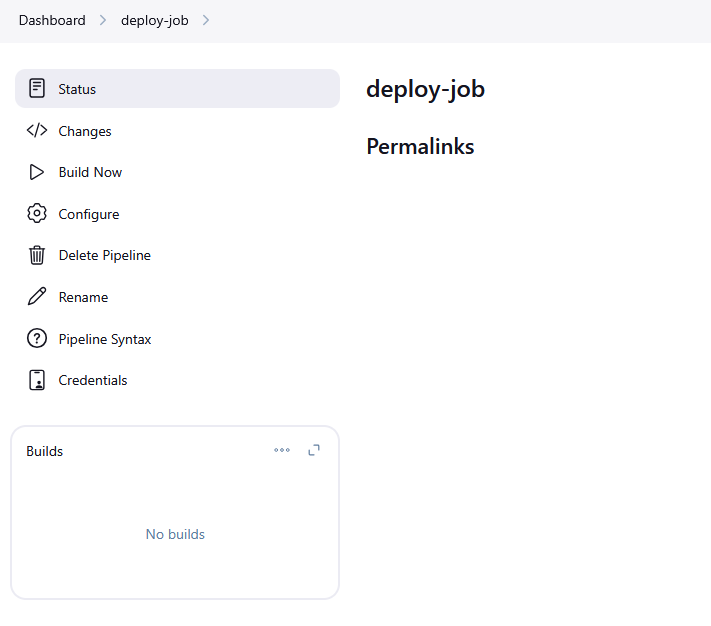
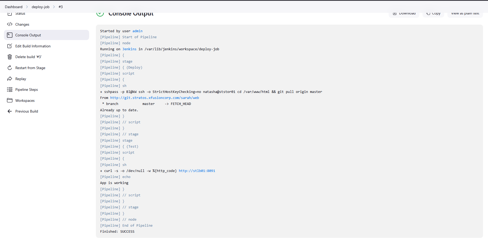

# Installation Steps:

Navigate to Jenkins Dashboard → Manage Jenkins → Plugins

Select Available plugins tab

Search and install pipeline plugins

Restart Jenkins after installation

# Install plugin




# Repository Configuration

Verify Git repository access from the target server:

```
ssh natasha@ststor01
cd /var/www/html/
git status
git remote -v
vi index.html 
```



# Commit and Push Changes

```
git status
git add index.html
git commit -m "first deployment"
git push
```



# Jenkins Pipeline Configuration

# Create New Pipeline

Navigate to Jenkins Dashboard → New Item

Enter pipeline name 

Select Pipeline project type

Click OK



# Pipeline Script Implementation

```
pipeline {
    agent any

    stages {
        stage('Deploy') {
            steps {
                script {
                    sh 'sshpass -p "Bl@kW" ssh -o StrictHostKeyChecking=no natasha@ststor01 "cd /var/www/html && git pull origin master"' 
                }
            }
        }
        
        stage('Test') {
            steps {
                script {
                    def response_code = sh(script: "curl -s -o /dev/null -w '%{http_code}' http://stlb01:8091", returnStdout: true).trim()
                    if (response_code != '200') {
                        error("App not working after deployment. Http Code ${response_code}")
                    } else {
                        echo "App is working"
                    }
                }
            }
        }
    }
}
```




# Pipeline Execution & Monitoring

Run Initial Build

Click Build Now on the pipeline page

Monitor real-time execution in Console Output





***