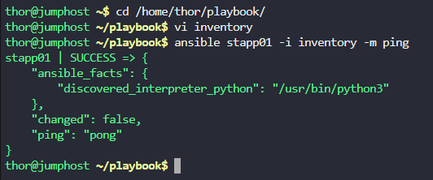

# Step 1: Create the inventory file


# Navigate to the playbook directory
```
cd /home/thor/playbook/
```

# Create the inventory file
```
vi inventory
```

# Step 2: Add App Server 1 with the correct credentials

Press i to enter insert mode and add the following content:
```
[app_servers]
stapp01 ansible_host=172.16.238.10 ansible_user=tony ansible_ssh_pass=Ir0nM@n ansible_connection=ssh
```

# Step 3: Test the inventory


# Test the connection to stapp01
```
ansible stapp01 -i inventory -m ping
```



***