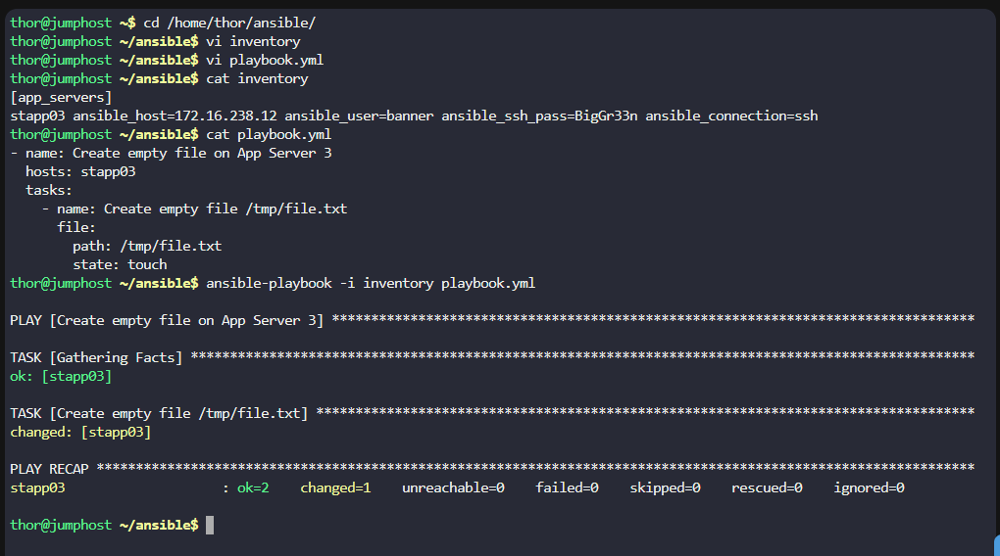

# Step 1: Navigate to the Ansible directory
```
cd /home/thor/ansible/
```

# Step 2: Update the inventory file for App Server 3

From your previous connection information, App Server 3 (stapp03) has:

IP: 172.16.238.12

User: banner

Password: BigGr33n

Edit the inventory file:
```
vi inventory
```

Add the following content:
```
[app_servers]
stapp03 ansible_host=172.16.238.12 ansible_user=banner ansible_ssh_pass=BigGr33n ansible_connection=ssh
```

Save and exit:

Press ESC

Type :wq

Press Enter

# Step 3: Create the playbook file
```
vi playbook.yml
```

Step 4: Add the playbook content

Press i to enter insert mode and add the following YAML content:

```
---
- name: Create empty file on App Server 3
  hosts: stapp03
  tasks:
    - name: Create empty file /tmp/file.txt
      file:
        path: /tmp/file.txt
        state: touch
```

Save and exit:

    Press ESC

    Type :wq

    Press Enter

# Step 5: Verify the files

Check that both files are created with correct content:
```
# Check inventory file
cat inventory

# Check playbook file
cat playbook.yml
```

# Step 6: Test the playbook
```
ansible-playbook -i inventory playbook.yml
```



***