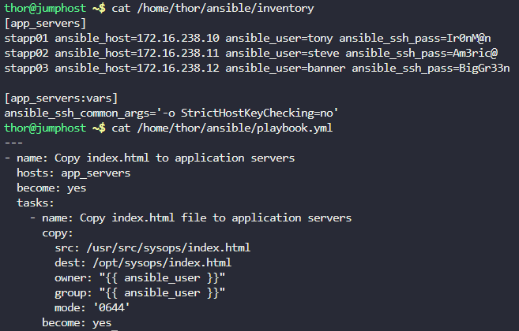
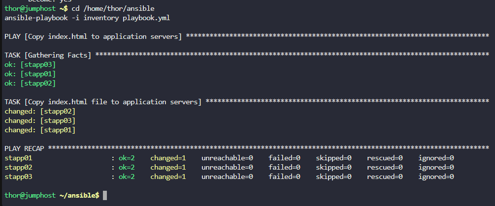

# Step 1: Create the Inventory File

Since we're copying to application servers only, we'll include stapp01, stapp02, and stapp03:

# Create the inventory file
```
cat > /home/thor/ansible/inventory << EOF
[app_servers]
stapp01 ansible_host=172.16.238.10 ansible_user=tony ansible_ssh_pass=Ir0nM@n
stapp02 ansible_host=172.16.238.11 ansible_user=steve ansible_ssh_pass=Am3ric@
stapp03 ansible_host=172.16.238.12 ansible_user=banner ansible_ssh_pass=BigGr33n

[app_servers:vars]
ansible_ssh_common_args='-o StrictHostKeyChecking=no'
EOF
```

# Step 2: Create the Playbook

Now create the playbook file:
```
cat > /home/thor/ansible/playbook.yml << EOF
---
- name: Copy index.html to application servers
  hosts: app_servers
  become: yes
  tasks:
    - name: Copy index.html file to application servers
      copy:
        src: /usr/src/sysops/index.html
        dest: /opt/sysops/index.html
        owner: "{{ ansible_user }}"
        group: "{{ ansible_user }}"
        mode: '0644'
      become: yes
EOF
```

# Step 3: Verify the Files

Let's verify both files were created correctly:
```
# Check inventory file
cat /home/thor/ansible/inventory

# Check playbook file
cat /home/thor/ansible/playbook.yml
```



# Step 4: Test the Playbook

Now you can test the playbook with the validation command:
```
cd /home/thor/ansible
ansible-playbook -i inventory playbook.yml
```



***
