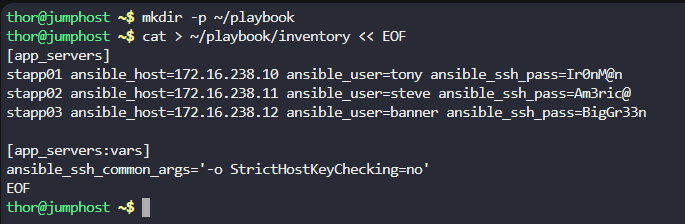
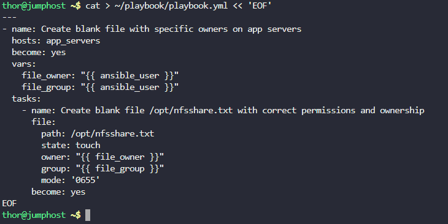
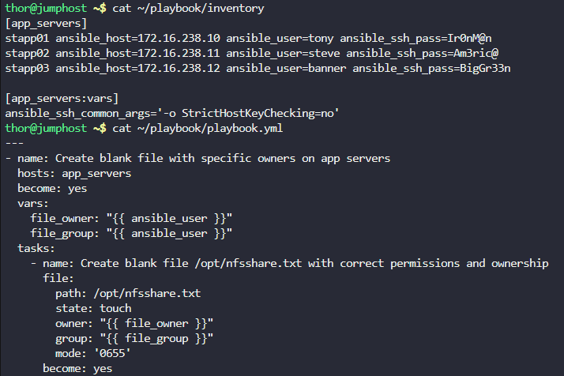
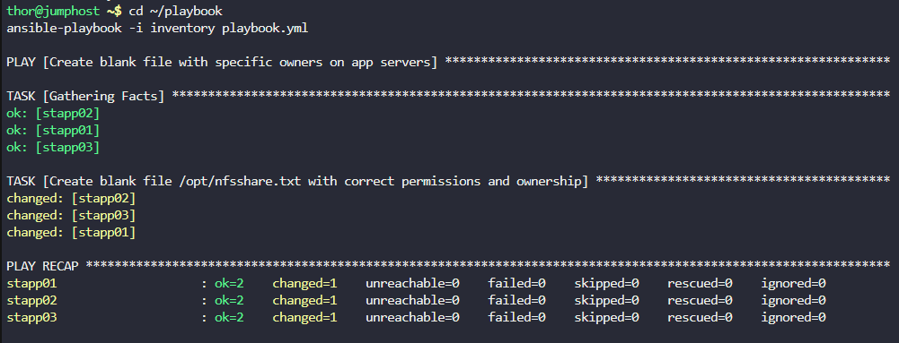

# Step 1: Create the Inventory File
```
# Create the directory if it doesn't exist
mkdir -p ~/playbook

# Create the inventory file
cat > ~/playbook/inventory << EOF
[app_servers]
stapp01 ansible_host=172.16.238.10 ansible_user=tony ansible_ssh_pass=Ir0nM@n
stapp02 ansible_host=172.16.238.11 ansible_user=steve ansible_ssh_pass=Am3ric@
stapp03 ansible_host=172.16.238.12 ansible_user=banner ansible_ssh_pass=BigGr33n

[app_servers:vars]
ansible_ssh_common_args='-o StrictHostKeyChecking=no'
EOF
```



# Step 2: Create the Playbook

Now create the playbook that will handle the file creation with specific owners for each server:
```
cat > ~/playbook/playbook.yml << 'EOF'
---
- name: Create blank file with specific owners on app servers
  hosts: app_servers
  become: yes
  vars:
    file_owner: "{{ ansible_user }}"
    file_group: "{{ ansible_user }}"
  tasks:
    - name: Create blank file /opt/nfsshare.txt with correct permissions and ownership
      file:
        path: /opt/nfsshare.txt
        state: touch
        owner: "{{ file_owner }}"
        group: "{{ file_group }}"
        mode: '0655'
      become: yes
EOF
```


# Step 3: Verify the Files

Let's check that both files were created correctly:
```
# Check inventory file
cat ~/playbook/inventory

# Check playbook file  
cat ~/playbook/playbook.yml
```



# Step 4: Test the Playbook

Run the playbook to test it:
```
cd ~/playbook
ansible-playbook -i inventory playbook.yml
```



Explanation
```
What the Playbook Does:

    Creates the file: Uses the file module with state: touch to create a blank file at /opt/nfsshare.txt

    Sets permissions: The mode: '0655' sets the file permissions to:

        Owner: read, write, execute (6 = rw-)

        Group: read, execute (5 = r-x)

        Others: read, execute (5 = r-x)

    Sets ownership:

        On stapp01: owner and group will be tony

        On stapp02: owner and group will be steve

        On stapp03: owner and group will be banner

File Permission Explanation:

    0655 in octal means:

        0 - no special permissions (setuid, setgid, sticky bit)

        6 - owner can read and write (rw-)

        5 - group can read and execute (r-x)

        5 - others can read and execute (r-x)

The playbook will work exactly as required and can be executed with the validation command: ansible-playbook -i inventory playbook.yml
```

***