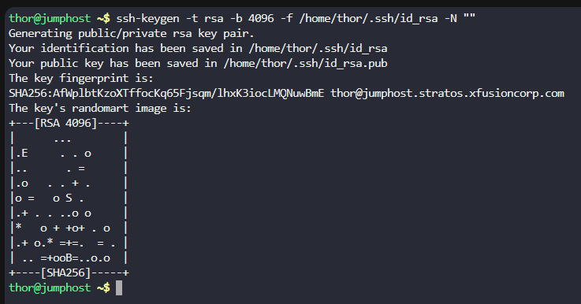
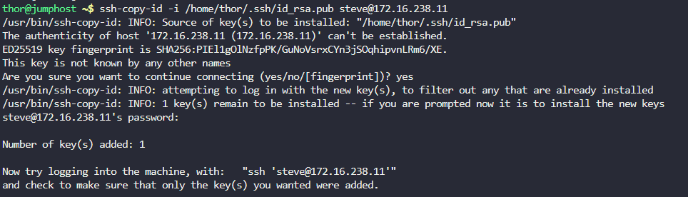
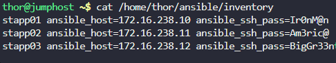
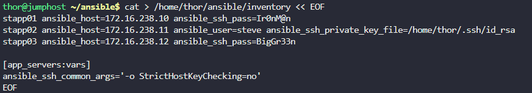
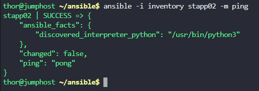

# Step 1: Generate SSH Key Pair on Jump Host

First, let's generate an SSH key pair for the thor user on the jump host:
```
# Generate SSH key pair (if not already exists)
ssh-keygen -t rsa -b 4096 -f /home/thor/.ssh/id_rsa -N ""
```



# Step 2: Copy the Public Key to App Server 2

Now, let's copy the public key to App Server 2 (stapp02). We'll use the password provided to authenticate:

```
# Copy SSH public key to App Server 2
ssh-copy-id -i /home/thor/.ssh/id_rsa.pub steve@172.16.238.11
```

When prompted for the password, enter: `Am3ric@`



# Step 3: Verify SSH Connection

Test the SSH connection to ensure it works without a password:

```
# Test SSH connection to App Server 2
ssh steve@172.16.238.11 "hostname"
```

This should return stapp02.stratos.xfusioncorp.com without asking for a password.


# Step 4: Check/Update the Inventory File

Let's check the existing inventory file and ensure it's properly configured:
```
# Check the inventory file
cat /home/thor/ansible/inventory
```




```
# Update the inventory file with proper formatting
cat > /home/thor/ansible/inventory << EOF
[app_servers]
stapp01 ansible_host=172.16.238.10 ansible_user=tony ansible_ssh_pass=Ir0nM@n
stapp02 ansible_host=172.16.238.11 ansible_user=steve ansible_ssh_private_key_file=/home/thor/.ssh/id_rsa
stapp03 ansible_host=172.16.238.12 ansible_user=banner ansible_ssh_pass=BigGr33n

[app_servers:vars]
ansible_ssh_common_args='-o StrictHostKeyChecking=no'
EOF
```

```

# Step 5: Test Ansible Ping

Now test the Ansible ping module to verify the connection:
```
# Test Ansible ping to App Server 2
cd /home/thor/ansible
ansible -i inventory stapp02 -m ping
```



***