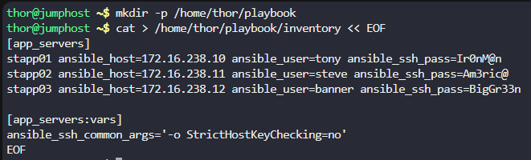
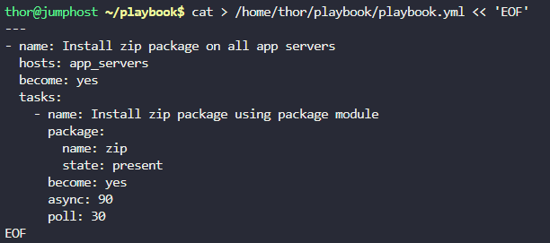
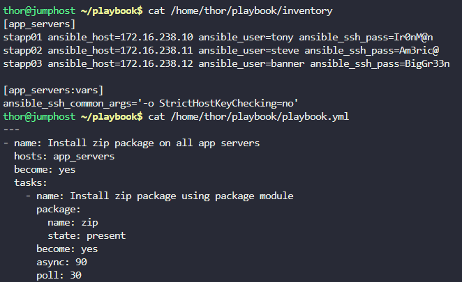
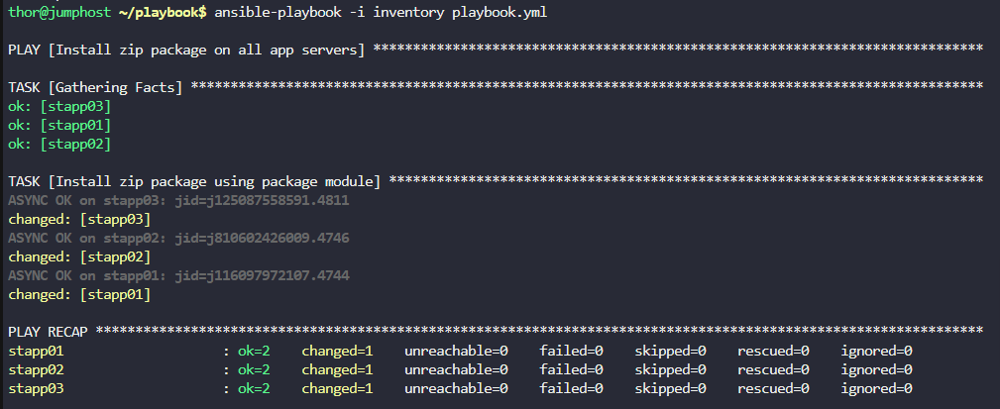

# Step 1: Create the Inventory File

First, let's create the directory and inventory file with all app servers:
```
# Create the directory
mkdir -p /home/thor/playbook

# Create the inventory file
cat > /home/thor/playbook/inventory << EOF
[app_servers]
stapp01 ansible_host=172.16.238.10 ansible_user=tony ansible_ssh_pass=Ir0nM@n
stapp02 ansible_host=172.16.238.11 ansible_user=steve ansible_ssh_pass=Am3ric@
stapp03 ansible_host=172.16.238.12 ansible_user=banner ansible_ssh_pass=BigGr33n

[app_servers:vars]
ansible_ssh_common_args='-o StrictHostKeyChecking=no'
EOF
```



# Step 2: Create the Ansible Playbook

Now, let's create the playbook that will install the zip package using the yum module:
```
cat > /home/thor/playbook/playbook.yml << 'EOF'
---
- name: Install zip package on all app servers
  hosts: app_servers
  become: yes
  tasks:
    - name: Install zip package using package module
      package:
        name: zip
        state: present
      become: yes
      async: 90
      poll: 30
EOF
```



# Step 3: Verify the Files

Let's check that both files were created correctly:
```
# Check inventory file
cat /home/thor/playbook/inventory

# Check playbook file
cat /home/thor/playbook/playbook.yml
```



# Step 4: Test the Playbook

Now, let's test the playbook to make sure it works:
```
cd /home/thor/playbook
ansible-playbook -i inventory playbook.yml
```

Output



***
