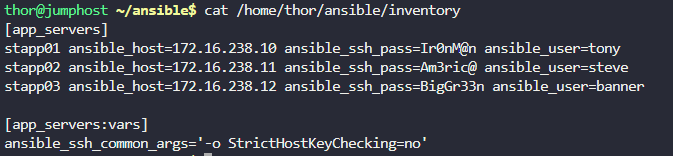

# Day 88: Ansible Blockinfile Module

# Step 1: Check the Existing Inventory

First, let's verify the inventory file exists and is properly configured:
```
cat /home/thor/ansible/inventory
```


# Step 2: Fix the Inventory File

Let's update the inventory file to include the [app_servers] group:
```
cat > /home/thor/ansible/inventory << 'EOF'
[app_servers]
stapp01 ansible_host=172.16.238.10 ansible_ssh_pass=Ir0nM@n ansible_user=tony
stapp02 ansible_host=172.16.238.11 ansible_ssh_pass=Am3ric@ ansible_user=steve
stapp03 ansible_host=172.16.238.12 ansible_ssh_pass=BigGr33n ansible_user=banner

[app_servers:vars]
ansible_ssh_common_args='-o StrictHostKeyChecking=no'
EOF
```

# Step 3: Verify the Fixed Inventory
```
cat /home/thor/ansible/inventory
```



# Step 4: Create the Playbook

Now, let's create the playbook that will:

- Install httpd web server

- Start and enable the service

- Create the index.html file with the specified content

- Set the correct ownership and permissions


```
cat > /home/thor/ansible/playbook.yml << 'EOF'
---
- name: Install httpd and create index.html
  hosts: all
  become: yes
  tasks:
    - name: Install httpd package
      yum:
        name: httpd
        state: present

    - name: Start and enable httpd service
      service:
        name: httpd
        state: started
        enabled: yes

    - name: Create a custom index.html
      blockinfile:
        path: /var/www/html/index.html
        create: yes
        block: |
          Welcome to XfusionCorp!

          This is Nautilus sample file, created using Ansible!

          Please do not modify this file manually!
        owner: apache
        group: apache
        mode: 0655
EOF
```


# Step 5: Verify the Playbook

Let's check that the playbook was created correctly:
```
cat /home/thor/ansible/playbook.yml
```

# Step 6: Run the Playbook

Now, execute the playbook:
```
cd /home/thor/ansible
ansible-playbook -i inventory playbook.yml
```

Output

```
thor@jumphost ~/ansible$ ansible-playbook playbook.yml -i inventory

PLAY [Install httpd and create index.html] ************************************************************************************

TASK [Gathering Facts] ********************************************************************************************************
ok: [stapp03]
ok: [stapp02]
ok: [stapp01]

TASK [Install httpd package] **************************************************************************************************
changed: [stapp03]
changed: [stapp02]
changed: [stapp01]

TASK [Start and enable httpd service] *****************************************************************************************
changed: [stapp01]
changed: [stapp02]
changed: [stapp03]

TASK [Create a custom index.html] *********************************************************************************************
changed: [stapp01]
changed: [stapp02]
changed: [stapp03]

PLAY RECAP ********************************************************************************************************************
stapp01                    : ok=4    changed=3    unreachable=0    failed=0    skipped=0    rescued=0    ignored=0   
stapp02                    : ok=4    changed=3    unreachable=0    failed=0    skipped=0    rescued=0    ignored=0   
stapp03                    : ok=4    changed=3    unreachable=0    failed=0    skipped=0    rescued=0    ignored=0     
```

# Step 7: Verify the Setup (Optional)

You can verify that everything is working correctly:
```
# Check if httpd is installed and running
ansible -i inventory app_servers -m command -a "systemctl status httpd" -b


# Check the content of index.html
ansible -i inventory app_servers -m command -a "cat /var/www/html/index.html" -b

# Check file permissions and ownership
ansible -i inventory app_servers -m command -a "ls -la /var/www/html/index.html" -b
```
Output

```
thor@jumphost ~/ansible$ ansible -i inventory app_servers -m command -a "systemctl status httpd" -b
stapp03 | CHANGED | rc=0 >>
● httpd.service - The Apache HTTP Server
     Loaded: loaded (/usr/lib/systemd/system/httpd.service; enabled; preset: disabled)
     Active: active (running) since Tue 2025-11-04 11:03:21 UTC; 51s ago
       Docs: man:httpd.service(8)
   Main PID: 3535 (httpd)
     Status: "Total requests: 0; Idle/Busy workers 100/0;Requests/sec: 0; Bytes served/sec:   0 B/sec"
      Tasks: 177 (limit: 411140)
     Memory: 19.8M
     CGroup: /docker/b54c83cbe9db5af903517f591c5cb2c85f4c2b8ee7d6bd9c3dfa25644aafe782/system.slice/httpd.service
             ├─3535 /usr/sbin/httpd -DFOREGROUND
             ├─3549 /usr/sbin/httpd -DFOREGROUND
             ├─3550 /usr/sbin/httpd -DFOREGROUND
             ├─3551 /usr/sbin/httpd -DFOREGROUND
             └─3552 /usr/sbin/httpd -DFOREGROUND

Nov 04 11:03:21 stapp03.stratos.xfusioncorp.com systemd[1]: httpd.service: Changed start -> running
Nov 04 11:03:21 stapp03.stratos.xfusioncorp.com systemd[1]: httpd.service: Job 249 httpd.service/start finished, result=done
Nov 04 11:03:21 stapp03.stratos.xfusioncorp.com systemd[1]: Started The Apache HTTP Server.
Nov 04 11:03:21 stapp03.stratos.xfusioncorp.com systemd[1]: httpd.service: Failed to send unit change signal for httpd.service: Connection reset by peer
Nov 04 11:03:21 stapp03.stratos.xfusioncorp.com systemd[1]: httpd.service: Got notification message from PID 3535 (READY=1, STATUS=Started, listening on: port 80, MAINPID=3535)
Nov 04 11:03:30 stapp03.stratos.xfusioncorp.com systemd[1]: httpd.service: Got notification message from PID 3535 (READY=1, STATUS=Total requests: 0; Idle/Busy workers 100/0;Requests/sec: 0; Bytes served/sec:   0 B/sec)
Nov 04 11:03:40 stapp03.stratos.xfusioncorp.com systemd[1]: httpd.service: Got notification message from PID 3535 (READY=1, STATUS=Total requests: 0; Idle/Busy workers 100/0;Requests/sec: 0; Bytes served/sec:   0 B/sec)
Nov 04 11:03:50 stapp03.stratos.xfusioncorp.com systemd[1]: httpd.service: Got notification message from PID 3535 (READY=1, STATUS=Total requests: 0; Idle/Busy workers 100/0;Requests/sec: 0; Bytes served/sec:   0 B/sec)
Nov 04 11:04:00 stapp03.stratos.xfusioncorp.com systemd[1]: httpd.service: Got notification message from PID 3535 (READY=1, STATUS=Total requests: 0; Idle/Busy workers 100/0;Requests/sec: 0; Bytes served/sec:   0 B/sec)
Nov 04 11:04:10 stapp03.stratos.xfusioncorp.com systemd[1]: httpd.service: Got notification message from PID 3535 (READY=1, STATUS=Total requests: 0; Idle/Busy workers 100/0;Requests/sec: 0; Bytes served/sec:   0 B/sec)
stapp02 | CHANGED | rc=0 >>
● httpd.service - The Apache HTTP Server
     Loaded: loaded (/usr/lib/systemd/system/httpd.service; enabled; preset: disabled)
     Active: active (running) since Tue 2025-11-04 11:03:21 UTC; 51s ago
       Docs: man:httpd.service(8)
   Main PID: 3536 (httpd)
     Status: "Total requests: 0; Idle/Busy workers 100/0;Requests/sec: 0; Bytes served/sec:   0 B/sec"
      Tasks: 177 (limit: 411140)
     Memory: 15.1M
     CGroup: /docker/08ad3f4fda9cdd720e85e956b17c19c0cfc3004ab06b07a28a22818fe83fdbc8/system.slice/httpd.service
             ├─3536 /usr/sbin/httpd -DFOREGROUND
             ├─3543 /usr/sbin/httpd -DFOREGROUND
             ├─3544 /usr/sbin/httpd -DFOREGROUND
             ├─3545 /usr/sbin/httpd -DFOREGROUND
             └─3546 /usr/sbin/httpd -DFOREGROUND

Nov 04 11:03:21 stapp02.stratos.xfusioncorp.com systemd[1]: httpd.service: Changed start -> running
Nov 04 11:03:21 stapp02.stratos.xfusioncorp.com systemd[1]: httpd.service: Job 249 httpd.service/start finished, result=done
Nov 04 11:03:21 stapp02.stratos.xfusioncorp.com systemd[1]: Started The Apache HTTP Server.
Nov 04 11:03:21 stapp02.stratos.xfusioncorp.com systemd[1]: httpd.service: Failed to send unit change signal for httpd.service: Connection reset by peer
Nov 04 11:03:21 stapp02.stratos.xfusioncorp.com systemd[1]: httpd.service: Got notification message from PID 3536 (READY=1, STATUS=Started, listening on: port 80, MAINPID=3536)
Nov 04 11:03:30 stapp02.stratos.xfusioncorp.com systemd[1]: httpd.service: Got notification message from PID 3536 (READY=1, STATUS=Total requests: 0; Idle/Busy workers 100/0;Requests/sec: 0; Bytes served/sec:   0 B/sec)
Nov 04 11:03:40 stapp02.stratos.xfusioncorp.com systemd[1]: httpd.service: Got notification message from PID 3536 (READY=1, STATUS=Total requests: 0; Idle/Busy workers 100/0;Requests/sec: 0; Bytes served/sec:   0 B/sec)
Nov 04 11:03:50 stapp02.stratos.xfusioncorp.com systemd[1]: httpd.service: Got notification message from PID 3536 (READY=1, STATUS=Total requests: 0; Idle/Busy workers 100/0;Requests/sec: 0; Bytes served/sec:   0 B/sec)
Nov 04 11:04:00 stapp02.stratos.xfusioncorp.com systemd[1]: httpd.service: Got notification message from PID 3536 (READY=1, STATUS=Total requests: 0; Idle/Busy workers 100/0;Requests/sec: 0; Bytes served/sec:   0 B/sec)
Nov 04 11:04:10 stapp02.stratos.xfusioncorp.com systemd[1]: httpd.service: Got notification message from PID 3536 (READY=1, STATUS=Total requests: 0; Idle/Busy workers 100/0;Requests/sec: 0; Bytes served/sec:   0 B/sec)
stapp01 | CHANGED | rc=0 >>
● httpd.service - The Apache HTTP Server
     Loaded: loaded (/usr/lib/systemd/system/httpd.service; enabled; preset: disabled)
     Active: active (running) since Tue 2025-11-04 11:03:20 UTC; 51s ago
       Docs: man:httpd.service(8)
   Main PID: 3474 (httpd)
     Status: "Total requests: 0; Idle/Busy workers 100/0;Requests/sec: 0; Bytes served/sec:   0 B/sec"
      Tasks: 177 (limit: 411140)
     Memory: 15.1M
     CGroup: /docker/5629ac4db822800039fde866c7e49232eeaa12943fc0d70498ec4fbd3474f562/system.slice/httpd.service
             ├─3474 /usr/sbin/httpd -DFOREGROUND
             ├─3482 /usr/sbin/httpd -DFOREGROUND
             ├─3483 /usr/sbin/httpd -DFOREGROUND
             ├─3484 /usr/sbin/httpd -DFOREGROUND
             └─3485 /usr/sbin/httpd -DFOREGROUND

Nov 04 11:03:20 stapp01.stratos.xfusioncorp.com systemd[1]: httpd.service: Changed start -> running
Nov 04 11:03:20 stapp01.stratos.xfusioncorp.com systemd[1]: httpd.service: Job 209 httpd.service/start finished, result=done
Nov 04 11:03:20 stapp01.stratos.xfusioncorp.com systemd[1]: Started The Apache HTTP Server.
Nov 04 11:03:20 stapp01.stratos.xfusioncorp.com systemd[1]: httpd.service: Failed to send unit change signal for httpd.service: Connection reset by peer
Nov 04 11:03:20 stapp01.stratos.xfusioncorp.com systemd[1]: httpd.service: Got notification message from PID 3474 (READY=1, STATUS=Started, listening on: port 80, MAINPID=3474)
Nov 04 11:03:29 stapp01.stratos.xfusioncorp.com systemd[1]: httpd.service: Got notification message from PID 3474 (READY=1, STATUS=Total requests: 0; Idle/Busy workers 100/0;Requests/sec: 0; Bytes served/sec:   0 B/sec)
Nov 04 11:03:39 stapp01.stratos.xfusioncorp.com systemd[1]: httpd.service: Got notification message from PID 3474 (READY=1, STATUS=Total requests: 0; Idle/Busy workers 100/0;Requests/sec: 0; Bytes served/sec:   0 B/sec)
Nov 04 11:03:49 stapp01.stratos.xfusioncorp.com systemd[1]: httpd.service: Got notification message from PID 3474 (READY=1, STATUS=Total requests: 0; Idle/Busy workers 100/0;Requests/sec: 0; Bytes served/sec:   0 B/sec)
Nov 04 11:03:59 stapp01.stratos.xfusioncorp.com systemd[1]: httpd.service: Got notification message from PID 3474 (READY=1, STATUS=Total requests: 0; Idle/Busy workers 100/0;Requests/sec: 0; Bytes served/sec:   0 B/sec)
Nov 04 11:04:09 stapp01.stratos.xfusioncorp.com systemd[1]: httpd.service: Got notification message from PID 3474 (READY=1, STATUS=Total requests: 0; Idle/Busy workers 100/0;Requests/sec: 0; Bytes served/sec:   0 B/sec)
thor@jumphost ~/ansible$ ansible -i inventory app_servers -m command -a "cat /var/www/html/index.html" -b
stapp01 | CHANGED | rc=0 >>
# BEGIN ANSIBLE MANAGED BLOCK
Welcome to XfusionCorp!

This is Nautilus sample file, created using Ansible!

Please do not modify this file manually!
# END ANSIBLE MANAGED BLOCK
stapp03 | CHANGED | rc=0 >>
# BEGIN ANSIBLE MANAGED BLOCK
Welcome to XfusionCorp!

This is Nautilus sample file, created using Ansible!

Please do not modify this file manually!
# END ANSIBLE MANAGED BLOCK
stapp02 | CHANGED | rc=0 >>
# BEGIN ANSIBLE MANAGED BLOCK
Welcome to XfusionCorp!

This is Nautilus sample file, created using Ansible!

Please do not modify this file manually!
# END ANSIBLE MANAGED BLOCK
thor@jumphost ~/ansible$ ansible -i inventory app_servers -m command -a "ls -la /var/www/html/index.html" -b
stapp02 | CHANGED | rc=0 >>
-rw-r-xr-x 1 apache apache 178 Nov  4 11:03 /var/www/html/index.html
stapp03 | CHANGED | rc=0 >>
-rw-r-xr-x 1 apache apache 178 Nov  4 11:03 /var/www/html/index.html
stapp01 | CHANGED | rc=0 >>
-rw-r-xr-x 1 apache apache 178 Nov  4 11:03 /var/www/html/index.html
```

***