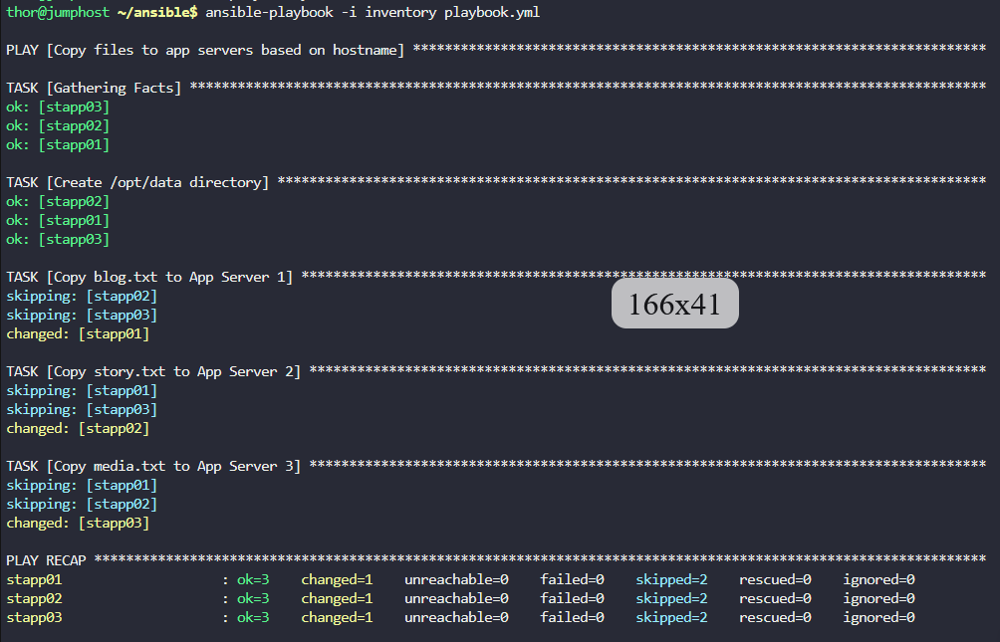
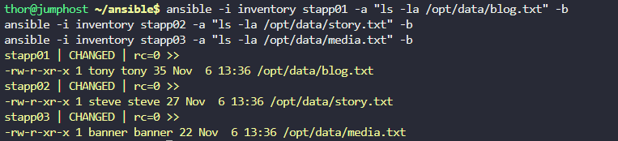

# Step 1: Create the Playbook

```
cd ~/ansible
vi playbook.yml
```

# Step 2: Add the Following Content

```
---
- name: Copy files to app servers based on hostname
  hosts: all
  become: yes
  tasks:
    - name: Create /opt/data directory
      file:
        path: /opt/data
        state: directory
        mode: "0755"

    - name: Copy blog.txt to App Server 1
      copy:
        src: /usr/src/data/blog.txt
        dest: /opt/data/blog.txt
        owner: tony
        group: tony
        mode: "0655"
      when: inventory_hostname == "stapp01"

    - name: Copy story.txt to App Server 2
      copy:
        src: /usr/src/data/story.txt
        dest: /opt/data/story.txt
        owner: steve
        group: steve
        mode: "0655"
      when: inventory_hostname == "stapp02"

    - name: Copy media.txt to App Server 3
      copy:
        src: /usr/src/data/media.txt
        dest: /opt/data/media.txt
        owner: banner
        group: banner
        mode: "0655"
      when: inventory_hostname == "stapp03"
```

Save and exit (Esc + :wq + Enter).

# Step 3: Verify the Playbook Content

```
cat playbook.yml
```

# Step 4: Run the Playbook

```
ansible-playbook -i inventory playbook.yml
```



# Step 5: Verify the Results


```
# Check if files were copied correctly on each server
ansible -i inventory stapp01 -a "ls -la /opt/data/blog.txt" -b
ansible -i inventory stapp02 -a "ls -la /opt/data/story.txt" -b
ansible -i inventory stapp03 -a "ls -la /opt/data/media.txt" -b
```



***

