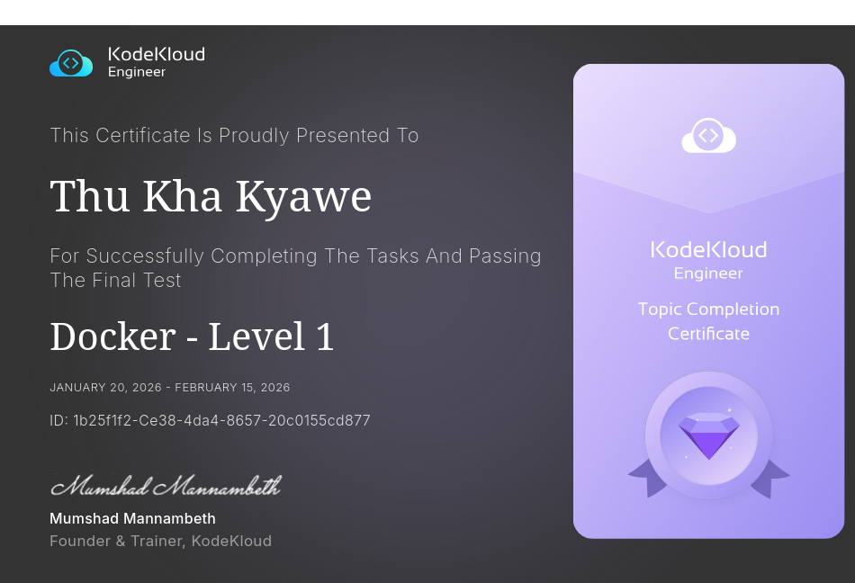

Task 1

The Nautilus team wants to create a debug container on Application Server 1. However, they had some specific requirements related to the CMD. Please complete the task as per details given below:

a. On Application Server 1 create a container named debug_1 using image ubuntu/apache2:latest.

b. Overwrite the default CMD with command sleep 1000.

c. Make sure the container is in running state.

---

Task 2

The Nautilus DevOps team is testing some applications deployment on some of the application servers. They need to deploy a nginx container on Application Server 1. Please complete the task as per details given below:

On Application Server 1 create a container named nginx_1 using image nginx with alpine tag and make sure container is in running state.

---

Task 3

We received a request to copy some of the data from one of the docker containers to the docker host. The container is running on App Server 1 in Stratos Datacenter. Below are more details about the task:

On App Server 1 in Stratos Datacenter copy an encrypted file /tmp/test.txt.gpg from development_3 docker container to the docker host in /tmp location. Please do not try to modify this file in any way.

---

Task 4

The Nautilus DevOps team has some confidential data present on App Server 1 in Stratos Datacenter. There is a container ubuntu_latest running on the same server. We received a request to copy some of the data from the docker host to the container. Below are more details about the task:

On App Server 1 in Stratos Datacenter copy an encrypted file /tmp/nautilus.txt.gpg from docker host to ubuntu_latest container (running on same server) in /tmp/ location (create this location if doesn't exit). Please do not try to modify this file in any way.

---

Task 5

The Nautilus DevOps team wanted to transfer some docker images from one server to another server so they wanted to save some docker images as tar archives on the docker host itself. Find below the exact requirements:

There is a docker image named nginx:mainline-alpine-slim on App Server 1 in Stratos Datacenter, save this image as nginx.tar archive under /home directory on the same server.

---

Task 6

We need some docker images on Application Server 1, these images will be used to create some containers later. Pull below mentioned images on Application Server 1 in Stratos DC.

a. redis:alpine

b. memcached:alpine

---

Task 7

The Nautilus DevOps team is planning to setup/create some docker containers on App Server 1 in Stratos Datacenter, some prerequisites are needs to be done on this server. Find below more details:

Create a new network named mysql-network using the bridge driver. Allocate subnet 182.18.0.0/24, configure Gateway 182.18.0.1.

---

Task 8

The Nautilus DevOps team is planning to do some cleanup on App Server 1 in Stratos Datacenter, some old and unused docker networks need to be deleted. Find below more details:

Delete a docker network named php-network from App Server 1 in Stratos Datacenter.

---

Task 9

There were some containers created by the DevOps team on App Server 1 in Stratos DC, and those were running fine till yesterday. Team found that those containers were exited somehow today, look into the issue and make sure all containers are in running state. Below is the name of two containers which were exited:

a. lab1_container
b. lab2_container

---

[KodeKloud Certificate-Docker-Level 1](https://engineer.kodekloud.com/certificate-verification/1b25f1f2-ce38-4da4-8657-20c0155cd877)

