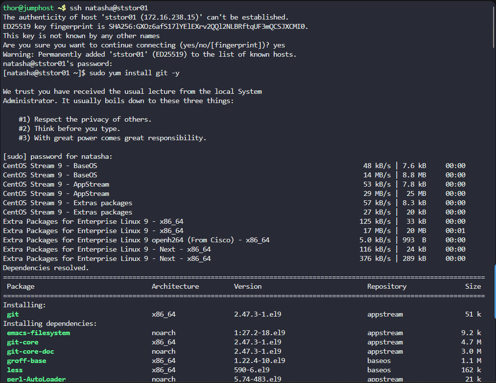

## Step 1: Install Git using yum

First, connect to the Storage server and install Git:
bash

- Connect to the Storage server 
```
ssh natasha@ststor01
```

- Install Git using yum
```
sudo yum install git -y
```




## Step 2: Create a bare Git repository

Once Git is installed, create the bare repository at the specified location:

```
# Create the bare repository
sudo git init --bare /opt/cluster.git
```

Step 3: Verify the repository

Check that the repository was created correctly:
bash

# Check if the repository exists and has the proper structure
ls -la /opt/cluster.git


***

