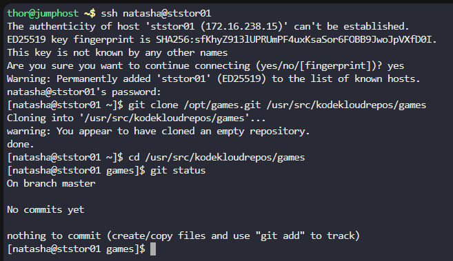

## Step 1: Connect to the Storage Server

From your jump server, connect to the Storage Server:

```
# Connect from jump server to storage server
ssh natasha@ststor01
# Password: Bl@kW
```

## Step 2: Clone the repository

Once logged in as natasha on ststor01, clone the repository:

```
# Clone the repository to the specified directory
git clone /opt/games.git /usr/src/kodekloudrepos/games
```

## Step 3: Verify the clone

Check that the repository was cloned successfully:
bash

# Verify the repository was cloned
ls -la /usr/src/kodekloudrepos/games

# You can also check git status to confirm it's a valid repository
cd /usr/src/kodekloudrepos/games
git status



***