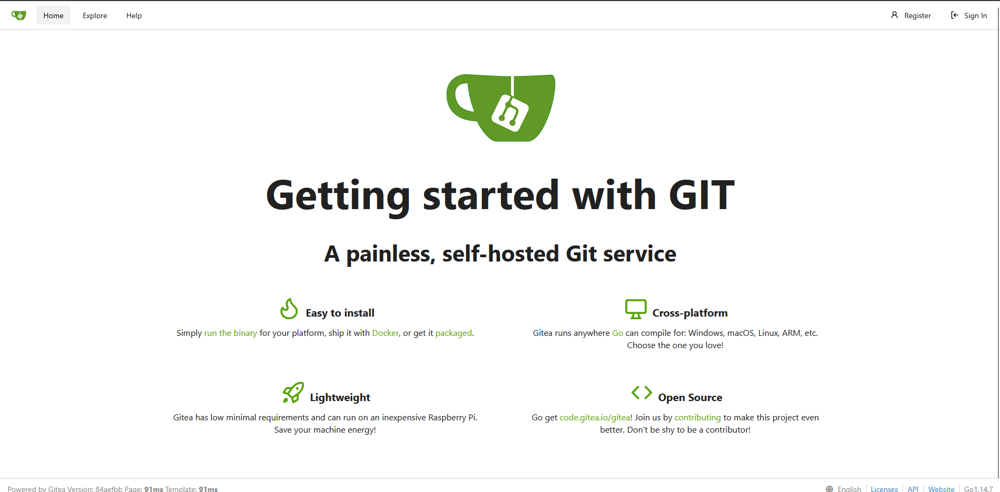
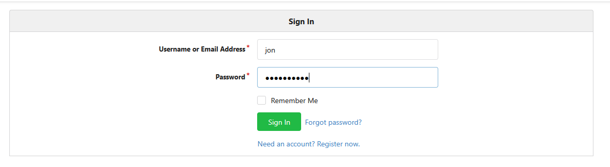
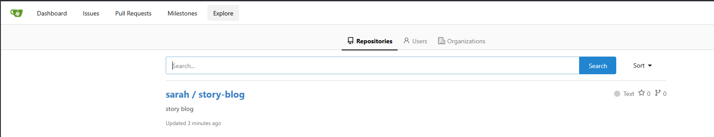
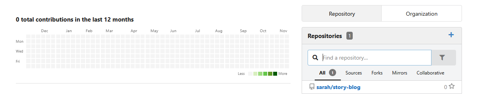
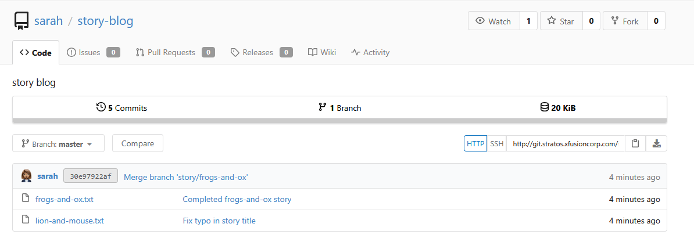
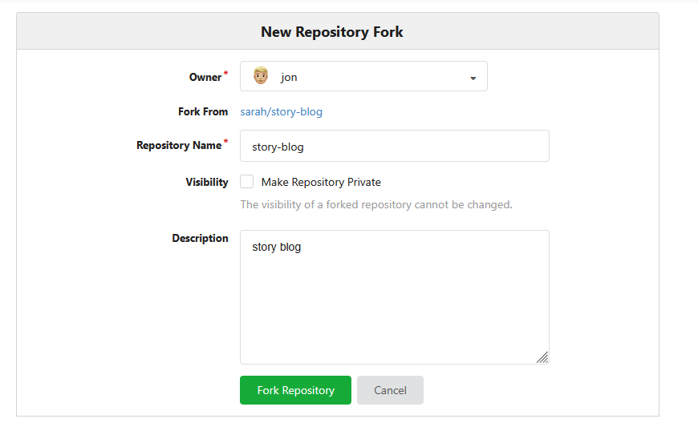
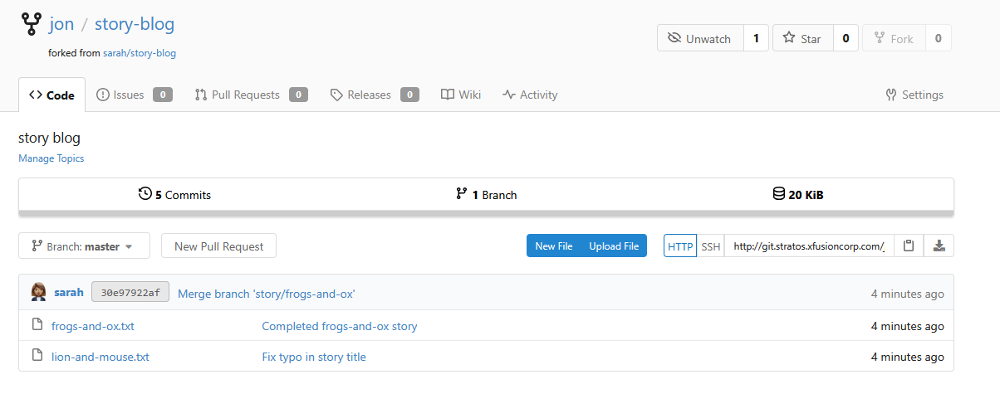

Step-by-Step Instructions:
## Step 1: Access Gitea UI

Click on the "Gitea UI" button located on the top bar of your lab environment

## Step 2: Login to Gitea

Click the "Sign In" button

Username: jon

Password: Jon_pass123

## Step 3: Locate the Repository

In the top navigation bar, click on "Explore" or look for a search function

Search for sarah/story-blog in the search bar

Alternatively, you might see it listed under "Repositories" or "Trending"

## Step 4: Access the Repository

Click on the repository name sarah/story-blog to open it

## Step 5: Fork the Repository

Look for the "Fork" button (usually located in the top-right corner of the repository page)

Click the "Fork" button

A modal window may appear asking for fork details - ensure it's forking to your user jon

Click "Fork Repository" or similar confirmation button

## Step 6: Verify the Fork

Verify the repository URL shows jon/story-blog instead of sarah/story-blog

***