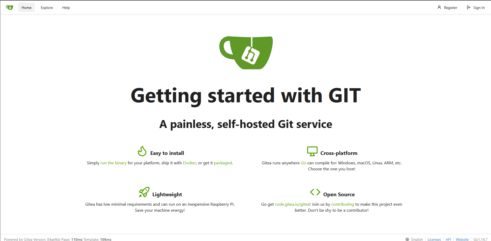
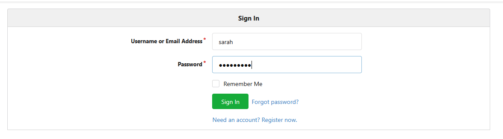
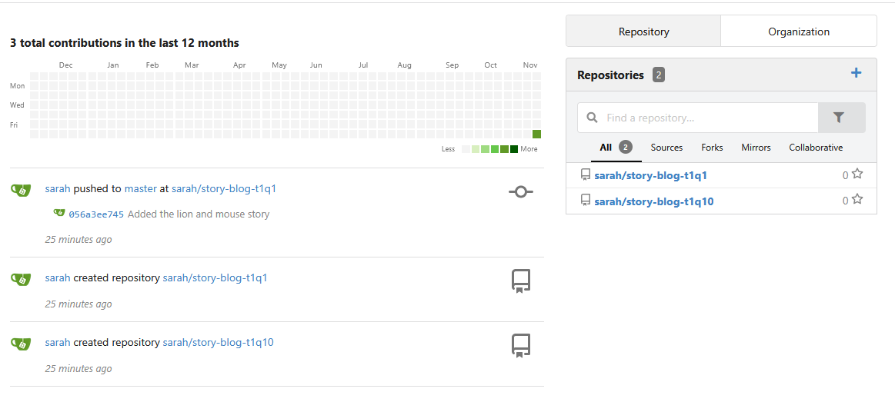
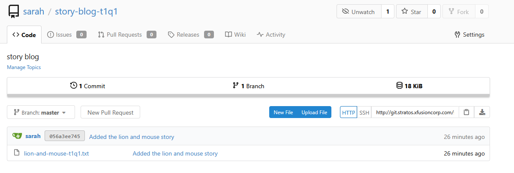
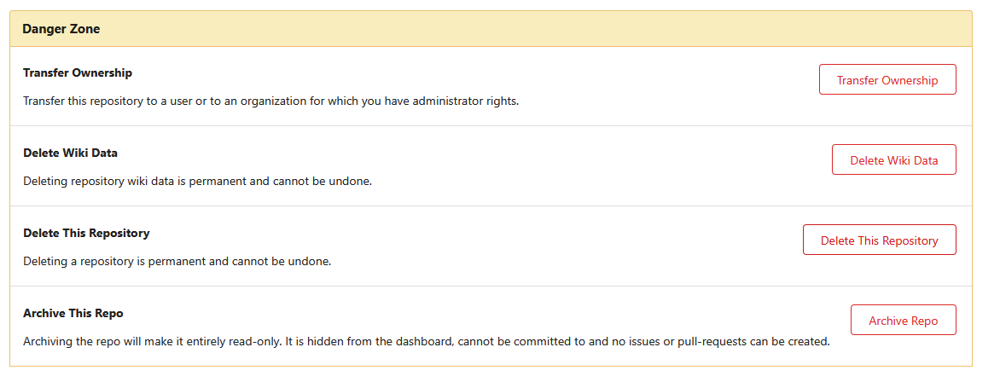
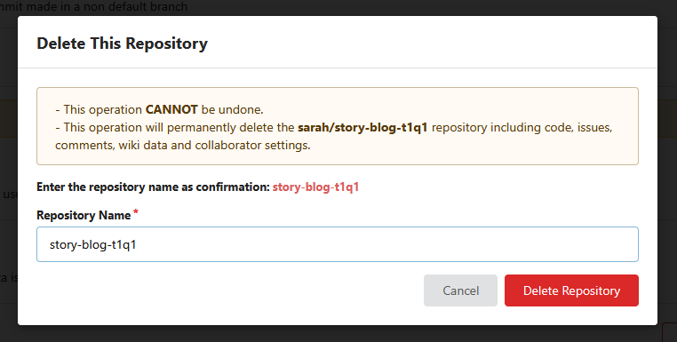

As developers are currently in the process of creating Git repositories, a new requirement has emerged to create a bare repository on the storage server. Below are the details for this request.

Create a bare repository named /home/sarah/games.git on Storage server.

Use below credentials to SSH into the storage server and to complete this task.

Username: sarah
Password: S3cure321


## Step 1: Connect to the Storage Server as Sarah
```
ssh sarah@ststor01

Password: S3cure321
```

## Step 2: Create the Bare Repository

```
# Create a bare Git repository
git init --bare /home/sarah/games.git
```

***

Recently a bare repository was created by one of the developers. Now, they were planning to add some content in this repository so this needs to be cloned somewhere so that one of the developers can start adding data in it. Below you can find more details.

Clone the repository /opt/story-blog-t1q11.git under sarah user's home on storage server.

Use below credentials to SSH into the storage server and to complete this task.

Username: sarah
Password: S3cure321

'/opt/story-blog-t1q11.git' repository was cloned under Sarah's home?


##  Step 1: Connect to the Storage Server as Sarah
```
ssh sarah@ststor01
Password: S3cure321
```
## Step 2: Clone the Repository to Sarah's Home

```
# Clone the repository to Sarah's home directory
git clone /opt/story-blog-t1q11.git /home/sarah/story-blog-t1q11
```

***

A developer was in the process of creating repositories on the Gitea server. Unfortunately, one repository was mistakenly created and now needs to be deleted. Below are further details regarding this issue.

The repository name is story-blog-t1q1 and is located under the sarah user on the Gitea server. The Gitea login credentials are as follows:

Username: sarah
Password: S3cure321


## Step 1: Access Gitea UI
Click on the "Gitea UI" button located on the top bar of your lab environment



## Step 2: Login to Gitea

Username: sarah

Password: S3cure321

Click the "Sign In" button



## Step 3: Navigate to Your Repositories

Click on your profile picture/avatar in the top-right corner

Select "Your Repositories" from the dropdown menu

Alternatively, click on "+" icon → "Your Repositories"




## Step 4: Access the Repository Settings

Click on the repository name "story-blog-t1q1" to open it

In the repository navigation, click on "Settings" (usually a gear icon or tab)



## Step 5: Delete the Repository

Scroll down to the "Danger Zone" section at the bottom of the settings page

Click on "Delete this repository"

You will be asked to confirm by typing the repository name

Type: story-blog-t1q1

Click the "Delete" button to confirm




## Step 6: Verify Deletion

After deletion, you should be redirected to your main repositories page

Verify that "story-blog-t1q1" no longer appears in your repositories list



***

## Step 1: Connect to the Storage Server as Sarah

```
ssh sarah@ststor01

Password: S3cure321
```

## Step 2: Navigate to the Repository
```
cd /usr/src/kodekloudrepos/games-t2q6
```

## Step 3: Find and Fix the Typo

First, let's check the current content of the file:

```
# View the file content
cat lion-and-mouse.txt

```
Now, fix the typo by replacing "LIOON" with "LION":

```
# Use sed to replace LIOON with LION
sed -i 's/LIOON/LION/g' lion-and-mouse.txt
```

## Step 4: Verify the Fix

```
# Check that the typo is fixed
cat lion-and-mouse.txt
```

## Step 5: Commit the Changes

```
# Add the modified file to staging
git add lion-and-mouse.txt

# Commit with the required message
git commit -m "Fix typo in story title"
```

***

A new repository named /usr/src/kodekloudrepos/games-t2q5 was created recently and some data was added in it. Now one of the developers wanted to use this repository further to add/update some data.

Checkout the master branch under repo /usr/src/kodekloudrepos/games-t2q5.

Use below credentials to SSH into the storage server and to complete this task.

Username: sarah
Password: S3cure321


## Step 1: Connect to the Storage Server as Sarah

```
ssh sarah@ststor01

Password: S3cure321
```

## Step 2: Navigate to the Repository

```
cd /usr/src/kodekloudrepos/games-t2q5
```

## Step 3: Check Current Branch

```
# Check which branch you're currently on
git branch
```

## Step 4: Checkout Master Branch

```
# Checkout the master branch
git checkout master
```

