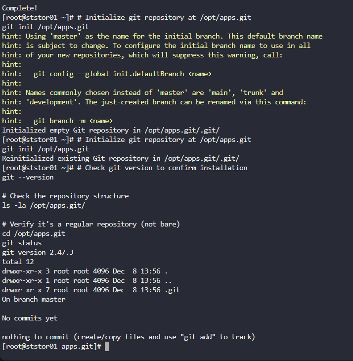

#### Step-by-Step Solution


Step 1: Connect to the Storage Server from Jump Host

First, connect to the jump host, then to the storage server:


```
# From jump host, connect to storage server
ssh natasha@ststor01

# Password: Bl@kW
```

Step 2: Install Git using YUM

```
# Switch to root or use sudo if configured
sudo su -
```


```
# As root user
yum install git -y
```

Step 3: Create/Initialize the Git Repository

```
# Initialize git repository at /opt/apps.git
git init /opt/apps.git
```

Step 4: Verify the Installation and Repository


```
# Check git version to confirm installation
git --version

# Check the repository structure
ls -la /opt/apps.git/

# Verify it's a regular repository (not bare)
cd /opt/apps.git
git status

```




---