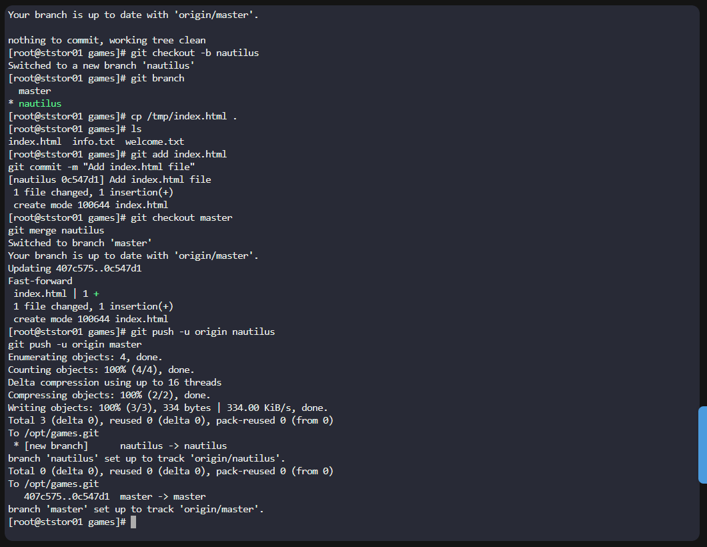

#### Step-by-Step Solution
1. Login to Storage Server
```
ssh natasha@ststor01.stratos.xfusioncorp.com
# Password when prompted: Bl@kW
```

2. Switch to root
```
sudo su -
# Password when prompted: Bl@kW
```

3. Go to the repository
```
cd /usr/src/kodekloudrepos/games
# Verify:
git status
```


4. Create and switch to new branch nautilus
```
git checkout -b nautilus
# Verify:
git branch
```

5. Copy the file into the repo
```
cp /tmp/index.html .
# Verify:
ls
```


6. Stage and commit
```
git add index.html
git commit -m "Add index.html file"
```

7. Switch back to master and merge
```
git checkout master
git merge nautilus
```

8. Push BOTH branches
```
git push -u origin nautilus
git push -u origin master
```



---