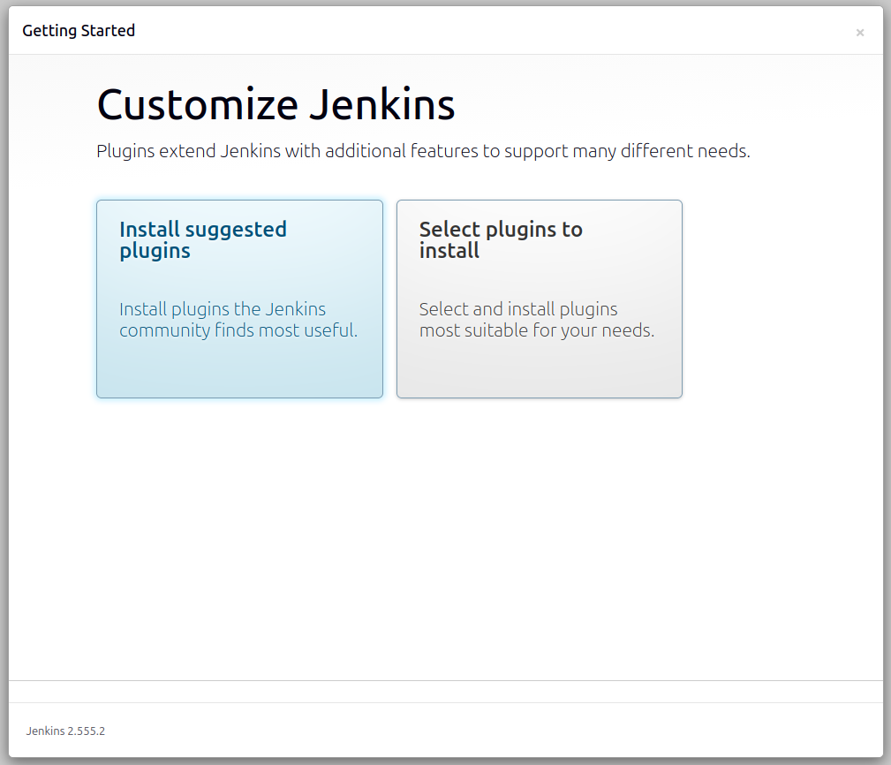
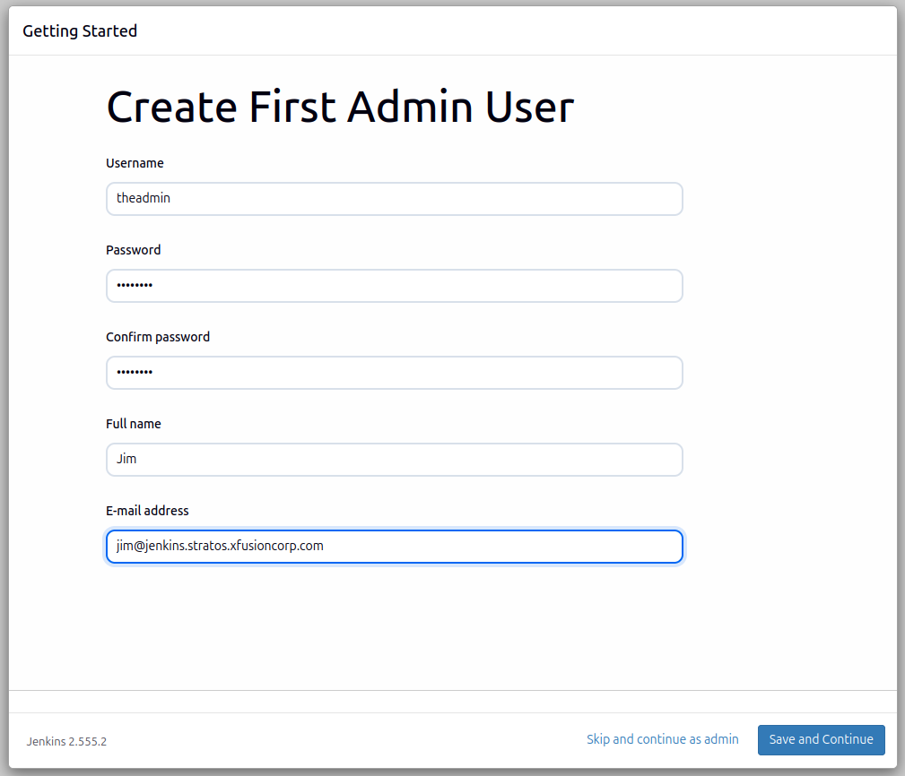
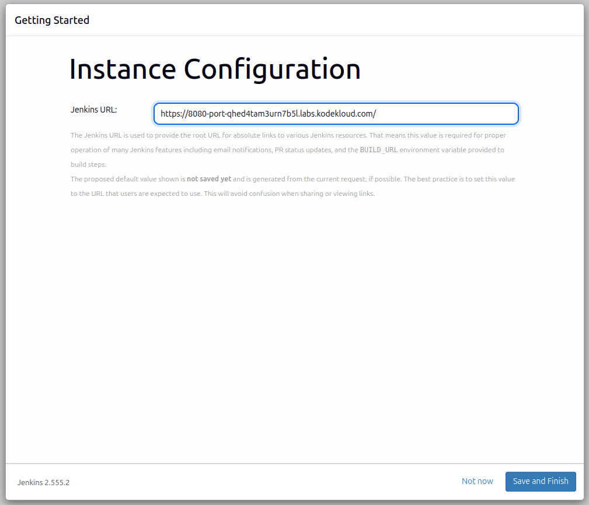
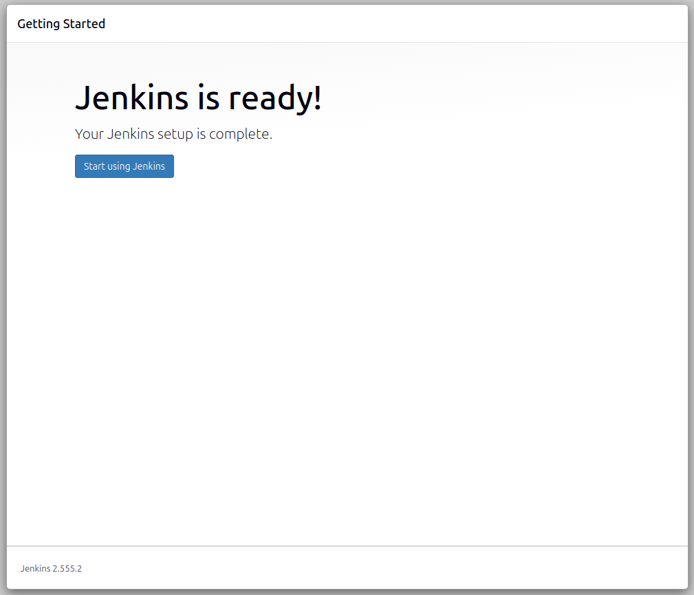
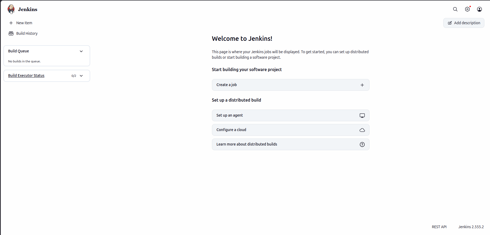

# Lab Information

The DevOps team at xFusionCorp Industries is initiating the setup of CI/CD pipelines and has decided to utilize Jenkins as their server. Execute the task according to the provided requirements:


1. Install Jenkins on the jenkins server using the apt utility only, and start it using the service command.

    If you face a timeout issue while starting the Jenkins service, first check the service status with service jenkins status
    Then review the logs in /var/log/jenkins/jenkins.log to identify the cause.

2. Jenkin's admin user name should be theadmin, password should be Adm!n321, full name should be Jim and email should be jim@jenkins.stratos.xfusioncorp.com.

Note:

1. To access the jenkins server, connect from the jump host using the root user with the password S3curePass.

2. After Jenkins server installation, click the Jenkins button on the top bar to access the Jenkins UI and follow on-screen instructions to create an admin user.


---

# Lab Solutions

🧭 Part 1: Lab Step-by-Step Guidelines

Step 1: Connect to the Jenkins Server from the Jump Host

From the jump host terminal:

```
ssh root@jenkins

# Password:

S3curePass
```

Step 2: Update Package Index

```
apt update
```

Step 3: Install Java (Required for Jenkins)

```
apt install openjdk-21-jre -y
```

# Verify Java:

java -version
```

Step 4: Add Jenkins Repository Key

```
wget -O /usr/share/keyrings/jenkins-keyring.asc \
https://pkg.jenkins.io/debian-stable/jenkins.io-2023.key
```

Step 5: Add Jenkins Repository

```
echo deb [signed-by=/usr/share/keyrings/jenkins-keyring.asc] \
https://pkg.jenkins.io/debian-stable binary/ | tee \
/etc/apt/sources.list.d/jenkins.list > /dev/null
```

Step 6: Update apt Again

```
apt update
```

Step 7: Install Jenkins Using apt ONLY

```
apt install jenkins -y
```

Step 8: Start Jenkins Service

```
service jenkins start


# Check status:

service jenkins status
```
Step 9: If Jenkins Fails or Times Out

Check service status:

```
service jenkins status
```
Check logs:

```
cat /var/log/jenkins/jenkins.log
```
Common fix:

```
systemctl daemon-reload
service jenkins restart
```

Then recheck:

```
service jenkins status
```


Step 10: Get Initial Admin Password

```
cat /var/lib/jenkins/secrets/initialAdminPassword
```

Copy the password.

Step 11: Open Jenkins UI

Open browser and click the Jenkins button from the lab top bar.

Or access:

http://<jenkins-server>:8080


Step 12: Unlock Jenkins

Paste the initial admin password.

Choose:

Install suggested plugins



Wait for installation.

Step 13: Create Admin User

Use these exact details:

Field	            Value
Username	        theadmin
Password	        Adm!n321
Confirm Password	Adm!n321
Full Name	        Jim
Email	            jim@jenkins.stratos.xfusioncorp.com

Click:

Save and Continue

Then:

Start using Jenkins









---

🧠 Part 2: Simple Step-by-Step Explanation (Beginner Friendly)

What You Are Doing

You are setting up a Jenkins CI/CD server.

Jenkins helps automate:

Building applications
Running tests
Deploying software
Why Java Is Installed

Jenkins is a Java application.

Without Java, Jenkins cannot run.

Why We Add Jenkins Repository

Ubuntu/Debian default repositories may not contain the latest Jenkins package.

So we:

Add Jenkins official repository
Add its security key
Install Jenkins safely using apt
Why We Use service jenkins start

This command starts the Jenkins server process.

After starting, Jenkins listens on:

Port 8080
Why We Check Logs

If Jenkins fails to start:

Java may be missing
Port may be busy
Configuration may be broken

Logs in:

/var/log/jenkins/jenkins.log

help identify the exact issue.

What the Initial Admin Password Does

The first time Jenkins starts, it locks itself for security.

The password file:

/var/lib/jenkins/secrets/initialAdminPassword

is used to unlock Jenkins setup.

Why You Create an Admin User

This becomes the main Jenkins administrator account.

In this lab:

Username: theadmin
Password: Adm!n321

This account manages pipelines, jobs, plugins, and users.

---