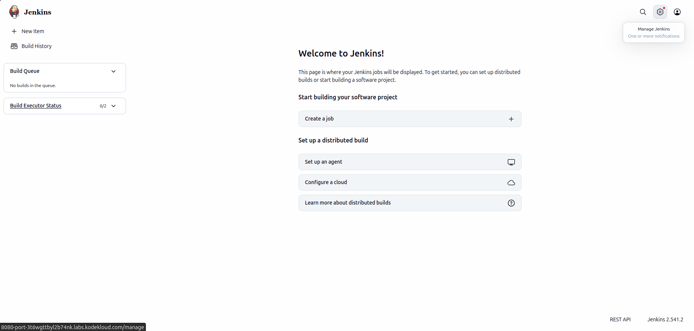
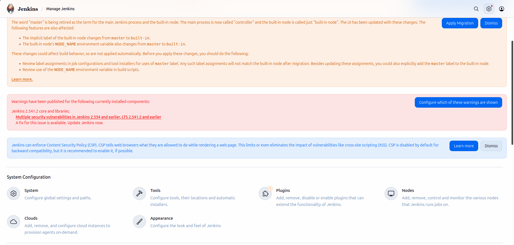
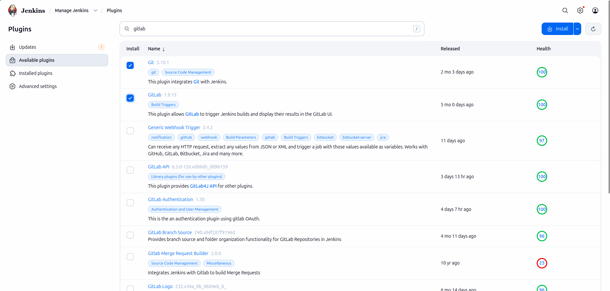
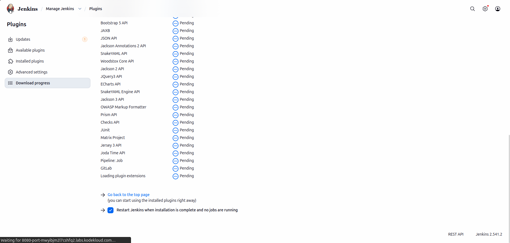
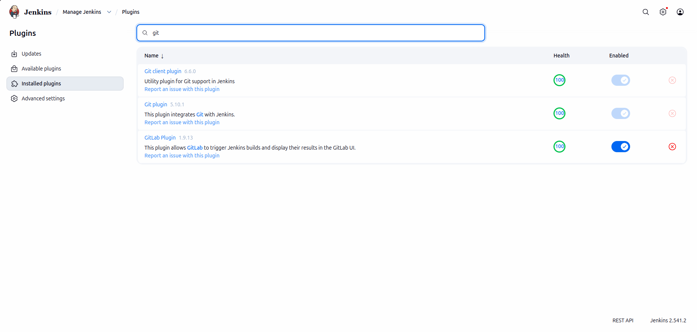

# Lab Information

The Nautilus DevOps team has recently setup a Jenkins server, which they want to use for some CI/CD jobs. Before that they want to install some plugins which will be used in most of the jobs. Please find below more details about the task

1. Click on the Jenkins button on the top bar to access the Jenkins UI. Login using username admin and password Adm!n321.

2. Once logged in, install the Git and GitLab plugins. You may need to restart Jenkins to complete the plugin installation; if required, opt to Restart Jenkins when installation is complete and no jobs are running on the plugin installation/update page (Update Centre).

Note:

1. After restarting Jenkins, wait for the login page to reappear before proceeding.

2. For tasks involving web UI changes, capture screenshots to share for review or consider using screen recording software like loom.com for documentation and sharing.

# Lab Solutions

🧭 Part 1: Lab Step-by-Step Guidelines

Step 1: Open Jenkins UI

Click the Jenkins button from the lab top bar.

Login using:

Field	    Value
Username	admin
Password	Adm!n321

Step 2: Open Plugin Manager

From the Jenkins dashboard:

Manage Jenkins

Then click:

Plugins

Step 3: Install Git Plugin

Go to:

Available plugins

Search for:

Git

Check the box for:

Git

Step 4: Install GitLab Plugin

In the search box type:

GitLab

Check the box for:

GitLab

Step 5: Install Selected Plugins

Click:

Install

or

Install without restart

Step 6: Restart Jenkins (If Prompted)

If Jenkins displays:

Restart Jenkins when installation is complete and no jobs are running

Enable/check that option.

Wait until Jenkins restarts completely.

Step 7: Verify Jenkins Is Back Online

Wait for the login page to reappear.

Login again using:

Username	    Password
admin	        Adm!n321

Step 8: Verify Plugins Installed

Go to:

Manage Jenkins → Plugins → Installed plugins

Verify both plugins appear:

Git
GitLab

---

🧠 Part 2: Simple Step-by-Step Explanation (Beginner Friendly)

What Are Jenkins Plugins?

Plugins add extra features to Jenkins.

Without plugins, Jenkins only has basic functionality.

Why Install the Git Plugin?

The Git plugin allows Jenkins to:

Clone repositories
Pull source code
Trigger builds from Git commits

This is essential for CI/CD pipelines.

Why Install the GitLab Plugin?

The GitLab plugin connects Jenkins with GitLab.

It helps Jenkins:

Receive webhooks
Trigger jobs automatically
Integrate merge requests and pipelines

Why Jenkins Sometimes Restarts

Some plugins modify Jenkins core components.

A restart ensures:

New plugins load correctly
Jenkins recognizes new functionality
Why Verify Installed Plugins

Checking Installed Plugins confirms:

Installation succeeded
Jenkins loaded the plugins correctly
CI/CD jobs can use them later

---