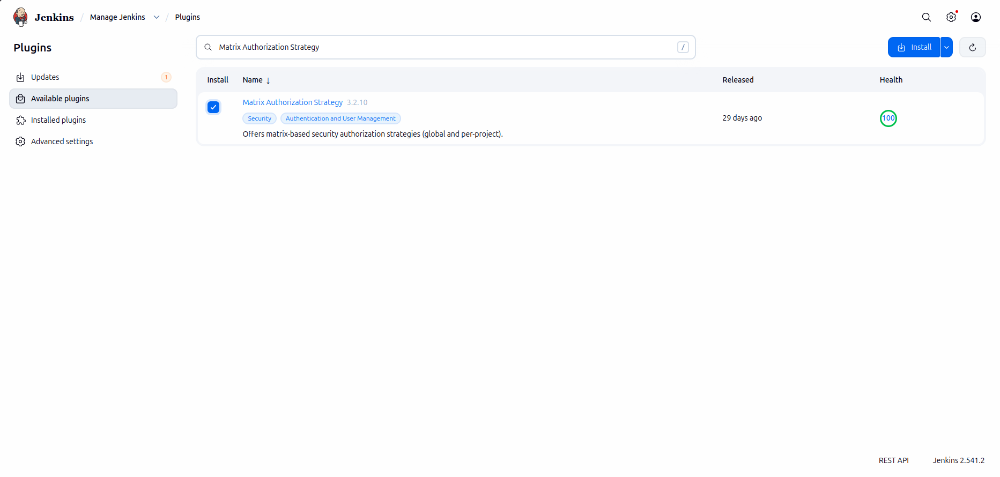
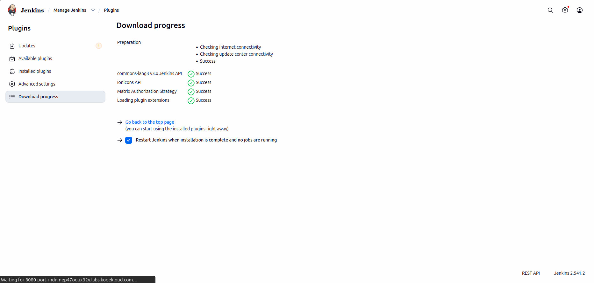
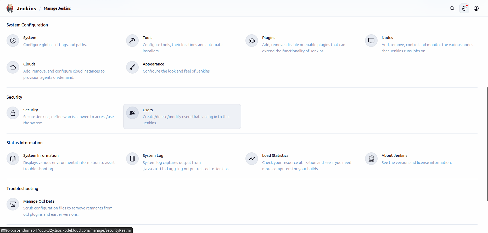
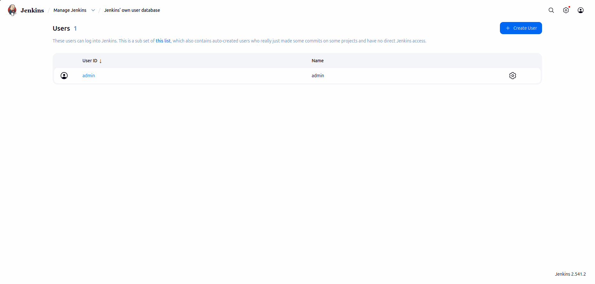
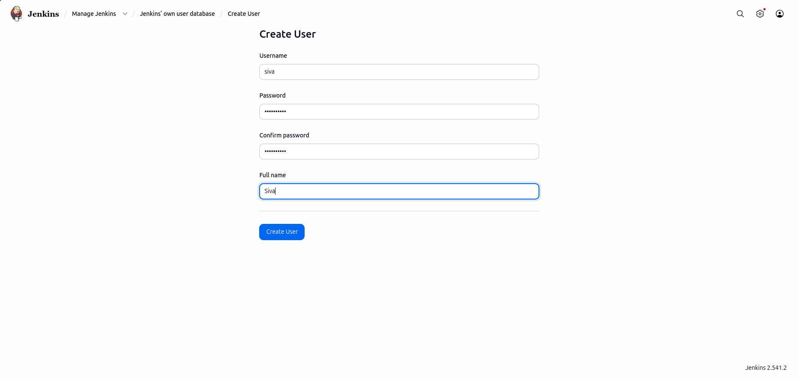
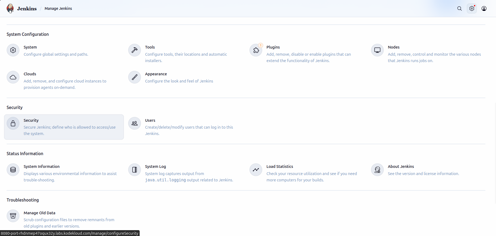
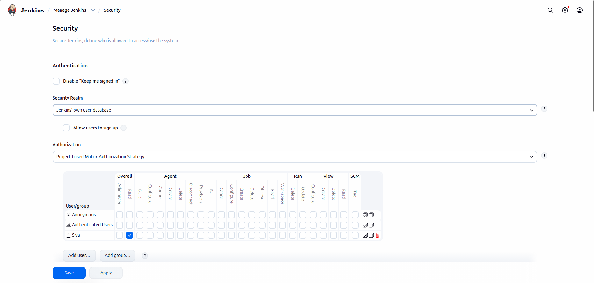
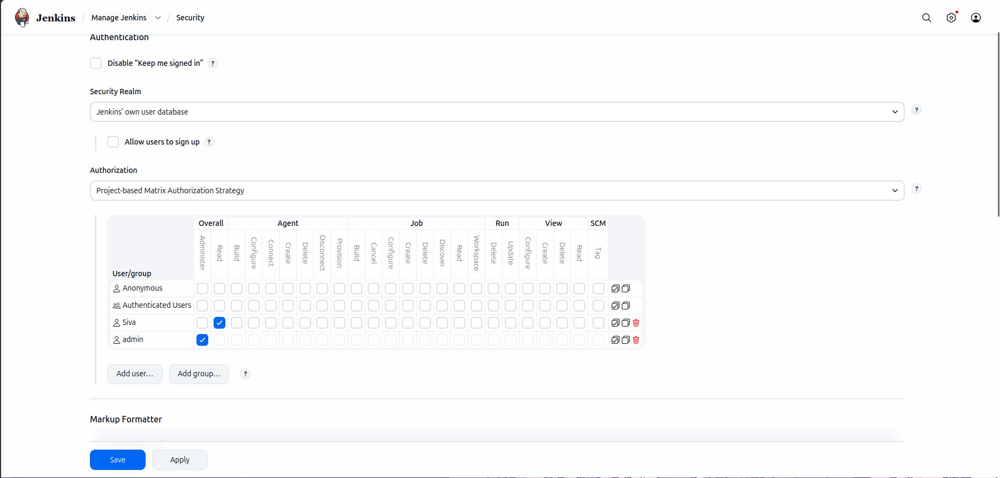
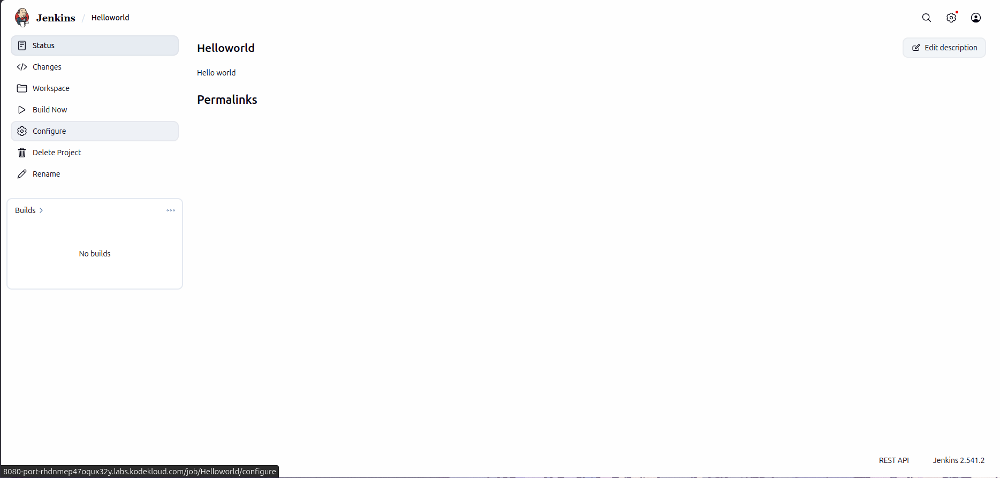
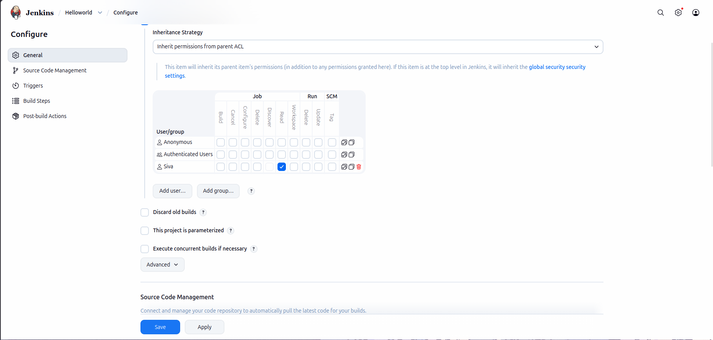

# Lab Information

The Nautilus team is integrating Jenkins into their CI/CD pipelines. After setting up a new Jenkins server, they're now configuring user access for the development team, Follow these steps:

1. Click on the Jenkins button on the top bar to access the Jenkins UI. Login with username admin and password Adm!n321.

2. Create a jenkins user named siva with the password B4zNgHA7Ya. Their full name should match Siva.

3. Utilize the Project-based Matrix Authorization Strategy to assign overall read permission to the siva user.

4. Remove all permissions for Anonymous users (if any) ensuring that the admin user retains overall Administer permissions.

5. For the existing job, grant siva user only read permissions, disregarding other permissions such as Agent, SCM etc.

Note:

1. You may need to install plugins and restart Jenkins service. After plugins installation, select Restart Jenkins when installation is complete and no jobs are running on plugin installation/update page.

2. After restarting the Jenkins service, wait for the Jenkins login page to reappear before proceeding. Avoid clicking Finish immediately after restarting the service.

3. Capture screenshots of your configuration for review purposes. Consider using screen recording software like loom.com for documentation and sharing.

# Lab Solutions

🧭 Part 1: Lab Step-by-Step Guidelines

Step 1: Open Jenkins UI

Click the Jenkins button from the lab top bar.

Login using:

Field	    Value
Username	admin
Password	Adm!n321

Step 2: Open Plugin Manager

Go to:

Manage Jenkins

Then:

Plugins

Step 3: Install Matrix Authorization Plugin

Open:

Available plugins

Search for:

Matrix Authorization Strategy

Install the plugin.

If prompted:

Restart Jenkins when installation is complete and no jobs are running

Select it.

Wait until Jenkins restarts fully.

Step 4: Login Again

Use:

Field	    Value
Username	admin
Password	Adm!n321

Step 5: Open Security Realm User Management

Go to:

Manage Jenkins → Users

Click:

Create User

Step 6: Create User siva

Use exactly:

Field	            Value
Username	        siva
Password	        B4zNgHA7Ya
Confirm Password	B4zNgHA7Ya
Full Name	        Siva
Email	            leave blank or optional

Click:

Create User

Step 7: Open Security Settings

Go to:

Manage Jenkins → Security

Step 8: Configure Authorization Strategy

Under:

Authorization

Select:

Project-based Matrix Authorization Strategy

Step 9: Add User siva

In the user/group field type:

siva

Click:

Add

Configure Global Permissions

Step 10: Grant Overall Read Permission to siva

Under the matrix:

For user siva check ONLY:

Overall → Read

Do NOT select other permissions.

Step 11: Remove Anonymous Permissions

Find:

Anonymous

Uncheck ALL permissions for Anonymous.

Important: Add administer permission for admin user if not already present.

Ensure admin still has:

Overall → Administer

Otherwise you may lock yourself out. Then click Save

Step 12: Open Existing Job Configuration

From Jenkins dashboard:

Click the existing job.

Then click:

Configure

Step 13: Enable Project-based Security

Find:

Enable project-based security

Check the box.

Step 14: Add siva to Job Permissions

Add user:

siva

Grant ONLY:

Job → Read

Do NOT grant:

Build
Configure
Delete
Discover
SCM
Agent
Workspace
Any others

Step 15: Save Configuration

Click:

Save

---

🧠 Part 2: Simple Step-by-Step Explanation (Beginner Friendly)

What Is Matrix Authorization?

Matrix Authorization lets Jenkins control permissions very precisely.

You can decide:

Who can read
Who can build
Who can configure jobs
Who can administer Jenkins
Why Give siva Only Overall Read?

This allows siva to:

✅ Login
✅ View Jenkins dashboard

But NOT:

❌ Change settings
❌ Create jobs
❌ Manage plugins
❌ Administer Jenkins

Why Remove Anonymous Permissions?

Anonymous users are people who are NOT logged in.

Removing Anonymous permissions prevents unauthorized access.

This improves security.

Why Keep Administer Permission for admin?

Without:

Overall → Administer

the admin user loses control of Jenkins.

You could accidentally lock yourself out completely.

Why Use Project-based Security?

Global permissions affect ALL jobs.

Project-based security lets you control permissions for a specific job only.

In this lab:

siva can ONLY view the existing job
Cannot modify or run it
Important Lab Tip

Before clicking Save on security settings:

✅ Verify admin still has Administer permission.

This is the most common Jenkins lab mistake.

---