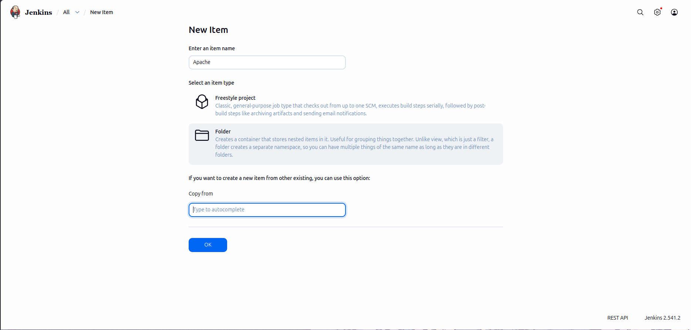
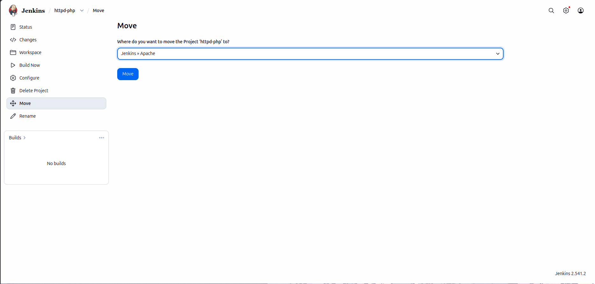
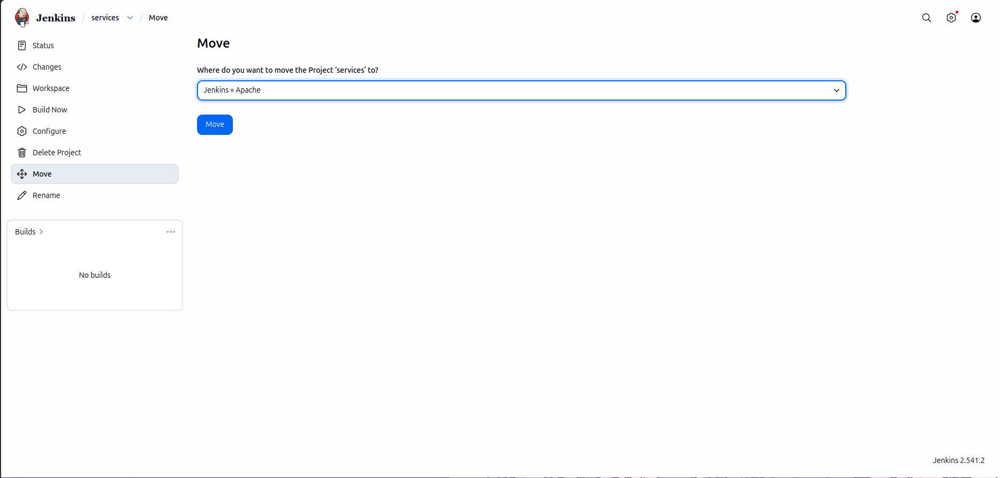
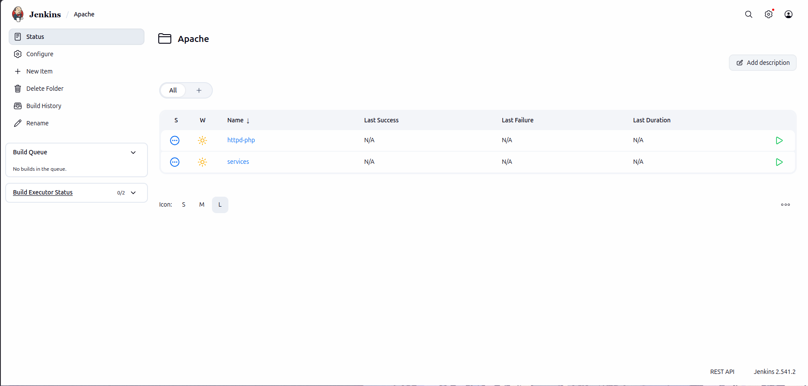

# Lab Information

xFusionCorp Industries' DevOps team aims to streamline the management of Jenkins jobs by organizing them into distinct folders based on their purpose. Complete the task following the provided requirements:

1.Access the Jenkins UI by clicking on the Jenkins button in the top bar. Log in using the credentials: username admin and password Adm!n321.

2. Create a new folder named Apache within the Jenkins UI.

3. Move the existing jobs httpd-php and services under the newly created Apache folder.

Note:

1. Ensure to install any required plugins and restart the Jenkins service if necessary. Opt for Restart Jenkins when installation is complete and no jobs are running on the plugin installation/update page.

2. Be aware that Jenkins UI may experience temporary unresponsiveness during the service restart. Refresh the UI page if needed.

3. Capture screenshots of your work for documentation and review purposes. Alternatively, utilize screen recording software like loom.com for detailed documentation and sharing.

# Lab Solutions

🧭 Part 1: Lab Step-by-Step Guidelines

Step 1: Open Jenkins UI

Click the Jenkins button from the top bar.

Login with:

Field	    Value
Username	admin
Password	Adm!n321

Step 2: Open Plugin Manager

Go to:

Manage Jenkins → Plugins

Step 3: Install CloudBees Folders Plugin

Open:

Available plugins

Search for:

Folders

Install:

`Folders` which is Maintained by CloudBees

Step 4: Restart Jenkins (If Prompted)

If Jenkins shows:

Restart Jenkins when installation is complete and no jobs are running

Select it.

Wait for Jenkins login page to reappear.

Refresh browser if UI becomes unresponsive.

Step 5: Login Again

Use:

Username	Password
admin	    Adm!n321

Step 6: Create New Item

From Jenkins dashboard click:

New Item

Step 7: Create Folder

Enter name:

Apache

Select:

Folder

Click:

OK

Then click:

Save

Step 8: Open httpd-php Job

From dashboard click:

httpd-php

Step 9: Move httpd-php Job

On the left sidebar click:

Move

Destination:

Apache

Confirm move.

Step 10: Move services Job

Repeat same process:

Open services
Click Move
Select destination:
Apache
Confirm
Verify Structure

Step 11: Verify Jobs Inside Apache Folder

Open:

Apache

You should see:

httpd-php
services

inside the folder.

---

🧠 Part 2: Simple Step-by-Step Explanation (Beginner Friendly)

What Is a Jenkins Folder?

Folders help organize Jenkins jobs.

Instead of keeping all jobs on one dashboard, you can group related jobs together.

Example:

Apache/
 ├── httpd-php
 └── services
Why Install the Folders Plugin?

Jenkins does not support folders by default.

The CloudBees Folders Plugin adds:

Folder creation
Nested job organization
Better CI/CD management
What Does “Move Job” Mean?

Moving a job changes its location in Jenkins.

The job itself is not deleted.

Its:

Build history
Configuration
Workspace
Settings

remain intact.

Why Organize Jobs Into Folders?

Large Jenkins servers may contain hundreds of jobs.

Folders help teams:

Stay organized
Separate environments/projects
Manage permissions more easily
Reduce dashboard clutter
Important Lab Tip

If you do not see:

Folder

during “New Item” creation, the plugin installation likely did not complete yet.

Wait for Jenkins restart and login again.

---