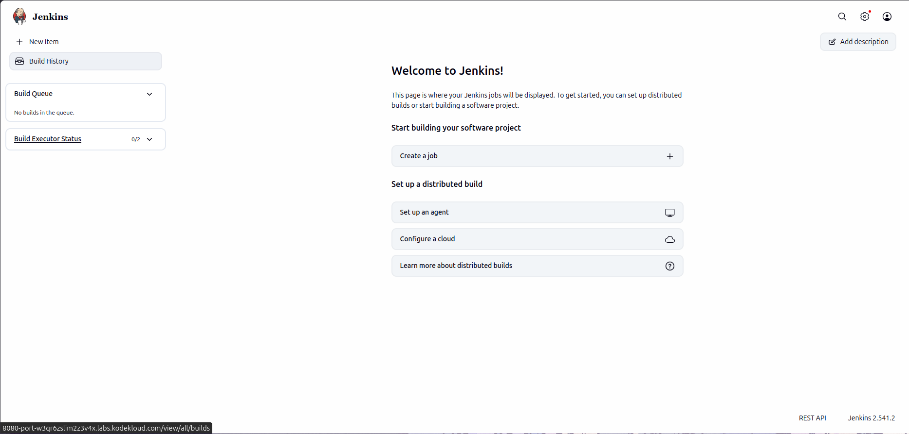
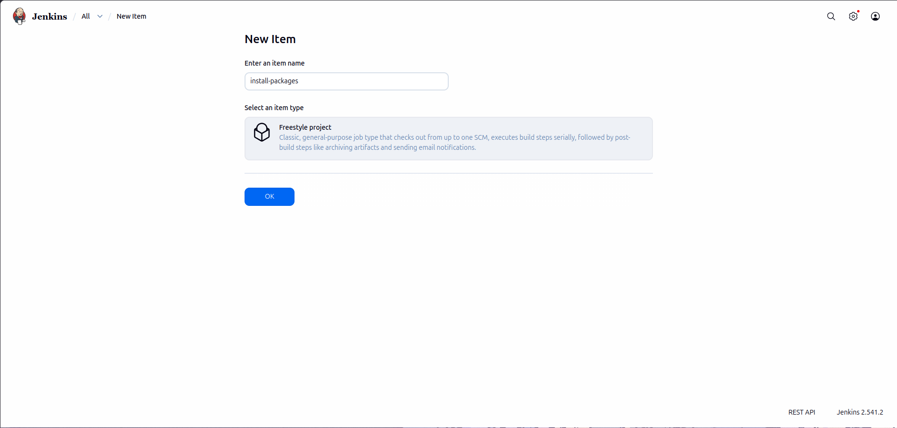
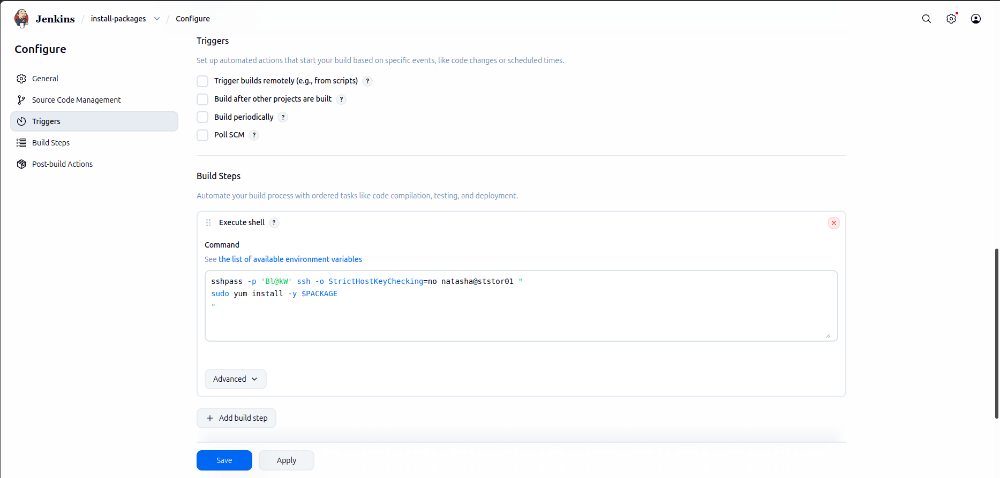
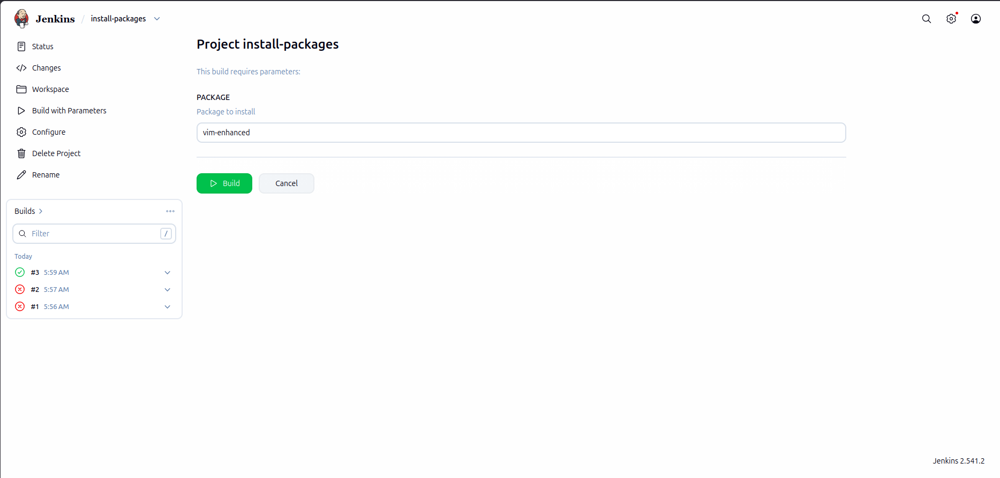
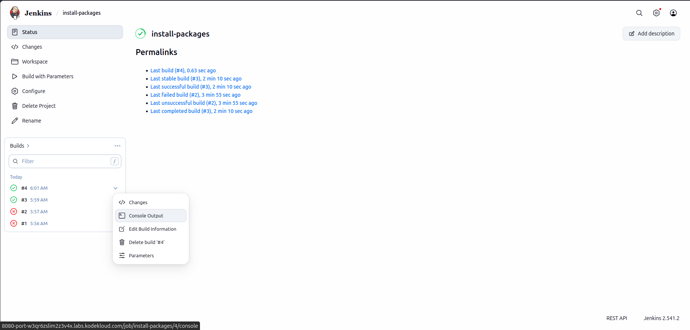
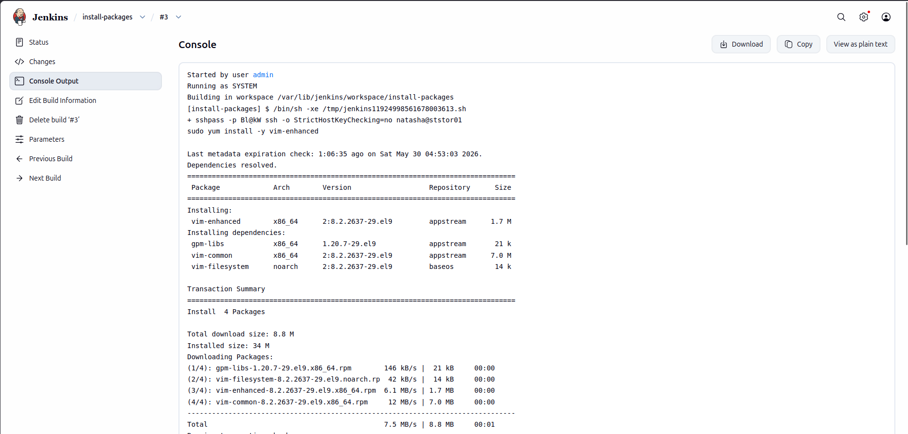

# Lab Information

Some new requirements have come up to install and configure some packages on the Nautilus infrastructure under Stratos Datacenter. The Nautilus DevOps team installed and configured a new Jenkins server so they wanted to create a Jenkins job to automate this task. Find below more details and complete the task accordingly:


1. Access the Jenkins UI by clicking on the Jenkins button in the top bar. Log in using the credentials: username admin and password Adm!n321.

2. Create a new Jenkins job named install-packages and configure it with the following specifications:

    Add a string parameter named PACKAGE.

    Configure the job to install a package specified in the $PACKAGE parameter on the storage server (Stratos Datacenter).

    Build the job at least once (e.g. with parameter PACKAGE=vim-enhanced) so the package is installed on the Storage server and can be verified.

Note:

1. Ensure to install any required plugins and restart the Jenkins service if necessary. Opt for Restart Jenkins when installation is complete and no jobs are running on the plugin installation/update page. Refresh the UI page if needed after restarting the service.

2. Verify that the Jenkins job runs successfully on repeated executions to ensure reliability.

3. Capture screenshots of your configuration for documentation and review purposes. Alternatively, use screen recording software like loom.com for comprehensive documentation and sharing.


# Lab Solutions

🧭 Part 1: Lab Step-by-Step Guidelines

Step 1: Open Jenkins UI

Click the Jenkins button from the top bar.

Login with:

Field	    Value
Username	admin
Password	Adm!n321

Step 2: Create New Jenkins Job

From dashboard click:

New Item



Step 3: Configure Job Name

Enter:

install-packages

Select:

Freestyle project

Click:

OK



Step 4: Add String Parameter

Under:

General

Check:

This project is parameterized

Click:

Add Parameter

Select:

String Parameter

Configure:

Field	        Value
Name	        PACKAGE
Default Value	vim-enhanced
Description	    Package to install


Step 5: Configure Build Step

Scroll to:

Build Steps

Click:

Add build step

Select:

Execute shell

Add this script:

```
sshpass -p 'Bl@kW' ssh -o StrictHostKeyChecking=no natasha@ststor01 "
sudo yum install -y $PACKAGE
"
```

Step 6: Save Job

Click:

Save




Step 7: Build the Job

Click:

Build with Parameters

Use:

Parameter	Value
PACKAGE	vim-enhanced

Click:

Build




Step 8: Verify Build Success

Open:

Build History

Click latest build.

Then click:

Console Output

Expected output should show:

```
Started by user admin

Running as SYSTEM
Building in workspace /var/lib/jenkins/workspace/install-packages
[install-packages] $ /bin/sh -xe /tmp/jenkins11924998561678003613.sh
+ sshpass -p Bl@kW ssh -o StrictHostKeyChecking=no natasha@ststor01 
sudo yum install -y vim-enhanced

Last metadata expiration check: 1:06:35 ago on Sat May 30 04:53:03 2026.
Dependencies resolved.
================================================================================
 Package             Arch        Version                   Repository      Size
================================================================================
Installing:
 vim-enhanced        x86_64      2:8.2.2637-29.el9         appstream      1.7 M
Installing dependencies:
 gpm-libs            x86_64      1.20.7-29.el9             appstream       21 k
 vim-common          x86_64      2:8.2.2637-29.el9         appstream      7.0 M
 vim-filesystem      noarch      2:8.2.2637-29.el9         baseos          14 k

Transaction Summary
================================================================================
Install  4 Packages

Total download size: 8.8 M
Installed size: 34 M
Downloading Packages:
(1/4): gpm-libs-1.20.7-29.el9.x86_64.rpm        146 kB/s |  21 kB     00:00    
(2/4): vim-filesystem-8.2.2637-29.el9.noarch.rp  42 kB/s |  14 kB     00:00    
(3/4): vim-enhanced-8.2.2637-29.el9.x86_64.rpm  6.1 MB/s | 1.7 MB     00:00    
(4/4): vim-common-8.2.2637-29.el9.x86_64.rpm     12 MB/s | 7.0 MB     00:00    
--------------------------------------------------------------------------------
Total                                           7.5 MB/s | 8.8 MB     00:01     
Running transaction check
Transaction check succeeded.
Running transaction test
Transaction test succeeded.
Running transaction
  Preparing        :                                                        1/1 
  Installing       : gpm-libs-1.20.7-29.el9.x86_64                          1/4 
  Installing       : vim-filesystem-2:8.2.2637-29.el9.noarch                2/4 
  Installing       : vim-common-2:8.2.2637-29.el9.x86_64                    3/4 
  Installing       : vim-enhanced-2:8.2.2637-29.el9.x86_64                  4/4 
  Running scriptlet: vim-enhanced-2:8.2.2637-29.el9.x86_64                  4/4 
  Verifying        : vim-filesystem-2:8.2.2637-29.el9.noarch                1/4 
  Verifying        : gpm-libs-1.20.7-29.el9.x86_64                          2/4 
  Verifying        : vim-common-2:8.2.2637-29.el9.x86_64                    3/4 
  Verifying        : vim-enhanced-2:8.2.2637-29.el9.x86_64                  4/4 

Installed:
  gpm-libs-1.20.7-29.el9.x86_64         vim-common-2:8.2.2637-29.el9.x86_64    
  vim-enhanced-2:8.2.2637-29.el9.x86_64 vim-filesystem-2:8.2.2637-29.el9.noarch

Complete!
Finished: SUCCESS
```





---

🧠 Part 2: Simple Step-by-Step Explanation (Beginner Friendly)

What This Jenkins Job Does

This Jenkins job automatically installs software packages on the Storage Server.

Instead of manually logging into the server every time, Jenkins performs the installation for you.

Why We Use a Parameter

The parameter:

PACKAGE

makes the Jenkins job reusable.

Example:

PACKAGE Value	What Happens
vim-enhanced	Installs Vim editor
git	            Installs Git
wget	        Installs wget

So you can install different packages without changing the job configuration.

Why Jenkins Uses SSH

Jenkins runs on its own server.

To install software on another machine (ststor01), Jenkins must connect remotely using SSH.

This command:

```
ssh natasha@ststor01
```
means:

Connect to server ststor01
Login as user natasha

Why We Use sshpass

Normally SSH asks for a password manually.

But Jenkins jobs are automated and cannot type passwords interactively.

sshpass sends the password automatically so the job can run without human input.

Why We Use sudo

The user natasha is not a root user.

Installing packages requires administrator privileges.

So we use:

```
sudo yum install
```

which temporarily gives admin permissions.

What This Command Does

```
yum install -y $PACKAGE
```

Breakdown:

Part	    Meaning
yum	        Linux package manager
install	    Install software
-y	        Automatically answer yes
$PACKAGE	Uses Jenkins parameter value

Why We Run the Job Once

The lab requires:

✅ Jenkins job created
✅ Job executed successfully
✅ Package actually installed on Storage Server

Running the build proves the automation works correctly.

How To Verify Success

If the build succeeds, the Console Output usually shows:

Complete!

or package installation messages.

This confirms Jenkins successfully connected to the Storage Server and installed the package.

---
