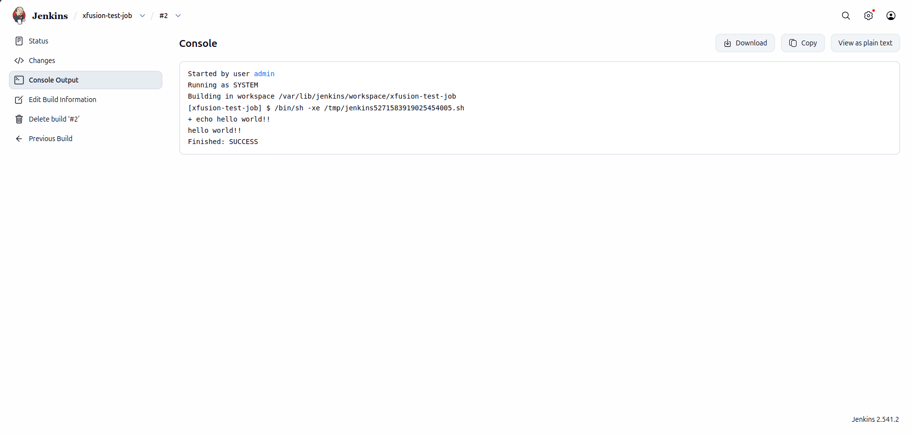

# Lab Information

The DevOps team of xFusionCorp Industries is planning to create a number of Jenkins jobs for different tasks. So to easily manage the jobs within Jenkins UI they decided to create different views for all Jenkins jobs based on usage/nature of these jobs, - for example xfusion-crons view for all cron jobs. Based on the requirements shared below please perform the below mentioned task:

Click on the Jenkins button on the top bar to access the Jenkins UI. Login using username admin and password Adm!n321.

1. Create a Jenkins job named xfusion-test-job.

2. Configure this job to run a simple bash command i.e echo "hello world!!".

3. Create a view named xfusion-crons (it must be a global view of type List View) and make sure xfusion-test-job and xfusion-cron-job (which is already present on Jenkins) jobs are listed under this new view.

4. Schedule this newly created job to build periodically at every minute i.e * * * * * (please make sure to use the cron expression exactly same how it is mentioned here).

5. Make sure the job builds successfully.

Note:

1. You might need to install some plugins and restart Jenkins service. So, we recommend clicking on Restart Jenkins when installation is complete and no jobs are running on plugin installation/update page i.e update centre. Also, Jenkins UI sometimes gets stuck when Jenkins service restarts in the back end. In this case please make sure to refresh the UI page.

2. For these kind of scenarios requiring changes to be done in a web UI, please take screenshots so that you can share it with us for review in case your task is marked incomplete. You may also consider using a screen recording software such as loom.com to record and share your work.

---

# Lab Solutions

✅ Part 1: Lab Step-by-Step Guidelines

Step 1: Log in to Jenkins
Click the Jenkins button on the top bar.
Login with:
Username: admin
Password: Adm!n321

Step 2: Create the Jenkins Job
From the Jenkins Home Dashboard (important: not from My Views), click New Item.
Enter:
xfusion-test-job
Select Freestyle project.
Click OK.

Step 3: Configure the Build Trigger
Open Configure for xfusion-test-job.
Scroll to Build Triggers.
Check Build periodically.
Enter exactly:
* * * * *

⚠️ Do not use:

H * * * *
H/1 * * * *

The validator checks for the exact cron expression.

Step 4: Configure the Build Step
Scroll to the Build section.
Click Add build step → Execute shell.
Enter:
echo "hello world!!"
Click Save.

Step 5: Create the Global View

⚠️ Important: Create the view from the Jenkins Home Dashboard, not from My Views.

Click the Jenkins logo to return to the main dashboard.
Click + New View.
Enter:
xfusion-crons
Select:
List View
Click Create.

Step 6: Add Jobs to the View
Open xfusion-crons.
Click Edit View.
Add these jobs:
xfusion-test-job
xfusion-cron-job
Save.
Verify both jobs appear in the view.

Step 7: Build the Job
Open xfusion-test-job.
Click Build Now.
Wait for the build to finish.

Step 8: Verify Success
Open the latest build.
Click Console Output.
Verify:
hello world!!
Finished: SUCCESS

---

🧠 Part 2: Simple Step-by-Step Explanations (Beginner Friendly)

- Why create xfusion-test-job?

A Jenkins job is a task Jenkins can run automatically. This lab requires creating a new job.

- Why use a Freestyle Project?

Freestyle projects are the simplest Jenkins jobs and are perfect for running shell commands.

- Why add the cron schedule?

The schedule tells Jenkins when to run the job automatically.

The expression:

* * * * *

means:

Every minute of every hour of every day

- Why add Execute shell?

This lets Jenkins run Linux commands.

The command:

echo "hello world!!"

simply prints:

hello world!!

to the build log.

- Why create xfusion-crons as a Global List View?

The lab specifically requires:

View name: xfusion-crons
View type: List View
Scope: Global

Creating it from Jenkins Home ensures the validator can find it.

- How do I know the task is complete?

You should have:

✔ Job: xfusion-test-job

✔ Build command:

echo "hello world!!"

✔ Global List View:

xfusion-crons

✔ Both jobs listed:

xfusion-test-job
xfusion-cron-job

✔ Cron schedule:

* * * * *

✔ Console Output:

hello world!!
Finished: SUCCESS

---