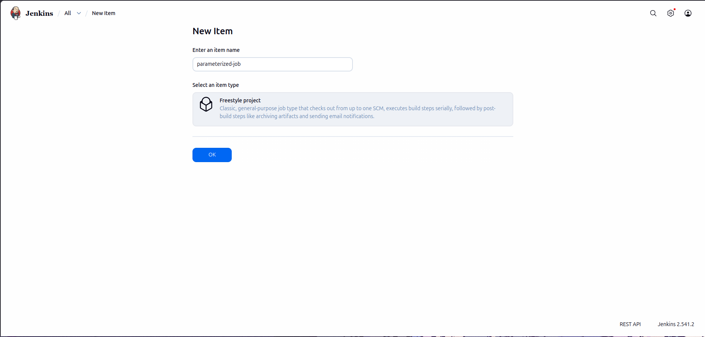
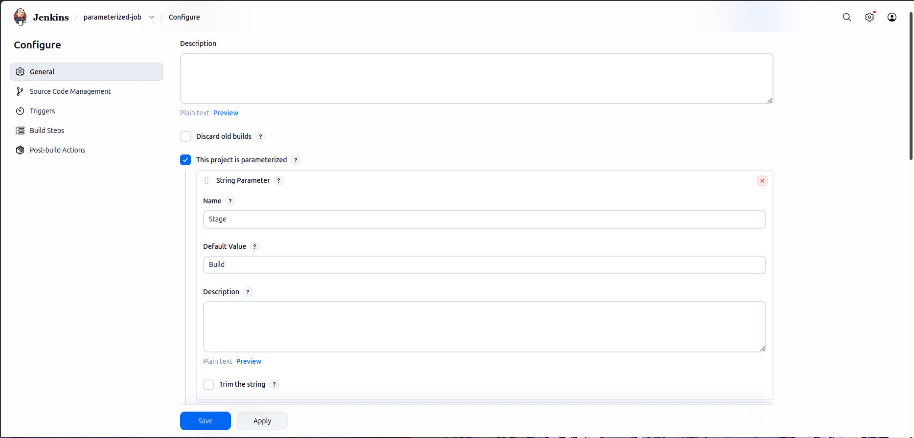
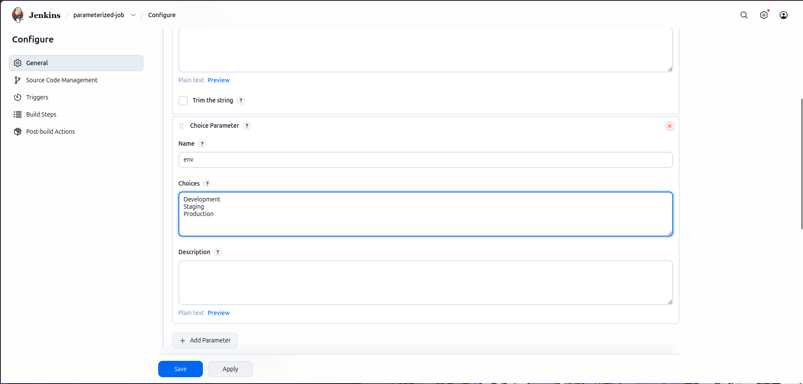
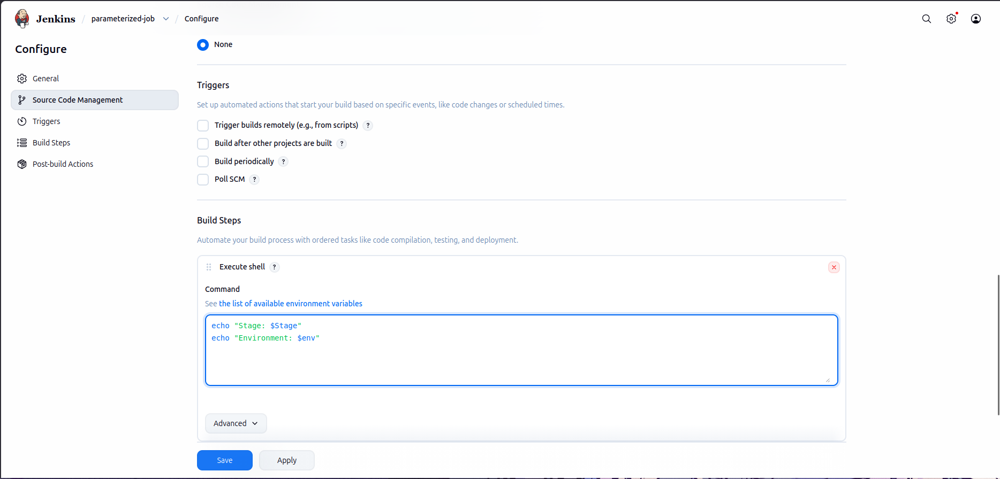
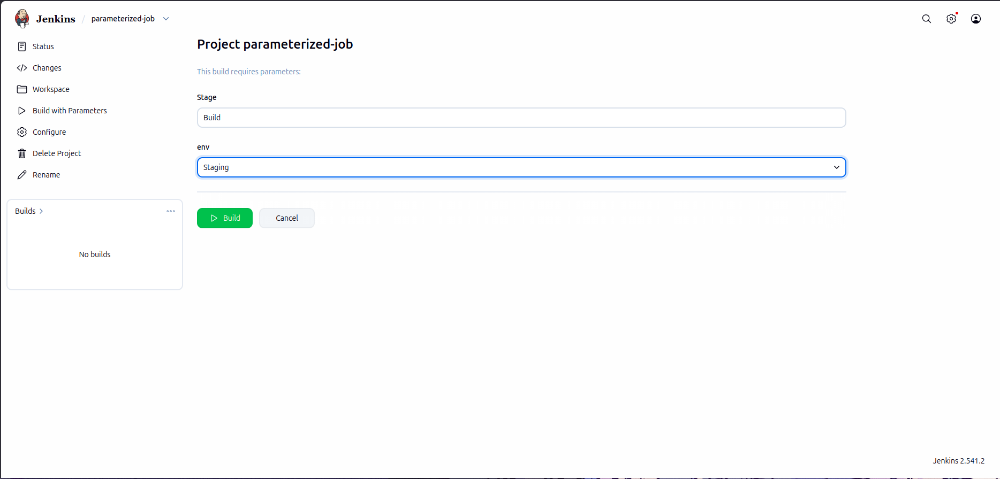
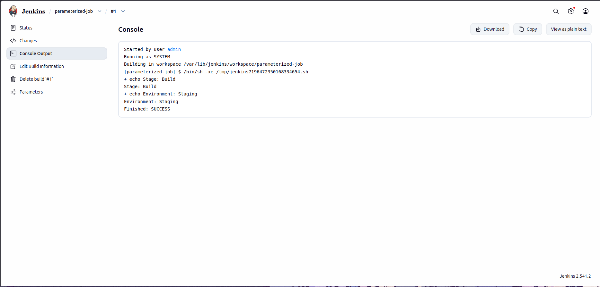

# Lab Informaiton

A new DevOps Engineer has joined the team and he will be assigned some Jenkins related tasks. Before that, the team wanted to test a simple parameterized job to understand basic functionality of parameterized builds. He is given a simple parameterized job to build in Jenkins. Please find more details below:

Click on the Jenkins button on the top bar to access the Jenkins UI. Login using username admin and password Adm!n321.

1. Create a parameterized job which should be named as parameterized-job

2. Add a string parameter named Stage; its default value should be Build.

3. Add a choice parameter named env; its choices should be Development, Staging and Production.

4. Configure job to execute a shell command, which should echo both parameter values (you are passing in the job).

5. Build the Jenkins job at least once with choice parameter value Staging to make sure it passes.

Note:

1. You might need to install some plugins and restart Jenkins service. So, we recommend clicking on Restart Jenkins when installation is complete and no jobs are running on plugin installation/update page i.e update centre. Also, Jenkins UI sometimes gets stuck when Jenkins service restarts in the back end. In this case, please make sure to refresh the UI page.

2. For these kind of scenarios requiring changes to be done in a web UI, please take screenshots so that you can share it with us for review in case your task is marked incomplete. You may also consider using a screen recording software such as loom.com to record and share your work.

---

# Lab Solutions

✅ Part 1: Lab Step-by-Step Guidelines

Step 1: Log in to Jenkins
Click the Jenkins button on the top bar.
Login with:
Username: admin
Password: Adm!n321

Step 2: Create the Job
From the Jenkins Dashboard, click New Item.
Enter the job name: parameterized-job
Select Freestyle project.
Click OK.

Step 3: Enable Parameterized Build
In the job configuration page, scroll to This project is parameterized.
Check the box:
This project is parameterized

Step 4: Add String Parameter
Click Add Parameter.
Select String Parameter.
Configure:
Field	        Value
Name	        Stage
Default Value	Build

It should look like:

Name: Stage
Default Value: Build

Step 5: Add Choice Parameter
Click Add Parameter again.
Select Choice Parameter.
Configure:
Field	        Value
Name	        env

Choices (one per line):

Development
Staging
Production

Step 6: Configure Build Step
Scroll to the Build section.
Click Add build step → Execute shell.
Enter:
echo "Stage: $Stage"
echo "Environment: $env"
Click Save.

Step 7: Build the Job
Open parameterized-job.
Click:
Build with Parameters

(not "Build Now")

Set:
Parameter	Value
Stage	    Build
env	        Staging
Click Build.

Step 8: Verify Successful Build
Open the latest build.
Click Console Output.
Confirm output similar to:
Stage: Build
Environment: Staging
Finished: SUCCESS

---

🧠 Part 2: Simple Step-by-Step Explanations (Beginner Friendly)

- What is a Parameterized Job?

A parameterized job lets users provide values when starting a build.

Instead of hardcoding values, Jenkins asks for them before running the job.

Example:

Stage = Build
env = Staging

These values become variables Jenkins can use during the build.

- Why Create the String Parameter Stage?

A String Parameter allows users to type text.

You are creating:

Stage

with default value:

Build

If the user does not change it, Jenkins automatically uses:

Build

- Why Create the Choice Parameter env?

A Choice Parameter provides a dropdown menu.

Available options:

Development
Staging
Production

This prevents typing mistakes and ensures valid environments are selected.

- How Does the Shell Script Use Parameters?

When Jenkins runs the job:

echo "Stage: $Stage"
echo "Environment: $env"

Jenkins replaces:

$Stage

with the selected Stage value.

and replaces:

$env

with the selected environment.

Example:

Stage = Build
env = Staging

Output becomes:

Stage: Build
Environment: Staging

- Why Must You Use "Build with Parameters"?

A parameterized job requires values to be supplied.

Therefore use:

Build with Parameters

instead of:

Build Now

---