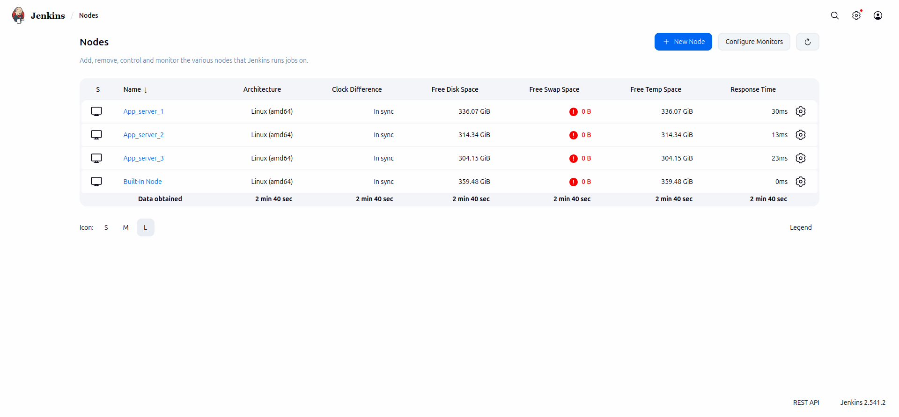

# Lab Information

The Nautilus DevOps team has installed and configured new Jenkins server in Stratos DC which they will use for CI/CD and for some automation tasks. There is a requirement to add all app servers as slave nodes in Jenkins so that they can perform tasks on these servers using Jenkins. Find below more details and accomplish the task accordingly.

Click on the Jenkins button on the top bar to access the Jenkins UI. Login using username admin and password Adm!n321.

1. Add all app servers as SSH build agent/slave nodes in Jenkins. Slave node name for app server 1, app server 2 and app server 3 must be App_server_1, App_server_2, App_server_3 respectively.

2. Add labels as below:

App_server_1 : stapp01

App_server_2 : stapp02

App_server_3 : stapp03

3. Remote root directory for App_server_1 must be /home/tony/jenkins, for App_server_2 must be /home/steve/jenkins and for App_server_3 must be /home/banner/jenkins.

4. Make sure slave nodes are online and working properly.

Note:

1. You might need to install some plugins and restart Jenkins service. So, we recommend clicking on Restart Jenkins when installation is complete and no jobs are running on plugin installation/update page i.e update centre. Also, Jenkins UI sometimes gets stuck when Jenkins service restarts in the back end. In this case, please make sure to refresh the UI page.

2. For these kind of scenarios requiring changes to be done in a web UI, please take screenshots so that you can share it with us for review in case your task is marked incomplete. You may also consider using a screen recording software such as loom.com to record and share your work.

---

# Lab Solutions

✅ Part 1: Lab Step-by-Step Guidelines

Step 1: Open Jenkins

Click the Jenkins button at the top of the KodeKloud lab.
Login with:
Username	Password
admin	    Adm!n321

Step 2: Install the SSH Build Agents Plugin (If Needed)

Go to:

Manage Jenkins
    ↓
Plugins
    ↓
Available Plugins

Search for:

SSH Build Agents

(or SSH Agent if that's what your Jenkins version provides.)

If it isn't installed:

Install it.

Restart Jenkins when prompted.

Refresh the browser after Jenkins comes back online.

Step 3: Create Agent for App Server 1

Go to:

Manage Jenkins
    ↓
Nodes
    ↓
New Node
Name
App_server_1

Select

Permanent Agent

Click Create.

Fill in:

Field	Value
Name	App_server_1
Number of executors	1
Remote root directory	/home/tony/jenkins
Labels	stapp01
Usage	Use this node as much as possible
Launch method	Launch agents via SSH
SSH Configuration
Field	Value
Host	stapp01
Credentials	Add new

Create credentials:

Type	Username with password
Username	tony
Password	Ir0nM@n

Save the credentials.

Set:

Host Key Verification Strategy

to:

Non verifying Verification Strategy

Click Save.

Step 4: Create Agent for App Server 2

Repeat the same process.

General
Field	Value
Name	App_server_2
Remote root directory	/home/steve/jenkins
Label	stapp02
SSH
Field	Value
Host	stapp02
Username	steve
Password	Am3ric@

Host key verification:

Non verifying Verification Strategy

Save.

Step 5: Create Agent for App Server 3

Again repeat.

General
Field	Value
Name	App_server_3
Remote root directory	/home/banner/jenkins
Label	stapp03
SSH
Field	Value
Host	stapp03
Username	banner
Password	BigGr33n

Host key verification:

Non verifying Verification Strategy

Save.

Step 6: Ensure Remote Directories Exist (If Connection Fails)

If Jenkins reports:

Remote root directory doesn't exist

SSH into each server from the Jump Host and create it.

App Server 1
ssh thor@jump-host
ssh tony@stapp01
Password : Ir0nM@n
mkdir -p /home/tony/jenkins
sudo dnf install java-17-openjdk -y
sudo alternatives --config java
Select - 2 and then Enter
exit

App Server 2
ssh steve@stapp02
Password : Am3ric@
mkdir -p /home/steve/jenkins
sudo dnf install java-17-openjdk -y
sudo alternatives --config java
Select - 2 and then Enter
exit

App Server 3
ssh banner@stapp03
Password : BigGr33n
mkdir -p /home/banner/jenkins
sudo dnf install java-17-openjdk -y
sudo alternatives --config java
Select - 2 and then Enter
exit

Step 7: Verify Agents Are Online

Go to:

Manage Jenkins
    ↓
Nodes

You should see Each Node:

Click Each Node
Click Status in the left sidebar.
On the Status page, if the node is offline, Click Launch agent

App_server_1
✔ Online

App_server_2
✔ Online

App_server_3
✔ Online

---

🧠 Part 2: Simple Step-by-Step Explanations (Beginner Friendly)

What is a Jenkins Agent (Slave)?

Think of Jenkins like a manager.

The manager doesn't do all the work itself.

Instead, it tells other computers to do the work.

            Jenkins
           (Manager)

          /     |     \
         /      |      \
 App1      App2      App3

Each App Server becomes an agent that Jenkins can use to run builds, tests, deployments, and scripts.

Why use SSH?

Jenkins needs a way to log into each server.

It uses SSH, just like you do manually.

When Jenkins connects, it runs commands remotely.

Jenkins
    │
SSH
    │
    ▼
stapp01
Why specify a Remote Root Directory?

Example:

/home/tony/jenkins

This is Jenkins' workspace on that server.

It stores:

Job workspaces
Temporary files
Build artifacts
Logs

Each agent should have its own workspace directory.

Why add Labels?

Example:

stapp01

Labels let you target a specific agent in your Jenkins jobs.

For example, a pipeline can say:

agent {
    label 'stapp01'
}

Then Jenkins knows to run the job only on App Server 1.

Why use "Launch agents via SSH"?

Jenkins needs to:

Connect to the server.
Copy the Jenkins agent (agent.jar).
Start it automatically.
Keep it connected.

The SSH launch method automates all of this.

Why use "Non verifying Verification Strategy"?

Normally, SSH checks the server's host key to prevent connecting to the wrong machine.

In KodeKloud labs, these servers are temporary, so their SSH host keys change frequently.

Using Non verifying Verification Strategy tells Jenkins to skip that verification, making it easier to connect in the lab environment.

Common Problems and Fixes
Error	Solution
SSH Build Agents plugin missing	Install the plugin and restart Jenkins.
Invalid credentials	Double-check the username and password.
Connection refused	Ensure the target server is reachable and SSH is running.
Remote root directory doesn't exist	Create it with mkdir -p.
Host key verification failed	Select Non verifying Verification Strategy.

---