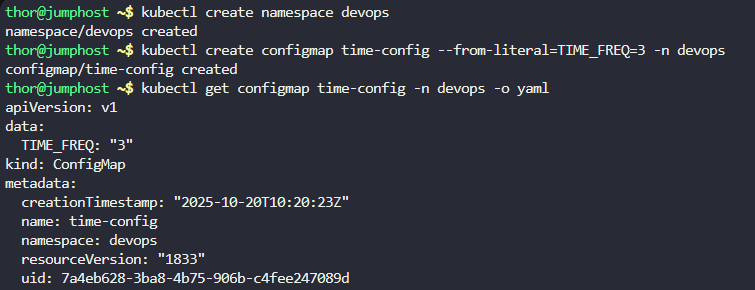
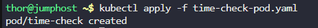
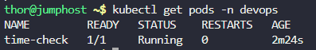
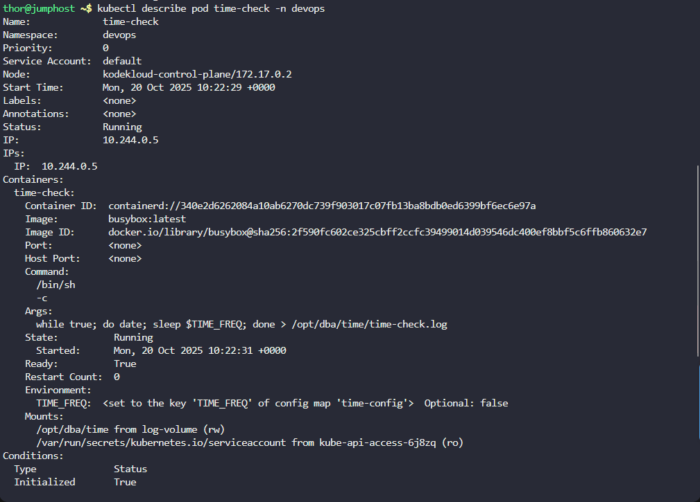
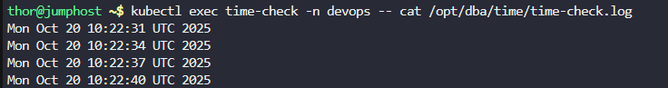
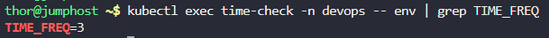
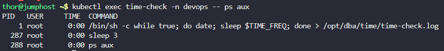
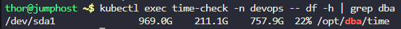

# Step 1: Create the devops namespace

First, let's create the namespace if it doesn't exist:
```
kubectl create namespace devops
```

# Step 2: Create the ConfigMap

Create the config map with the TIME_FREQ data:
```
kubectl create configmap time-config --from-literal=TIME_FREQ=3 -n devops
```

Verify the ConfigMap was created:
```
kubectl get configmap time-config -n devops -o yaml
```



# Step 3: Create the Pod YAML file

Now, let's create the pod configuration with all the requirements:
vi time-check-pod.yaml 
```
apiVersion: v1
kind: Pod
metadata:
  name: time-check
  namespace: devops
spec:
  containers:
  - name: time-check
    image: busybox:latest
    command: 
      - /bin/sh
      - -c
    args:
      - while true; do date; sleep \$TIME_FREQ; done > /opt/dba/time/time-check.log
    env:
    - name: TIME_FREQ
      valueFrom:
        configMapKeyRef:
          name: time-config
          key: TIME_FREQ
    volumeMounts:
    - name: log-volume
      mountPath: /opt/dba/time
  volumes:
  - name: log-volume
    emptyDir: {}
```

# Step 4: Apply the Pod configuration

Create the pod in the cluster:
```
kubectl apply -f time-check-pod.yaml
```



# Step 5: Verify the pod is running

Check the pod status:
```
kubectl get pods -n devops
```



# Step 6: Verify the pod details

Check the detailed configuration to ensure all requirements are met:
```
kubectl describe pod time-check -n devops
```



# Step 7: Check the logs and file creation

Wait about 10-15 seconds for the pod to generate some logs, then check:
Option 1: Check the log file content directly
```
kubectl exec time-check -n devops -- cat /opt/dba/time/time-check.log
```


Option 2: Check the environment variable
```
kubectl exec time-check -n devops -- env | grep TIME_FREQ
```



Option 3: Check the process is running
```
kubectl exec time-check -n devops -- ps aux
```



# Step 8: Verify the volume mount

Check that the volume is properly mounted:
```
kubectl exec time-check -n devops -- df -h | grep dba
```

