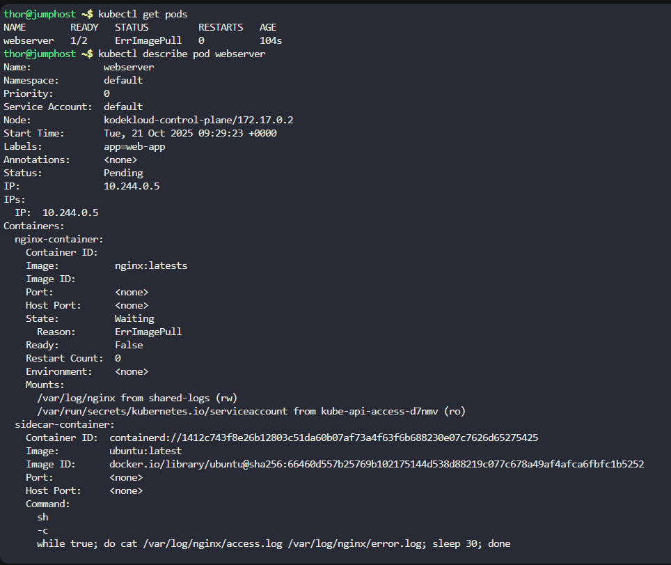
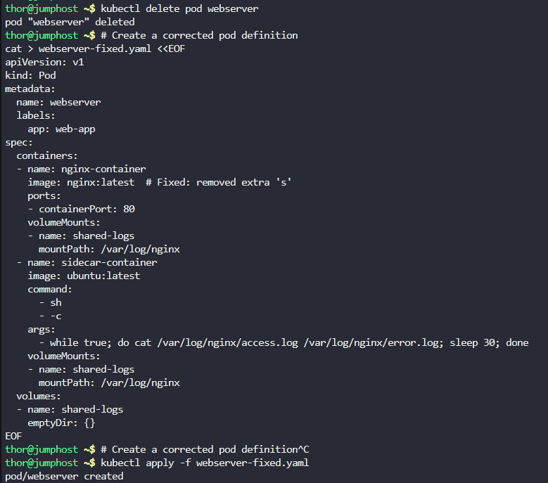
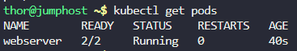
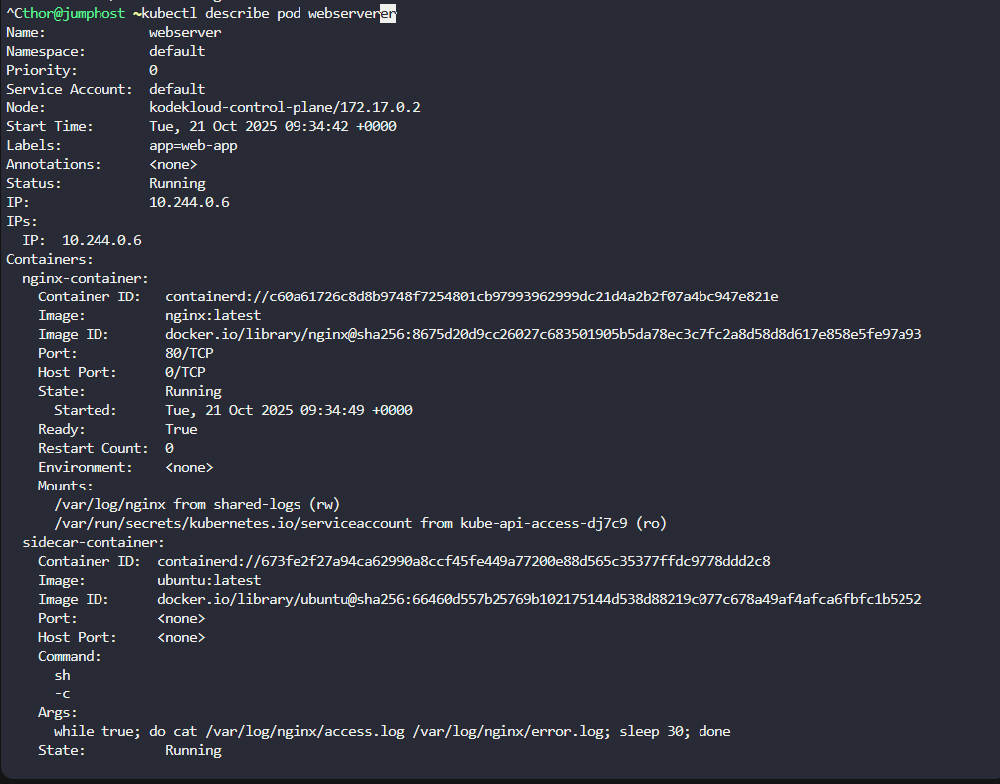
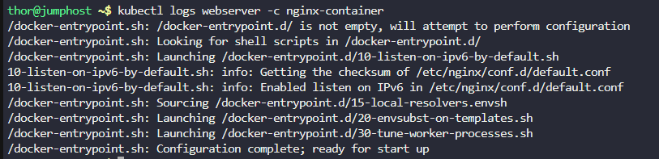
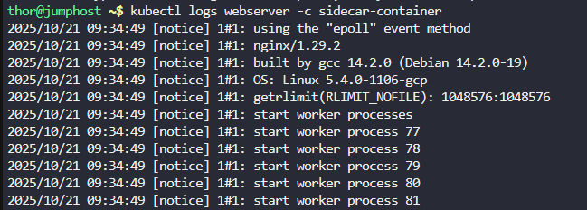
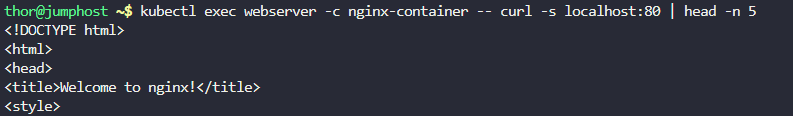

# Step 1: Check the current pod status and details
```
kubectl get pods
kubectl describe pod webserver
```



```
kubectl delete pod webserver
```

```
# Create a corrected pod definition
cat > webserver-fixed.yaml <<EOF
apiVersion: v1
kind: Pod
metadata:
  name: webserver
  labels:
    app: web-app
spec:
  containers:
  - name: nginx-container
    image: nginx:latest  # Fixed: removed extra 's'
    ports:
    - containerPort: 80
    volumeMounts:
    - name: shared-logs
      mountPath: /var/log/nginx
  - name: sidecar-container
    image: ubuntu:latest
    command: 
      - sh
      - -c
    args:
      - while true; do cat /var/log/nginx/access.log /var/log/nginx/error.log; sleep 30; done
    volumeMounts:
    - name: shared-logs
      mountPath: /var/log/nginx
  volumes:
  - name: shared-logs
    emptyDir: {}
EOF
```

# Step 2: Apply the corrected configuration
```
kubectl apply -f webserver-fixed.yaml
```



# Step 3: Verify the pod is running
```
kubectl get pods
```


# Step 4: Check both containers are running
```
kubectl describe pod webserver
```



# Step 5: Test the nginx container


# Check nginx container logs
```
kubectl logs webserver -c nginx-container
```



# Check sidecar container logs
```
kubectl logs webserver -c sidecar-container
```



# Step 6: Test application accessibility


# Test nginx internally from within the pod
```
kubectl exec webserver -c nginx-container -- curl -s localhost:80 | head -n 5
```



