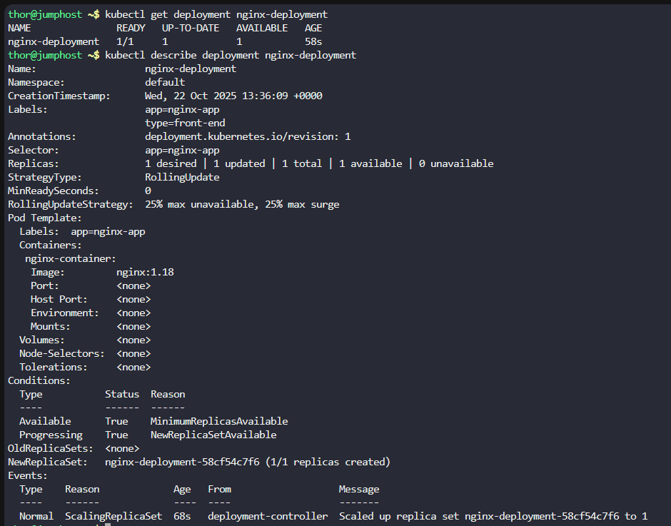

# Step 1: Check the current state

First, let's examine the current deployment and service:
```
kubectl get deployment nginx-deployment
kubectl describe deployment nginx-deployment
kubectl get service nginx-service
kubectl describe service nginx-service
```




# Step 2: Update the service NodePort

Let's modify the service to change the NodePort from 30008 to 32165:
```
kubectl edit service nginx-service
```

Then find the nodePort field and change 30008 to 32165, save and exit.

# Step 3: Update the deployment replicas

Change the number of replicas from 1 to 5:
```
kubectl scale deployment nginx-deployment --replicas=5
```


# Step 4: Update the container image

Update the image from nginx:1.18 to nginx:latest:
```
kubectl set image deployment nginx-deployment nginx-container=nginx:latest
```


# Step 5: Verify all changes

Let's verify each change was applied successfully:
Check service update:
```
kubectl get service nginx-service -o yaml | grep nodePort
```

Expected output: Should show nodePort: 32165


Check replicas count:
```
kubectl get deployment nginx-deployment -o wide
```

Expected output: Should show READY: 5/5


Check pods and their images:
```
kubectl get pods
kubectl describe deployment nginx-deployment | grep -A 5 "Image"
```


Expected output: Should show nginx:latest

