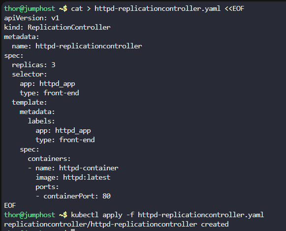
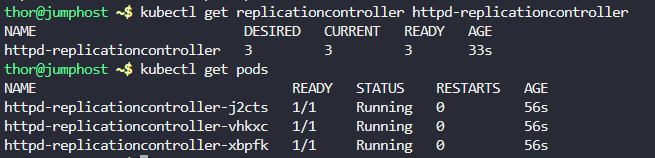
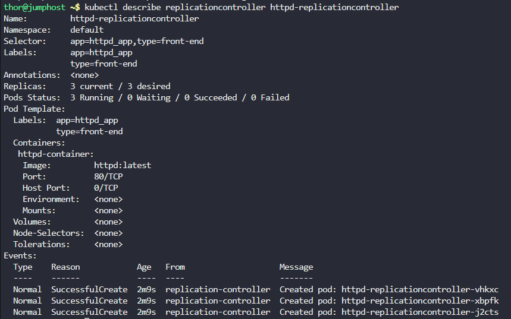
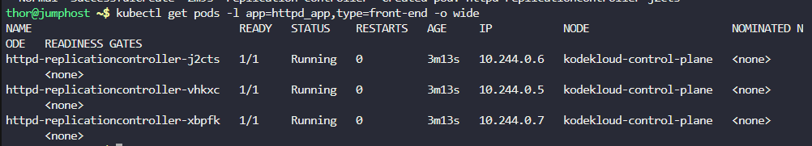

# Step 1: Create the ReplicationController YAML file

```
cat > httpd-replicationcontroller.yaml <<EOF
apiVersion: v1
kind: ReplicationController
metadata:
  name: httpd-replicationcontroller
spec:
  replicas: 3
  selector:
    app: httpd_app
    type: front-end
  template:
    metadata:
      labels:
        app: httpd_app
        type: front-end
    spec:
      containers:
      - name: httpd-container
        image: httpd:latest
        ports:
        - containerPort: 80
EOF
```


Explanation of the configuration:

ReplicationController name: httpd-replicationcontroller

Image: httpd:latest

Labels: app: httpd_app and type: front-end

Container name: httpd-container

Replica count: 3

# Step 2: Apply the ReplicationController

```
kubectl apply -f httpd-replicationcontroller.yaml
```



# Step 3: Verify the ReplicationController was created
```
kubectl get replicationcontroller httpd-replicationcontroller
```

# Step 4: Check the pods created by the ReplicationController
```
kubectl get pods
```



# Step 5: Verify pod details and labels
```
kubectl describe replicationcontroller httpd-replicationcontroller
```



# Step 6: Verify all pods are running
```
kubectl get pods -l app=httpd_app,type=front-end -o wide
```

