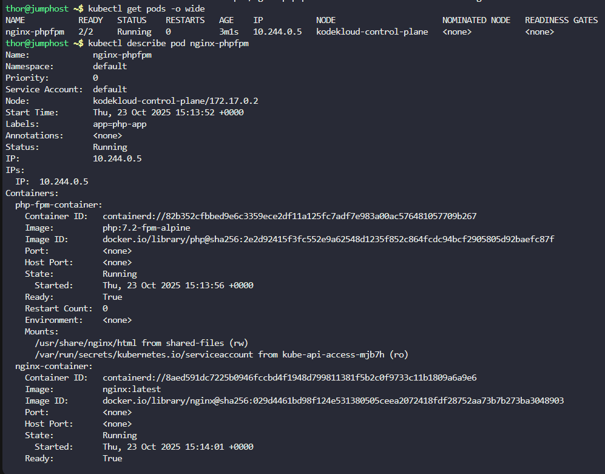
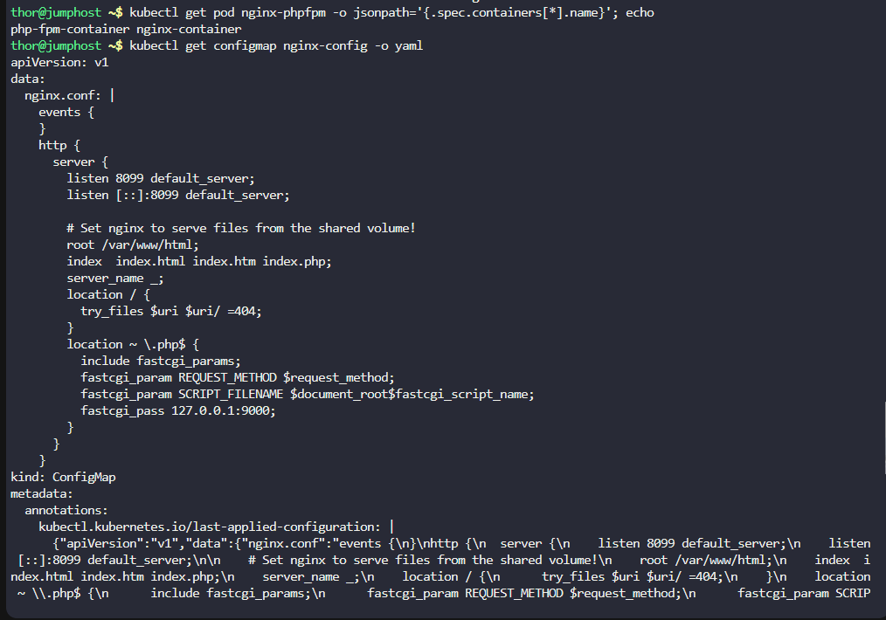
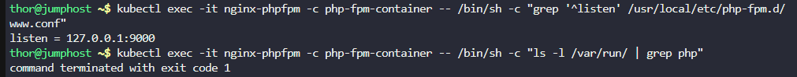
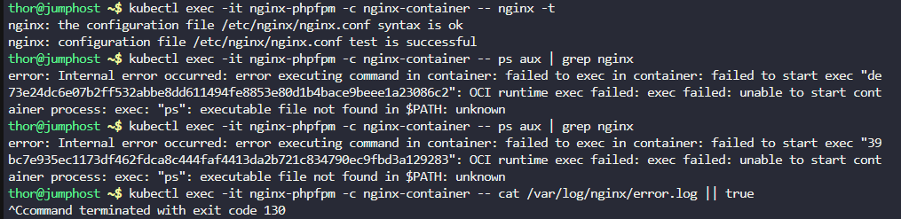
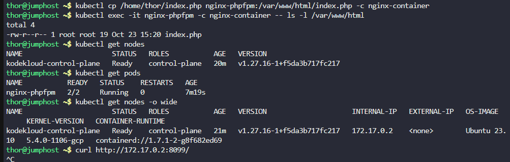
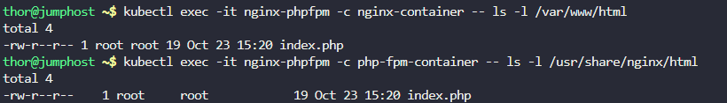
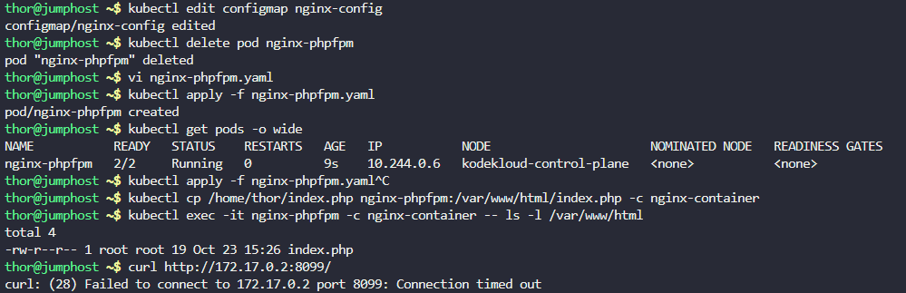
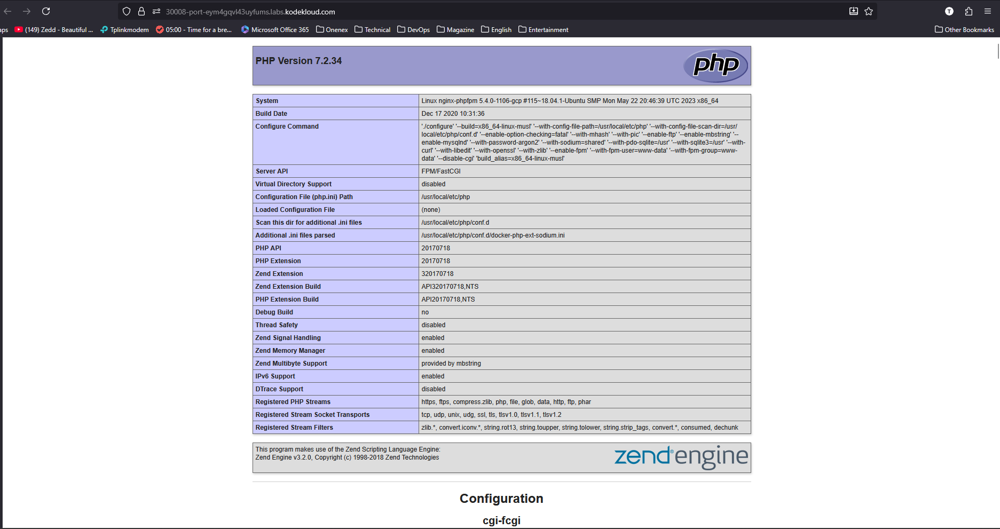

Now: run steps 1 → 4 (at minimum) and paste the outputs here:
```
kubectl get pods -o wide
kubectl describe pod nginx-phpfpm
kubectl get pod nginx-phpfpm -o jsonpath='{.spec.containers[*].name}'; echo
kubectl get configmap nginx-config -o yaml
```


```
thor@jumphost ~$ kubectl get pods -o wide
NAME           READY   STATUS    RESTARTS   AGE    IP           NODE                      NOMINATED NODE   READINESS GATES
nginx-phpfpm   2/2     Running   0          3m1s   10.244.0.5   kodekloud-control-plane   <none>           <none>
thor@jumphost ~$ kubectl describe pod nginx-phpfpm
Name:             nginx-phpfpm
Namespace:        default
Priority:         0
Service Account:  default
Node:             kodekloud-control-plane/172.17.0.2
Start Time:       Thu, 23 Oct 2025 15:13:52 +0000
Labels:           app=php-app
Annotations:      <none>
Status:           Running
IP:               10.244.0.5
IPs:
  IP:  10.244.0.5
Containers:
  php-fpm-container:
    Container ID:   containerd://82b352cfbbed9e6c3359ece2df11a125fc7adf7e983a00ac576481057709b267
    Image:          php:7.2-fpm-alpine
    Image ID:       docker.io/library/php@sha256:2e2d92415f3fc552e9a62548d1235f852c864fcdc94bcf2905805d92baefc87f
    Port:           <none>
    Host Port:      <none>
    State:          Running
      Started:      Thu, 23 Oct 2025 15:13:56 +0000
    Ready:          True
    Restart Count:  0
    Environment:    <none>
    Mounts:
      /usr/share/nginx/html from shared-files (rw)
      /var/run/secrets/kubernetes.io/serviceaccount from kube-api-access-mjb7h (ro)
  nginx-container:
    Container ID:   containerd://8aed591dc7225b0946fccbd4f1948d799811381f5b2c0f9733c11b1809a6a9e6
    Image:          nginx:latest
    Image ID:       docker.io/library/nginx@sha256:029d4461bd98f124e531380505ceea2072418fdf28752aa73b7b273ba3048903
    Port:           <none>
    Host Port:      <none>
    State:          Running
      Started:      Thu, 23 Oct 2025 15:14:01 +0000
    Ready:          True
    Restart Count:  0
    Environment:    <none>
    Mounts:
      /etc/nginx/nginx.conf from nginx-config-volume (rw,path="nginx.conf")
      /var/run/secrets/kubernetes.io/serviceaccount from kube-api-access-mjb7h (ro)
      /var/www/html from shared-files (rw)
Conditions:
  Type              Status
  Initialized       True 
  Ready             True 
  ContainersReady   True 
  PodScheduled      True 
Volumes:
  shared-files:
    Type:       EmptyDir (a temporary directory that shares a pod's lifetime)
    Medium:     
    SizeLimit:  <unset>
  nginx-config-volume:
    Type:      ConfigMap (a volume populated by a ConfigMap)
    Name:      nginx-config
    Optional:  false
  kube-api-access-mjb7h:
    Type:                    Projected (a volume that contains injected data from multiple sources)
    TokenExpirationSeconds:  3607
    ConfigMapName:           kube-root-ca.crt
    ConfigMapOptional:       <nil>
    DownwardAPI:             true
QoS Class:                   BestEffort
Node-Selectors:              <none>
Tolerations:                 node.kubernetes.io/not-ready:NoExecute op=Exists for 300s
                             node.kubernetes.io/unreachable:NoExecute op=Exists for 300s
Events:
  Type    Reason     Age    From               Message
  ----    ------     ----   ----               -------
  Normal  Scheduled  3m13s  default-scheduler  Successfully assigned default/nginx-phpfpm to kodekloud-control-plane
  Normal  Pulling    3m12s  kubelet            Pulling image "php:7.2-fpm-alpine"
  Normal  Pulled     3m10s  kubelet            Successfully pulled image "php:7.2-fpm-alpine" in 2.620893391s (2.620910147s including waiting)
  Normal  Created    3m10s  kubelet            Created container php-fpm-container
  Normal  Started    3m9s   kubelet            Started container php-fpm-container
  Normal  Pulling    3m9s   kubelet            Pulling image "nginx:latest"
  Normal  Pulled     3m4s   kubelet            Successfully pulled image "nginx:latest" in 5.617787164s (5.617801779s including waiting)
  Normal  Created    3m4s   kubelet            Created container nginx-container
  Normal  Started    3m4s   kubelet            Started container nginx-container
thor@jumphost ~$ kubectl get pod nginx-phpfpm -o jsonpath='{.spec.containers[*].name}'; echo
php-fpm-container nginx-container
thor@jumphost ~$ kubectl get configmap nginx-config -o yaml
apiVersion: v1
data:
  nginx.conf: |
    events {
    }
    http {
      server {
        listen 8099 default_server;
        listen [::]:8099 default_server;

        # Set nginx to serve files from the shared volume!
        root /var/www/html;
        index  index.html index.htm index.php;
        server_name _;
        location / {
          try_files $uri $uri/ =404;
        }
        location ~ \.php$ {
          include fastcgi_params;
          fastcgi_param REQUEST_METHOD $request_method;
          fastcgi_param SCRIPT_FILENAME $document_root$fastcgi_script_name;
          fastcgi_pass 127.0.0.1:9000;
        }
      }
    }
kind: ConfigMap
metadata:
  annotations:
    kubectl.kubernetes.io/last-applied-configuration: |
      {"apiVersion":"v1","data":{"nginx.conf":"events {\n}\nhttp {\n  server {\n    listen 8099 default_server;\n    listen [::]:8099 default_server;\n\n    # Set nginx to serve files from the shared volume!\n    root /var/www/html;\n    index  index.html index.htm index.php;\n    server_name _;\n    location / {\n      try_files $uri $uri/ =404;\n    }\n    location ~ \\.php$ {\n      include fastcgi_params;\n      fastcgi_param REQUEST_METHOD $request_method;\n      fastcgi_param SCRIPT_FILENAME $document_root$fastcgi_script_name;\n      fastcgi_pass 127.0.0.1:9000;\n    }\n  }\n}\n"},"kind":"ConfigMap","metadata":{"annotations":{},"name":"nginx-config","namespace":"default"}}
  creationTimestamp: "2025-10-23T15:13:52Z"
  name: nginx-config
  namespace: default
  resourceVersion: "1479"
  uid: 2bf57c90-d5bf-49ee-b05c-76b36536d0ad
```





🔍 Observations

The Nginx container mounts /etc/nginx/nginx.conf from the ConfigMap nginx-config.

The PHP-FPM container exposes no port, but the Nginx config tries to connect to 127.0.0.1:9000:

fastcgi_pass 127.0.0.1:9000;

Both containers share the same network namespace (since they’re in the same pod).
→ So, 127.0.0.1:9000 should reach PHP-FPM if it’s listening on port 9000.

However, php-fpm:7.2-fpm-alpine listens on a UNIX socket by default (/var/run/php-fpm.sock), not on TCP 9000 — unless configured otherwise.

So, likely the nginx can’t reach PHP-FPM, causing PHP pages (like index.php) to fail, even if both containers are running fine.
✅ Next step: Confirm PHP-FPM listening method

Please run the following to inspect how PHP-FPM is listening:

```
kubectl exec -it nginx-phpfpm -c php-fpm-container -- /bin/sh -c "grep '^listen' /usr/local/etc/php-fpm.d/www.conf"
```

Also check the socket file existence:
```
kubectl exec -it nginx-phpfpm -c php-fpm-container -- /bin/sh -c "ls -l /var/run/ | grep php"
```



```
thor@jumphost ~$ kubectl exec -it nginx-phpfpm -c php-fpm-container -- /bin/sh -c "grep '^listen' /usr/local/etc/php-fpm.d/www.conf"
listen = 127.0.0.1:9000
thor@jumphost ~$ kubectl exec -it nginx-phpfpm -c php-fpm-container -- /bin/sh -c "ls -l /var/run/ | grep php"
command terminated with exit code 1
```


✅ php-fpm is already listening on 127.0.0.1:9000, which matches your Nginx config (fastcgi_pass 127.0.0.1:9000;).
❌ The /var/run/php* socket check just failed because there is no socket file (since it’s not using one). That’s fine.

So, communication between Nginx and PHP-FPM should technically work.
Now we just need to verify two more things:
🔎 Step 1: Check if Nginx is running correctly and serving

Let’s test the Nginx syntax and confirm it’s not silently failing due to config mount issues.
```
kubectl exec -it nginx-phpfpm -c nginx-container -- nginx -t
```

Then check its running processes:
```
kubectl exec -it nginx-phpfpm -c nginx-container -- ps aux | grep nginx
```

Paste both outputs here.
🔎 Step 2: Check Nginx logs for any PHP errors

Run:
```
kubectl logs nginx-phpfpm -c nginx-container --tail=50
```
and also:
```
kubectl exec -it nginx-phpfpm -c nginx-container -- cat /var/log/nginx/error.log || true
```



```
thor@jumphost ~$ kubectl exec -it nginx-phpfpm -c nginx-container -- nginx -t
nginx: the configuration file /etc/nginx/nginx.conf syntax is ok
nginx: configuration file /etc/nginx/nginx.conf test is successful
thor@jumphost ~$ kubectl exec -it nginx-phpfpm -c nginx-container -- ps aux | grep nginx
error: Internal error occurred: error executing command in container: failed to exec in container: failed to start exec "de73e24dc6e07b2ff532abbe8dd611494fe8853e80d1b4bace9beee1a23086c2": OCI runtime exec failed: exec failed: unable to start container process: exec: "ps": executable file not found in $PATH: unknown
thor@jumphost ~$ kubectl exec -it nginx-phpfpm -c nginx-container -- ps aux | grep nginx
error: Internal error occurred: error executing command in container: failed to exec in container: failed to start exec "39bc7e935ec1173df462fdca8c444faf4413da2b721c834790ec9fbd3a129283": OCI runtime exec failed: exec failed: unable to start container process: exec: "ps": executable file not found in $PATH: unknown
thor@jumphost ~$ kubectl exec -it nginx-phpfpm -c nginx-container -- cat /var/log/nginx/error.log || true
^Ccommand terminated with exit code 130
```


🔍 What we know so far

✅ Nginx config syntax is OK. (nginx -t passed)

❌ The ps command isn’t installed in the nginx:latest container — that’s expected (it’s a minimal image).

❌ You pressed Ctrl+C while reading /var/log/nginx/error.log — probably because it hung (the file might not exist yet, or Nginx is running fine but has no errors logged).

At this point, everything looks healthy — both containers are running, and config syntax is fine.
So, the most likely issue is simply that the index.php file is missing in the Nginx document root (/var/www/html).

✅ Let’s confirm document root existence

Please run:
```
kubectl exec -it nginx-phpfpm -c nginx-container -- ls -l /var/www/html
```

If it’s empty or missing index.php, then that’s our issue.
🧩 Next (after confirming empty directory):

You’ll need to copy /home/thor/index.php from the jump host into that directory inside the nginx-container.

Run this from the jump host:
```
kubectl cp /home/thor/index.php nginx-phpfpm:/var/www/html/index.php -c nginx-container
```

Then verify inside the pod:
```
kubectl exec -it nginx-phpfpm -c nginx-container -- ls -l /var/www/html
```

You should now see index.php listed.
🌐 Finally

Once the file is in place, try accessing the website using the “Website” button at the top bar (or use curl if you prefer):
```
curl http://<node_ip>:8099/
```




```
thor@jumphost ~$ kubectl get nodes -o wide
NAME                      STATUS   ROLES           AGE   VERSION                     INTERNAL-IP   EXTERNAL-IP   OS-IMAGE       KERNEL-VERSION   CONTAINER-RUNTIME
kodekloud-control-plane   Ready    control-plane   21m   v1.27.16-1+f5da3b717fc217   172.17.0.2    <none>        Ubuntu 23.10   5.4.0-1106-gcp   containerd://1.7.1-2-g8f682ed69
thor@jumphost ~$ curl http://172.17.0.2:8099/
```


🔍 Diagnosis

✅ Nginx and PHP-FPM containers are both running fine.

✅ Nginx configuration syntax is OK.

⚠️ Website shows “File not found”, and curl gives no response — this indicates:

Nginx is serving requests correctly, but

It can’t find or execute /var/www/html/index.php.

This could happen because:

The file isn’t actually present inside the Nginx container (or is in the wrong directory).

The shared-files volume isn’t populated correctly — remember, /var/www/html in the Nginx container is a shared EmptyDir volume with /usr/share/nginx/html in PHP-FPM.
So, if you copied the file to Nginx’s /var/www/html, PHP-FPM may not see it.

Let’s confirm where the file actually is inside both containers.
🧩 Step 1: Check inside both containers

In Nginx container:
```
kubectl exec -it nginx-phpfpm -c nginx-container -- ls -l /var/www/html
```

In PHP-FPM container:
```
kubectl exec -it nginx-phpfpm -c php-fpm-container -- ls -l /usr/share/nginx/html
```

Paste both outputs here.
🧩 Step 2 (depending on the result)

If the file appears only in one of them, we’ll copy it again to the correct shared volume path so both containers can see it.

From your pod’s spec:

php-fpm-container:
  Mounts:
    /usr/share/nginx/html from shared-files
nginx-container:
  Mounts:
    /var/www/html from shared-files

So both containers share the same EmptyDir volume — but under different paths:

    Nginx: /var/www/html

    PHP-FPM: /usr/share/nginx/html

That’s fine as long as Nginx reads from /var/www/html (which it does).
But we need to confirm the file actually exists in that shared volume.
🧩 Step 3 (once we confirm where it’s missing)

If /var/www/html is empty, copy the file again like this:
```
kubectl cp /home/thor/index.php nginx-phpfpm:/var/www/html/index.php -c nginx-container
```

Then verify in both containers that it exists:
```
kubectl exec -it nginx-phpfpm -c nginx-container -- ls -l /var/www/html
kubectl exec -it nginx-phpfpm -c php-fpm-container -- ls -l /usr/share/nginx/html
```

Once you see the file in both, try:
```
curl http://172.17.0.2:8099/
```

Or click the Website button again.



```
thor@jumphost ~$ kubectl exec -it nginx-phpfpm -c nginx-container -- ls -l /var/www/html
total 4
-rw-r--r-- 1 root root 19 Oct 23 15:20 index.php
thor@jumphost ~$ kubectl exec -it nginx-phpfpm -c php-fpm-container -- ls -l /usr/share/nginx/html
total 4
-rw-r--r--    1 root     root            19 Oct 23 15:20 index.php
```

Perfect 👏 — that confirms the file exists in both containers, and the shared volume works fine.

Now the environment is in good shape, but since you still see “File not found”, this means:

Nginx is serving /var/www/html/index.php,

but when it tries to pass PHP requests to PHP-FPM, PHP-FPM can’t locate that script path because of a path mismatch between Nginx’s $document_root (/var/www/html) and PHP-FPM’s filesystem (/usr/share/nginx/html).

⚙️ Root Cause

The PHP-FPM container sees files under /usr/share/nginx/html,
but Nginx tells PHP-FPM:
SCRIPT_FILENAME = /var/www/html/index.php.

So PHP-FPM looks for /var/www/html/index.php inside its container,
but that path doesn’t exist there (it only has /usr/share/nginx/html/index.php).

That’s why PHP-FPM responds “File not found”.
✅ Fix: Update Nginx ConfigMap

We’ll correct the fastcgi_param SCRIPT_FILENAME line to point to the correct path as seen by PHP-FPM.

Run:
```
kubectl edit configmap nginx-config
```

Find this block:
```
fastcgi_param SCRIPT_FILENAME $document_root$fastcgi_script_name;
```

and replace it with:
```
fastcgi_param SCRIPT_FILENAME /usr/share/nginx/html$fastcgi_script_name;
```

Then save and exit (:wq).
🔄 Step 2: Restart the Pod

The ConfigMap change won’t take effect automatically — restart the pod to reload the new config:
```
kubectl delete pod nginx-phpfpm
```

Save this as nginx-phpfpm.yaml:
```
apiVersion: v1
kind: Pod
metadata:
  name: nginx-phpfpm
  labels:
    app: php-app
spec:
  containers:
    - name: php-fpm-container
      image: php:7.2-fpm-alpine
      volumeMounts:
        - name: shared-files
          mountPath: /usr/share/nginx/html
    - name: nginx-container
      image: nginx:latest
      volumeMounts:
        - name: nginx-config-volume
          mountPath: /etc/nginx/nginx.conf
          subPath: nginx.conf
        - name: shared-files
          mountPath: /var/www/html
  volumes:
    - name: nginx-config-volume
      configMap:
        name: nginx-config
    - name: shared-files
      emptyDir: {}
```


🚀 Apply the resources


Create the Pod:
```
kubectl apply -f nginx-phpfpm.yaml
```


Wait for it to reach Running (both containers ready).
```
kubectl get pods
```

🌐 Step 3: Test Access

Once the pod is back to Running, test again:
```
curl http://172.17.0.2:8099/
```

Or click the Website button at the top of the lab.

ou should now see the PHP page’s output (whatever is inside your /home/thor/index.php file).


📄 Copy your index.php back

Once it’s running:
```
kubectl cp /home/thor/index.php nginx-phpfpm:/var/www/html/index.php -c nginx-container
```

Verify inside pod:
```
kubectl exec -it nginx-phpfpm -c nginx-container -- ls -l /var/www/html
```

🌐 Test the site
```
curl http://172.17.0.2:8099/
```

Or use the Website button — you should now see your PHP output 🎉.




