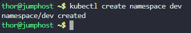
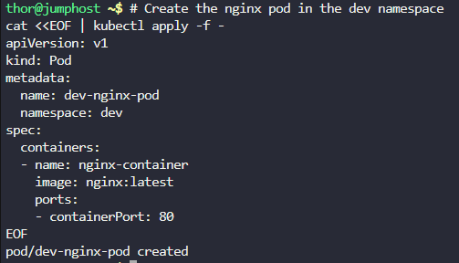
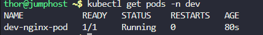
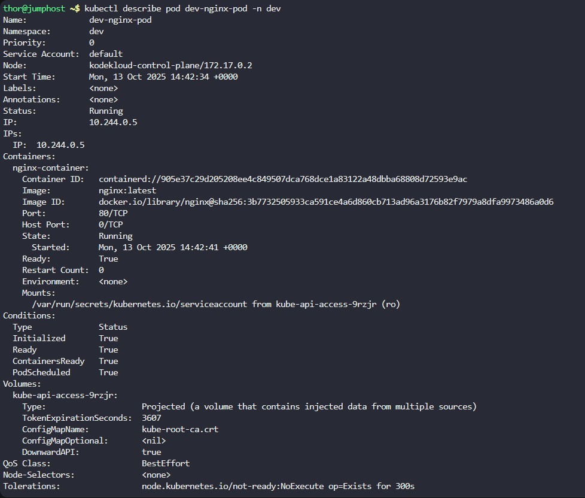
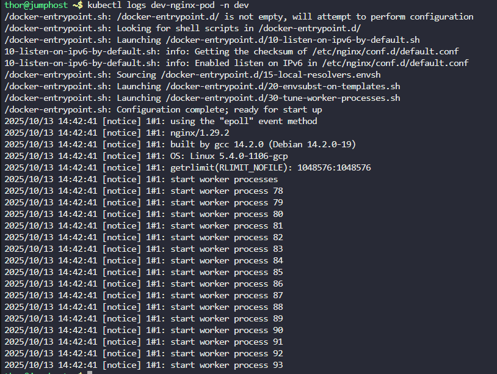

Step 1: Create the Namespace

# Create the dev namespace
```
kubectl create namespace dev
```



Step 2: Create the Nginx Pod in the dev Namespace

```
# Create the nginx pod in the dev namespace
cat <<EOF | kubectl apply -f -
apiVersion: v1
kind: Pod
metadata:
  name: dev-nginx-pod
  namespace: dev
spec:
  containers:
  - name: nginx-container
    image: nginx:latest
    ports:
    - containerPort: 80
EOF
```



Step 3: Verification
Check if the namespace was created:
```
kubectl get namespaces | grep dev
```


Check if the pod is running in the dev namespace:
```
kubectl get pods -n dev
```



Get detailed information about the pod:
```
kubectl describe pod dev-nginx-pod -n dev
```



Check the pod logs to ensure nginx started correctly:
```
kubectl logs dev-nginx-pod -n dev
```

